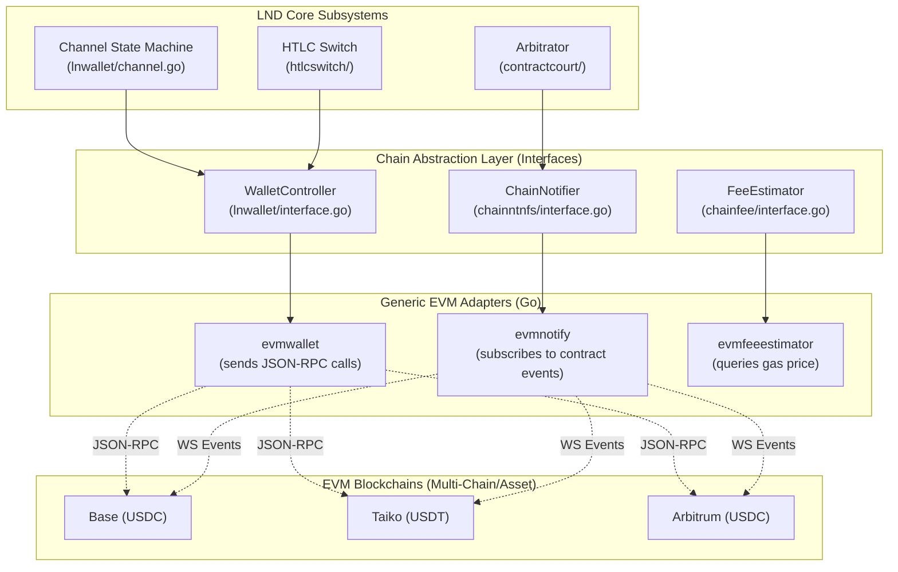
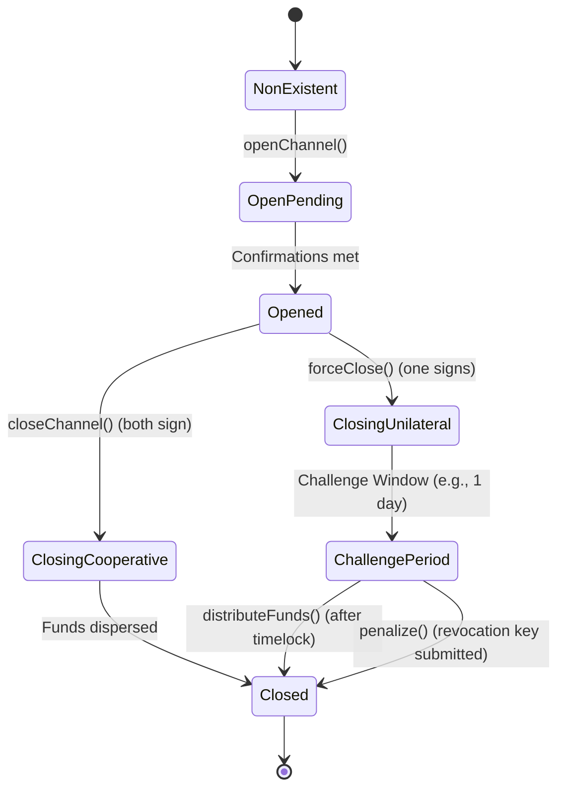
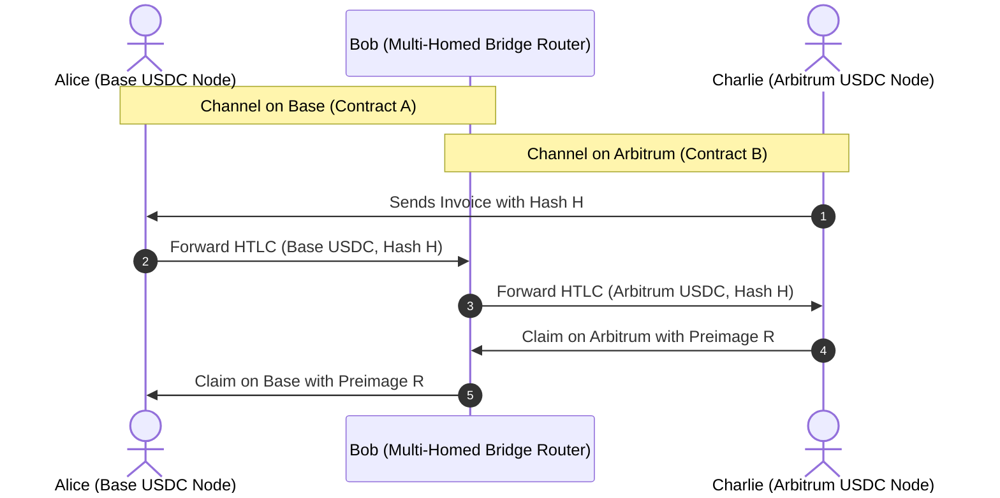

# LND and EVM-Compatible Chain Integration Architecture

This document defines the technical architecture for adapting LND to support EVM-compatible blockchains (such as Base, Taiko/Tempo, Arbitrum, and Ethereum Mainnet) and ERC20 stablecoins (USDT, USDC).

---

## 1. Architectural Philosophy: The Generic Adapter Pattern

Rather than creating separate codebase folders and forks for every EVM chain and every asset (which would lead to severe code duplication and fragmented subnetworks), this integration introduces a single **Generic EVM Adapter** layer.



### Key Highlights of the Adapter Architecture:
1. **Parameterized Execution**: The active chain and target token are completely parameter-driven. The same Compiled Go binary can connect to any EVM chain and target any ERC20 token by modifying config parameters.
2. **State Directory Isolation**: Each LND node instance manages a single asset on a single chain. To prevent database and state overlap, files are strictly isolated under:
   `data/chain/evm/{chain_name}/{asset_name}/`
   - Example: Base USDC: `data/chain/evm/base/usdc/channel.db`
   - Example: Taiko USDT: `data/chain/evm/taiko/usdt/channel.db`
3. **Decimals Scaling Factor**: Solves precision conflicts between tokens with differing decimal counts (e.g., 6 vs. 18 decimals) and LND's internal `int64` currency representation.

---

## 2. Configuration & State Path Management

Each LND instance is configured to handle one specific EVM asset network.

### LND Configuration Fields (`lnd.conf`)
```ini
[Application Options]
chain=evm

[EVM]
# Enable EVM adapter
evm.active=true

# Chain identifier (used for state directory naming and logging)
evm.chain=base

# Chain ID (used for EVM EIP-155 transaction signing)
evm.chainid=8453

# JSON-RPC Host endpoint (Supports HTTP and WebSocket for Event subscription)
evm.rpchost=https://mainnet.base.org

# Target ERC20 Token Contract Address (e.g. USDC on Base)
evm.tokenaddress=0x833589fCD6eDb6E08f4c7C32D4f71b54bdA02913

# Lightning Channel Manager Contract Address deployed on this chain
evm.contractaddress=0x1234567890abcdef1234567890abcdef12345678

# Gas parameters
evm.gaslimit=3000000
evm.maxgasprice=5000000000  # 5 Gwei
```

### Directory Tree Layout
```
data/
└── chain/
    └── evm/
        ├── base/
        │   └── usdc/
        │       ├── channel.db          # Isolated Channel Database
        │       ├── admin.macaroon      # Authentication tokens
        │       └── wallet.db           # EVM wallet accounts
        └── taiko/
            └── usdt/
                ├── channel.db
                ├── admin.macaroon
                └── wallet.db
```

---

## 3. EVM State Channel Architecture (Contract-Based Escrow)

Unlike Bitcoin, which relies on signing off-chain transaction structures spending UTXOs via scripts, EVM-compatible chains permit a **Contract-Based Channel** model. This is inspired by designs like the Raiden Network, modified to match LND's protocol semantics.

### 3.1 Role of the Channel Manager Contract
A central smart contract (`ChannelManager.sol`) acts as the escrow bank and final arbitrator. 
- It maintains a mapping of active channels:
  `mapping(bytes32 => Channel) public channels;`
- Funds are locked inside this contract, not in individual multisig addresses.
- The `channelId` is a unique 32-byte hash computed as:
  `channelId = keccak256(abi.encodePacked(participantA, participantB, salt))`

### 3.2 Channel Lifecycle States


### 3.3 State Update Verification
Off-chain updates (commitment states) are finalized by both parties signing a state digest:
```solidity
struct StateUpdate {
    bytes32 channelId;
    uint256 nonce;
    uint256 balanceA;
    uint256 balanceB;
    bytes32 htlcsHash; // Root hash of active HTLCs
}
```
The signatures are verified on-chain via `ECDSA.recover` if a dispute arises.

### 3.4 Revocation & Punishment
To prevent a party from broadcasting an old state (lower nonce):
1. Each state update is associated with a monotonically increasing `nonce` and a `revocationHash` (hash of a secret).
2. During the unilateral close **Challenge Period** (timelock window), the non-initiator can submit the revocation secret corresponding to the broadcasted state, or a state update with a higher `nonce` signed by both.
3. If valid, the contract awards the entire channel balance to the honest party (`penalize`).

---

## 4. Type Mapping & Semantic Translation

To interface between LND's Bitcoin-centric codebase and EVM, the adapter performs semantic conversions at the boundaries:

| LND Core Type | EVM Counterpart | Description |
| :--- | :--- | :--- |
| `wire.OutPoint.Hash` | `bytes32 channelId` | 32-byte unique channel identifier. |
| `wire.OutPoint.Index` | `0` (or constant) | Unused, since EVM balances are contract-account based rather than UTXO-based. |
| `btcutil.Amount` | `uint256 TokenWei` | Smallest unit of the ERC20 token, scaled to fit. |
| `wire.MsgTx` | `bytes msgBytes` | Serialized EVM contract call payload (contains target function selector and arguments). |
| `chainhash.Hash` | `bytes32 TxHash` | EVM transaction hash. |
| `btcutil.Address` | `address EvmAddress` | 20-byte EVM hex address. |

---

## 5. Token Decimals Scaling Factor

LND represents all capacities and amounts internally as `int64` (Satoshi or millisatoshi).
- **USDC/USDT**: 6 decimal places. Max amount of USDC that can fit in `int64` is $\$9 \times 10^{12}$, which is fine.
- **DAI/WETH**: 18 decimal places. Max amount that can fit in signed `int64` is $\approx 9.22$ tokens before overflow!

To support any ERC20 token seamlessly, the adapter introduces a **Decimals Scaling Factor** configuration parameter:

$$\text{Internal Amount (Satoshis)} = \text{Token Wei} \times 10^{\text{scale\_factor}}$$

### Scaling Rules
1. **Target Decimals Internally**: We normalize all tokens to an **8-decimal format** internally (matching Bitcoin's satoshi scale).
2. **Standard Scale Factor ($k$)**:
   - For **6-decimal tokens** (USDC/USDT): $k = +2$ (Multiply by 100).
     - $1.00$ USDC ($10^6$ units) $\rightarrow 10^8$ Satoshis ($1.0$ BTC equivalent capacity internally).
   - For **18-decimal tokens** (DAI/WETH): $k = -10$ (Divide by $10^{10}$).
     - $1.00$ DAI ($10^{18}$ Wei) $\rightarrow 10^8$ Satoshis ($1.0$ BTC equivalent capacity internally).

This scaling happens transparently inside `evmwallet` during transaction generation and receipt parsing, keeping the core LND routing and database engines completely unaware of decimal differences.

### Granularity, Rounding, and Dust (correctness-critical)
The scaling above only addresses *channel capacity* (sats). HTLC amounts inside LND are carried in **millisatoshi** (`lnwire.MilliSatoshi`, 1 sat = 1000 msat), so the effective internal granularity is `10^(scale_factor) × 1000` finer than one token base-unit. Two rules prevent value from being created or destroyed at the boundary:

1. **Rounding direction is asymmetric and always favors the contract.** When converting an internal msat amount *down* to on-chain token base-units for settlement (`closeChannel`/`claimHtlc`), round **down** (floor); when converting an incoming on-chain amount *up* to internal msat (funding/receipt), the value is exact (multiplication). Flooring on the way out guarantees the sum of both parties' on-chain payouts never exceeds the tokens actually escrowed, so `closeChannel` can never revert on an under-collateralized balance assertion.
2. **Dust floor.** For `k < 0` tokens (≥18 decimals, divide path) any sub-`10^|k|`-wei remainder is unrepresentable internally. The adapter MUST (a) reject channel `local_amt`/HTLC amounts whose low-order wei would truncate to zero, and (b) leave any sub-granularity remainder permanently with the contract (never silently credited to either party). USDC/USDT are 6-decimal (`k=+2`, pure multiply) so they are exact and dust-free — this rule only bites for DAI/WETH-style assets, which are out of the initial Base/Tempo scope.

---

## 6. Multi-Chain Topology & Cross-Chain HTLC Routing

### 6.1 Network Segregation (Sub-networks)
At the physical execution layer, each LND daemon process is configured to run on exactly **one target chain and one asset** (e.g. `Base USDC`, `Arbitrum USDC`, or `Taiko USDT`). 
- A single running daemon maintains a single channel database, connects to a single EVM RPC host, and only opens direct channels with peers running the same configuration.
- We define a sub-network by the tuple: `(Chain ID, Token Contract Address)`.

#### 6.1.1 How the sub-network tuple becomes LND's `ChainHash` (segregation mechanism)

The tuple above is a *concept*; the *mechanism* that actually keeps `Base USDC` and `Taiko USDT` peers from forming channels or gossiping into each other's graphs is LND's existing **`ChainHash`** (a 32-byte genesis-hash). LND enforces this in code, not by convention:

- `funding/manager.go` stamps every channel with `ChainHash` (from `Wallet.Cfg.NetParams.GenesisHash`) and rejects an `OpenChannel`/`AcceptChannel` whose `ChainHash` does not match.
- `discovery/gossiper.go` drops every `ChannelAnnouncement`/`ChannelUpdate` whose `ann.ChainHash` ≠ `cfg.ChainParams.GenesisHash`. So announcements from a USDC sub-network never pollute a USDT node's routing graph.
- `zpay32` derives the invoice HRP from `invoice.Net`, so invoices are not cross-decodable between sub-networks.

This is exactly the seam the Sui adapter already uses: `chainreg/sui_params.go` synthesizes a deterministic 32-byte `GenesisHash` per Sui network (e.g. SHA-256 pre-image of `"sui-devnet"`). The EVM adapter does the same, **derived from the sub-network tuple** so it is stable and collision-free across all (chain, asset) pairs:

```
GenesisHash = keccak256( BE64(chainID) || tokenAddress[20] )   // 32 bytes
```

`evm_params.go` computes this once at startup and assigns it to `ActiveNetParams.GenesisHash`; every downstream check (funding, gossip, invoice HRP, channel-backup chain tagging) then segregates sub-networks for free, with **zero changes** to `funding/`, `discovery/`, or `routing/`. Two nodes interoperate iff they derived the identical `GenesisHash`, i.e. iff they target the same chainID **and** the same token contract.

#### 6.1.2 Design decision: per-(chain, asset), not per-asset-issuer

A tempting alternative is "one network per *asset issuer*" — a single USDC network spanning Base, Arbitrum, Tempo, etc. **We deliberately reject this**, because the segregation must follow *fungibility*, and tokens are only fungible *within a single chain*:

- `USDC on Base` and `USDC on Arbitrum` are **different ERC20 contracts** holding **different balances**. A channel cannot net a Base-USDC balance against an Arbitrum-USDC balance without a bridge — they are no more fungible than USDC vs. USDT.
- An off-chain HTLC settles by adjusting a balance inside *one* `ChannelManager` contract on *one* chain. There is no on-chain object that simultaneously secures funds on two chains, so a single sub-network spanning two chains would have no common settlement layer — exactly the unbacked-IOU failure mode the Lightning trust model exists to avoid.

Therefore the canonical key is the full tuple `(chainID, tokenAddress)`. "USDT vs USDC" segregation falls out naturally (different `tokenAddress`), and so does "Base-USDC vs Arbitrum-USDC" (different `chainID`). Cross-chain and cross-issuer value transfer is then recovered *trustlessly* at the routing layer via the cross-chain HTLC in §6.2 — which is strictly safer than fusing two chains into one channel database.

#### 6.1.3 `ShortChannelID` derivation

LND's `lnwire.ShortChannelID` is the 8-byte `{BlockHeight:24, TxIndex:24, TxPosition:16}` routing locator (`funding/manager.go` builds it from the funding confirmation). EVM exposes the same three coordinates for the `ChannelOpened` log, so the mapping is direct and needs no protocol change:

| LND field            | EVM source                                  |
| -------------------- | ------------------------------------------- |
| `BlockHeight` (24b)  | block number of the `ChannelOpened` receipt |
| `TxIndex` (24b)      | transaction index within the block          |
| `TxPosition` (16b)   | log index of the `ChannelOpened` event      |

The full 32-byte `channelId` (keccak) remains the canonical identifier used as `wire.OutPoint.Hash`; the `ShortChannelID` is only the gossip/routing handle, identical in role to Bitcoin's `block:tx:output`. 24-bit block height comfortably covers Base/Tempo block heights for decades; should an L2 ever exceed 2²⁴ blocks, fall back to `blockNumber mod 2²⁴` plus a TLV carrying the full height (the same escape hatch the Sui adapter reserves for its truncated ObjectID).

### 6.2 Cross-Chain Routing via HTLC (Atomic Swaps)
Instead of forcing a single daemon to manage multiple blockchains simultaneously (which would violate LND's single-chain control design and severely complicate database schemas), cross-chain and cross-asset interoperability is achieved via **HTLC-based routing** at the protocol layer.

Because HTLCs are cryptographically locked using the same payment hash $H = \text{SHA256}(R)$, a payment can cross separate sub-networks atomically and trustlessly:



### 6.3 Why this Design is Better
1. **Zero-Trust Bridge-less Security**: Unlike traditional cross-chain bridges, Bob (the routing node) cannot steal funds. If Bob fails to forward the payment, Alice's HTLC times out and refunds. If Charlie claims the payment on Arbitrum by revealing preimage $R$, Bob obtains $R$ and is cryptographically guaranteed to claim the payment from Alice on Base.
2. **Architectural Simplicity**: LND instances remain single-purpose, fast, and secure. A node operator wishing to act as a cross-chain router simply runs two LND instances (one for `Base USDC` and one for `Arbitrum USDC`) and links them through standard peer-to-peer forwarding.
3. **Dynamic Rebalancing**: Market routing fees incentivize routers to maintain balanced channel liquidity across different chains, resolving fragmented liquidity issues organically.

