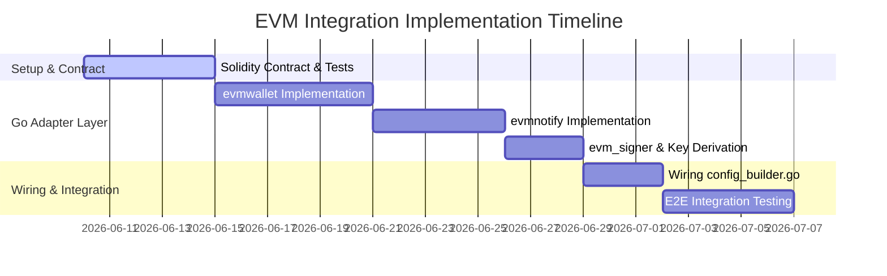

# Refactoring Plan for LND Adaptation to EVM/Solidity

This document details the refactoring plan and package design to integrate EVM-compatible chain support in LND using the generic adapter pattern.

---

## 1. Directory and Package Layout for EVM Adapters

To integrate EVM, we will introduce several new packages at the implementation layer, leaving existing LND interfaces untouched.

```
lnd/
├── chainntnfs/
│   └── evmnotify/            # [NEW] ChainNotifier implementation (subscribes to EVM events)
├── lnwallet/
│   ├── evmwallet/            # [NEW] WalletController + BlockChainIO + KeyRing (JSON-RPC wrapper)
│   ├── chanfunding/
│   │   └── evm_assembler.go  # [NEW] openChannel + ERC20 approve assembler
│   ├── chainfee/
│   │   └── evm_estimator.go  # [NEW] FeeEstimator implementation (gas prices)
│   └── channel.go            # [MODIFY] evmChainActive gate: EIP-712 StateUpdate commitment path
├── input/
│   └── evm_signer.go         # [NEW] Signer (EIP-155 tx + EIP-712 state-update signing)
├── chainreg/
│   ├── evm_params.go         # [NEW] EVM network registry + synthesized GenesisHash per (chainID, token)
│   └── chainregistry.go      # [MODIFY] Wiring EVM into ChainControl initialization
├── contractcourt/            # [MODIFY] resolver branch → ChannelManager methods (see §2.8)
├── funding/manager.go        # [MODIFY] EVM funding confirmation + EvmAssembler (see §2.7)
├── lnwire/
│   ├── channel_id.go         # [MODIFY] ChanID from 32-byte EVM channelId
│   └── short_channel_id.go   # [MODIFY] SCID from (blockNumber, txIndex, logIndex)
├── zpay32/                   # [MODIFY] EVM sub-network invoice HRP
├── evm_chain_builder.go      # [NEW] buildEvmChainControl (mirror of sui_chain_builder.go)
├── config.go                 # [MODIFY] EvmMode config + SetEvmChainActive(true)
└── config_builder.go         # [MODIFY] BuildChainControl EVM branch
```

---

## 2. Component Refactoring Specifications

### 2.1 Configuration Extension
**Files**: `config.go`, `lncfg/`, `chainreg/evm_params.go`

- Add `EvmChainName = "evm"` to active chain registries.
- Define config parameters:
  - `evm.active`: bool
  - `evm.chain`: string (e.g. `base`, `tempo`)
  - `evm.chainid`: uint64
  - `evm.rpchost`: string
  - `evm.tokenaddress`: string
  - `evm.contractaddress`: string
  - `evm.gaslimit`: uint64

- Create `chainreg/evm_params.go` defining parameters for common EVM networks:
  ```go
  package chainreg

  import (
      "github.com/lightningnetwork/lnd/keychain"
  )

  // EvmParams defines parameter configuration for an EVM chain.
  type EvmParams struct {
      ChainID      uint64
      TokenAddress string
      ContractAddr string
      CoinType     uint32 // BIP-0044 / BIP-1017 CoinType
  }
  ```

---

### 2.2 WalletController Adapter (`evmwallet`)
**File**: `lnwallet/evmwallet/wallet.go`

Implements `lnwallet.WalletController` using Go EVM client (e.g., `go-ethereum/ethclient`):
- `ConfirmedBalance`: Queries the ERC20 token balance of the wallet address, then applies the **Decimals Scaling Factor** to return a `btcutil.Amount`.
- `NewAddress`: Returns the wallet's 20-byte EVM address.
- `SendOutputs`: Packs the ERC20 transfer or the channel contract call into an EVM transaction payload, signs it using the node's private key, and sends it to the RPC host.
- `PublishTransaction`: Broadcasts a signed raw transaction to the EVM network.

---

### 2.3 ChainNotifier Adapter (`evmnotify`)
**File**: `chainntnfs/evmnotify/evm_notify.go`

Implements `chainntnfs.ChainNotifier` by subscribing to Solidity contract events:
- `RegisterConfirmationsNtfn`: Monitors the EVM transaction receipt to verify that a transaction has been confirmed in a block.
- `RegisterSpendNtfn`: Registers callbacks triggered when the channel state changes. Specifically, it watches for `ChannelClosed`, `HTLCClaimed`, `HTLCTimeout`, and `ChannelPunished` events emitted by the Channel Manager contract.
- `RegisterBlockEpochNtfn`: Fires block epochs as new blocks are mined/finalized on the EVM chain.

---

### 2.4 Signer & SecretKeyRing Adapter (`evm_signer`)
**File**: `input/evm_signer.go`

- **Key Derivation & CoinType**: EVM reuses **secp256k1**, the same curve as Bitcoin — a major simplification versus the Sui adapter, which had to bridge to Ed25519. We therefore reuse LND's existing `keychain.BtcWalletKeyRing` unchanged and only swap the BIP-44 coin type to **`60` (ETH)** for mainnet sub-networks (testnet sub-networks reuse `keychain.CoinTypeTestnet`, mirroring `chainreg/sui_params.go`). The HD path stays `m/1017'/60'/keyFamily'/0/index`, so all ten `KeyFamily` roles (MultiSig, Revocation, Htlc, Payment, Delay, RevocationRoot, NodeKey, …) carry over verbatim.
- **EVM address**: `address = keccak256(uncompressedPubKey[1:])[12:]` (last 20 bytes). The node's funding/identity key derives its on-chain account this way; no new wallet DB schema is needed.
- **Two signature surfaces** — both secp256k1 but with different digests, so `evm_signer` exposes both:
  1. **EVM transaction signing** (EIP-155): for the `ChannelManager` calls the adapter actually broadcasts (`openChannel`, `closeChannel`, …). Produces `(r, s, v)`.
  2. **Off-chain state-update signing** (EIP-712 typed data): for the per-commitment `StateUpdate` digest that both peers exchange in `commitment_signed` and that may later be presented to `forceClose`/`penalize`. See the interaction spec (`evm-ln-interaction-spec.md` §2) for the exact typed-data schema. This is what `input.Signer.SignOutputRaw` maps to in EVM mode.
- **`SetEvmChainActive` hook**: mirror the existing `lnwallet.SetSuiChainActive(true)` toggle in `lnwallet/channel.go`. In EVM mode the commitment-signing path emits/validates an EIP-712 `StateUpdate` digest instead of a SegWit commitment transaction; the toggle gates that branch so the Bitcoin path is byte-for-byte unchanged. Set it from `config.go` in the `cfg.EvmMode.Active` validation block, exactly where `SetSuiChainActive(true)` is set for Sui.

---

### 2.5 Channel State Machine Hook (`lnwallet/channel.go`)
**Strategy**: identical to the Sui adaptation — keep the off-chain protocol logic (`StateNum`, `UpdateLog`, HTLC add/settle/fail, revocation window) **unchanged**, and only swap what gets *signed* and *committed*:

- Gate on `evmChainActive` (the toggle from §2.4). When true, the commitment artifact each party signs is the EIP-712 `StateUpdate{channelId, nonce, balanceA, balanceB, htlcsHash}` rather than a `wire.MsgTx`.
- `nonce` ← LND `StateNum` (monotonic; the contract's replay protection compares against it, see §3 `forceClose`).
- `htlcsHash` ← a deterministic Merkle/keccak root over the active `UpdateLog` HTLC set, so the on-chain `claimHtlc`/`timeoutHtlc` can be proven against the committed state.

### 2.6 Revocation Reconciliation (`lnwallet/channel.go` + contract)

> **Design correction (phase 3.2, 2026-06-09).** The deployed `ChannelManager`
> does **not** implement a `revocationHash = keccak256(per_commitment_secret)`
> scheme. The original sketch below is superseded; the contract uses the
> **newer-nonce penalty** model (`penalize(channelId, correctNonce, …,
> correctSig)` with `correctNonce > storedNonce` and `ECDSA.recover(correctSig)
> == broadcaster`). EVM has no on-chain revocation-key construction, so there is
> nothing to bind a hashed secret to. Revocation reduces to: **retain the
> counterparty's latest signed `StateUpdate`** (already received in
> `commitment_signed` and persisted as `channeldb` `CommitSig`) and, if the
> cheater force-closes an obsolete state, submit that newer signed state to
> `penalize`. `revoke_and_ack` and the shachain producer are genuinely
> untouched — the per-commitment secret is simply not used on-chain.
>
> The one new primitive this requires is **recovering the signature's `v`**: the
> wire `commitment_signed` carries only the 64-byte `(r, s)` (`lnwire.Sig` drops
> `v`), but `forceClose`/`penalize` need the 65-byte `(r, s, v)` the contract's
> `ECDSA.recover` resolves. `input.RecoverEvmSigV` brute-forces `v ∈ {27, 28}`
> against the known counterparty funding address; `lnwallet.evmBreachEvidence`
> assembles the full calldata tuple. Both are cross-checked against the contract
> (`SigRecoveryVectors.t.sol`). The actual on-chain submission is wired in the
> `BreachArbitrator` branch of phase 3.4.

~~LND already produces a `per_commitment_secret` per state via the **shachain** producer (`KeyFamily 5: RevocationRoot`) and transmits it in `revoke_and_ack`. The EVM contract's `revocationHash`/`penalize` scheme **must reuse that existing secret** rather than invent a parallel one:~~

- ~~`revocationHash_N = keccak256(per_commitment_secret_N)` is bound to state `N` when the next state is signed.~~
- ~~On `revoke_and_ack`, the counterparty already learns `per_commitment_secret_N`. If a cheater later `forceClose`s with state `N`, the honest party submits that secret to `penalize` — no new key material, no change to `revoke_and_ack`.~~

### 2.7 Funding Manager Adaptation (`funding/manager.go`)
- `waitForFundingConfirmation`: in EVM mode, wait for the `ChannelOpened` event receipt to reach `evm.numconfs` confirmations (`evmnotify.RegisterConfirmationsNtfn`) instead of N Bitcoin blocks. L2 finality is fast but **not instant** — see the reorg discussion in `evm/security-audit.md`.
- Funding assembly switches to a new `chanfunding.EvmAssembler` (mirror of `lnwallet/chanfunding/sui_assembler.go`) that builds the `openChannel` call + the prerequisite ERC20 `approve` instead of selecting UTXOs.
- `ChainHash` for the channel comes from `ActiveNetParams.GenesisHash` (the synthesized tuple-hash, §6.1.1 of the integration doc) — no signature change.

### 2.8 Contract Court Resolver Mapping (`contractcourt/`)
Each LND resolver maps to a `ChannelManager` method; the resolver *state machines stay unchanged*, only the on-chain action they trigger is swapped (gate on the EVM chain type, same pattern as the Sui resolver branch):

| LND resolver              | Bitcoin action            | EVM action (`ChannelManager`)              |
| ------------------------- | ------------------------- | ------------------------------------------ |
| `commitSweepResolver`     | sweep `to_local` after CSV| `distributeFunds()` after challenge window |
| `htlcSuccessResolver`     | spend with preimage       | `claimHtlc(preimage)`                      |
| `htlcTimeoutResolver`     | spend after CLTV          | `timeoutHtlc()` after `timelock`           |
| `anchorResolver`          | CPFP anchor               | n/a (gas paid directly; no anchor outputs) |
| `BreachArbitrator`        | broadcast justice tx      | `penalize(revocationSecret)`               |

The challenge-period timer replaces CSV; the absolute `timelock` replaces CLTV. `sweep/` is simplified to a no-op for cooperative paths (the contract pays out directly) and to a single `distributeFunds()`/`claimHtlc()` call for force-close paths — mirroring the Sui sweep simplification.

---

## 3. Smart Contract Specifications (`ChannelManager.sol`)

Below is the Solidity smart contract interface to be deployed on target EVM chains.

```solidity
// SPDX-License-Identifier: MIT
pragma solidity ^0.8.20;

interface IChannelManager {
    struct HTLC {
        uint256 index;
        uint256 amount;
        bytes32 hashlock;
        uint32 timelock;
        address recipient;
    }

    // Emitted when a channel is successfully opened
    event ChannelOpened(bytes32 indexed channelId, address participantA, address participantB, uint256 balanceA, uint256 balanceB);

    // Emitted when a channel is closed cooperatively
    event ChannelClosed(bytes32 indexed channelId, uint256 finalBalanceA, uint256 finalBalanceB);

    // Emitted when a unilateral close is initiated
    event UnilateralCloseInitiated(bytes32 indexed channelId, address initiator, uint256 nonce, uint256 balanceA, uint256 balanceB, uint256 challengeExpiry);

    // Emitted when a breach penalty is executed
    event ChannelPunished(bytes32 indexed channelId, address punisher, uint256 rewardAmount);

    // Emitted when an HTLC is claimed
    event HTLCClaimed(bytes32 indexed channelId, uint256 indexed htlcIndex, bytes32 preimage);

    // Emitted when an HTLC is timed out
    event HTLCTimeout(bytes32 indexed channelId, uint256 indexed htlcIndex);

    // Open a channel by locking ERC20 tokens
    function openChannel(
        bytes32 salt,
        address counterparty,
        uint256 localFundingAmount,
        uint256 remoteFundingAmount
    ) external returns (bytes32 channelId);

    // Cooperatively close a channel (both signatures required)
    function closeChannel(
        bytes32 channelId,
        uint256 finalBalanceA,
        uint256 finalBalanceB,
        bytes calldata sigA,
        bytes calldata sigB
    ) external;

    // Force close a channel unilaterally
    function forceClose(
        bytes32 channelId,
        uint256 nonce,
        uint256 balanceA,
        uint256 balanceB,
        bytes32 htlcsHash,
        bytes calldata sig
    ) external;

    // Claim an HTLC using the preimage during the challenge window
    function claimHtlc(
        bytes32 channelId,
        uint256 htlcIndex,
        uint256 amount,
        bytes32 preimage
    ) external;

    // Timeout an HTLC after the timelock expires
    function timeoutHtlc(
        bytes32 channelId,
        uint256 htlcIndex,
        uint256 amount,
        uint32 timelock
    ) external;

    // Submit a newer state update to penalize a cheating counterparty
    function penalize(
        bytes32 channelId,
        uint256 cheatNonce,
        uint256 correctNonce,
        uint256 balanceA,
        uint256 balanceB,
        bytes32 htlcsHash,
        bytes calldata correctSig
    ) external;
}
```

---

## 4. Deterministic Smart Contract Deployment (CREATE2)

To simplify configuration across multiple EVM chains (Base, Taiko/Tempo, Arbitrum), we can deploy the `ChannelManager` contract to the **exact same contract address** on every network.

### 4.1 CREATE2 Mechanism
In EVM, deploying contracts using the `CREATE2` opcode computes the contract address deterministically as:
$$\text{Contract Address} = \text{keccak256}(0\text{xff}, \text{deployerAddress}, \text{salt}, \text{keccak256}(\text{bytecode}))$$

If we use the same deployer key, salt, and bytecode across all chains, the contract address will be identical, allowing LND to use a single hardcoded default contract address in its parameters.

### 4.2 Foundry Deployment Script (`Deploy.s.sol`)
Using Foundry's `forge script`, we can automate deterministic deployment:
```solidity
// SPDX-License-Identifier: MIT
pragma solidity ^0.8.20;

import "forge-std/Script.sol";
import "../src/ChannelManager.sol";

contract DeployChannelManager is Script {
    function run() external {
        uint256 deployerPrivateKey = vm.envUint("PRIVATE_KEY");
        bytes32 salt = bytes32(uint256(1337)); // Constant salt

        vm.startBroadcast(deployerPrivateKey);

        // Deploy using CREATE2
        ChannelManager manager = new ChannelManager{salt: salt}();

        vm.stopBroadcast();
        console.log("Deployed ChannelManager to:", address(manager));
    }
}
```
Deploying to multiple RPC endpoints:
```sh
# Deploy to Base
forge script script/Deploy.s.sol --rpc-url $BASE_RPC --broadcast

# Deploy to Taiko
forge script script/Deploy.s.sol --rpc-url $TAIKO_RPC --broadcast
```

---

## 5. Multi-Process Orchestration Tool (`lnd-evm-manager.sh`)

Since each chain+asset operates as an independent sub-network daemon, running multiple nodes manually is complex. We will introduce an orchestration script `scripts/lnd-evm-manager.sh` for multi-process management.

### 5.1 Orchestration Script Design
The script automatically assigns distinct listening, gRPC, and REST ports to prevent collisions, manages directories, and handles background processes.

```bash
#!/bin/bash
# scripts/lnd-evm-manager.sh
# Usage: ./lnd-evm-manager.sh [start|stop|status] --networks=base/usdc,tempo/usdc

# Base port configuration
BASE_P2P_PORT=10000
BASE_GRPC_PORT=20000
BASE_REST_PORT=30000

# Loop through and start/stop each configured (chain/asset) daemon...
```

### 5.2 Command Examples
- **Start multiple daemons**:
  ```sh
  ./scripts/lnd-evm-manager.sh start --instances=base/usdc,tempo/usdc
  ```
  This automatically starts:
  1. `LND (Base USDC)` on P2P port `10001`, gRPC port `20001`, REST port `30001` with data dir `data/chain/evm/base/usdc/`.
  2. `LND (Tempo USDC)` on P2P port `10002`, gRPC port `20002`, REST port `30002` with data dir `data/chain/evm/tempo/usdc/`.

- **Check status**:
  ```sh
  ./scripts/lnd-evm-manager.sh status
  ```
  Returns a list of running LND daemon PIDs, their bound ports, and tail logs.

- **Stop all instances**:
  ```sh
  ./scripts/lnd-evm-manager.sh stop
  ```

---

## 6. Implementation Stages



