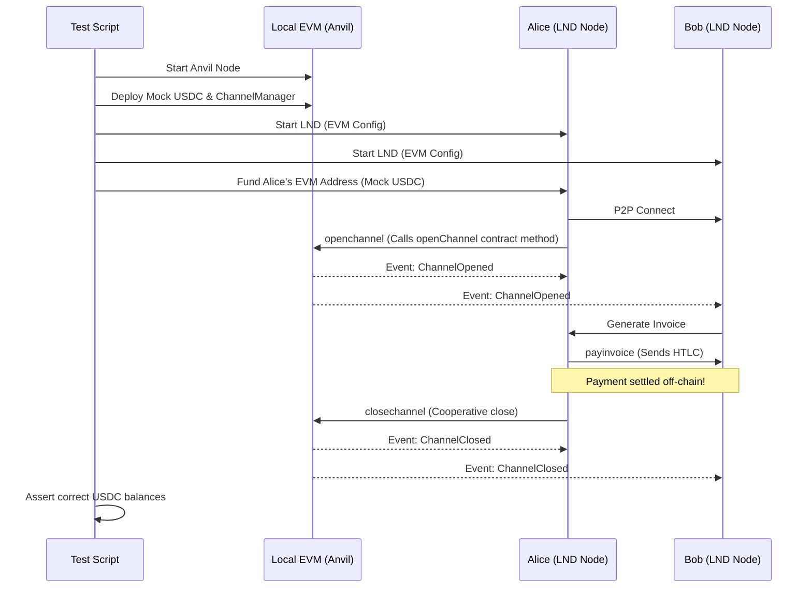

# Testing and Verification Documentation for EVM Integration

This document defines the testing and verification strategy for the EVM/Solidity adapted version of LND, covering unit tests, smart contract tests, and end-to-end (E2E) integration tests.

---

## 1. Unit Testing Strategy

### 1.1 Go Adapter Layer Unit Tests
We will mock the EVM JSON-RPC provider (using Go mock libraries like `gomock` or custom RPC mock handlers) to isolate and verify the Go adaptation layer logic.

- **`evmwallet` Testing**:
  - Verify ERC20 balance queries and correct conversion of raw `uint256` token amounts to internal `btcutil.Amount` using the configured **Decimals Scaling Factor**.
  - Verify contract call serialization (`openChannel`, `closeChannel`, etc.) into `wire.MsgTx`.
- **`evmnotify` Testing**:
  - Mock WebSocket logs for Solidity events (`ChannelOpened`, `ChannelClosed`, `HTLCClaimed`, etc.).
  - Verify that the appropriate `ChainNotifier` callbacks (`RegisterConfirmationsNtfn`, `RegisterSpendNtfn`) are triggered correctly upon event detection.

How to run:
```sh
make unit tags=evm
```

### 1.2 Solidity Contract Unit Tests
We will use **Foundry (Forge)** as the default smart contract testing framework.

- **Open Channel**: Assert that the ERC20 tokens are transferred from the caller to the Channel Manager contract and that the correct `channelId` is mapped and events are emitted.
- **Cooperative Close**: Verify that presenting signatures from both Alice and Bob immediately resolves the channel and distributes the tokens.
- **Unilateral Close**: Verify that a force close starts the challenge period and prevents instant withdrawal.
- **Breach Penalty**: Verify that submitting a valid revocation secret during the challenge period transfers all funds to the honest party.
- **HTLC Resolution**: Test that `claimHtlc` succeeds with a valid preimage before the timelock, and that `timeoutHtlc` only succeeds after the timelock.

How to run (inside the Solidity contract directory):
```sh
forge test
```

---

## 2. End-to-End (E2E) Integration Testing

To simulate a real-world multi-node payment flow, we will provide an automated integration script `scripts/itest_evm.sh` using a local EVM development node (Anvil or Hardhat Node).

### 2.1 E2E Test Workflow


### 2.2 Running the Integration Test
```sh
# Run the automated integration test script
./scripts/itest_evm.sh localnet
```

The script performs the following actions:
1. **Node Lifecycle**: Starts a local `anvil` node and deploys the contract artifacts.
2. **LND Startup**: Runs two LND nodes (Alice & Bob) with EVM config flags pointing to Anvil:
   ```sh
   ./lnd-debug \
       --chain=evm \
       --evm.active \
       --evm.chain="anvil" \
       --evm.chainid=31337 \
       --evm.rpchost="http://127.0.0.1:8545" \
       --evm.tokenaddress="$USDC_ADDRESS" \
       --evm.contractaddress="$MANAGER_ADDRESS"
   ```
3. **Channel Setup & Payment**: Alice connects to Bob, opens an ERC20 channel, Bob generates a lightning invoice, and Alice settles it.
4. **Asserts**: Verifies that the on-chain balances are distributed accurately upon channel closing.

---

## 3. Common Issues and Troubleshooting

- **Out of Gas / Estimation Errors**: EVM contracts perform cryptographic signature verification (`ecrecover`), which is expensive. Ensure LND is configured with sufficient default gas limits (`evm.gaslimit`).
- **Websocket Drops**: EVM event monitoring relies on a stable WS subscription. Implement robust reconnection logic in `evmnotify` to poll block headers in case of subscription timeout.
- **Scale Underflows**: If an asset has too few decimals (e.g. 2 decimals), ensure the scale factor does not round down transactions to zero satoshis, which would break HTLC routing.
