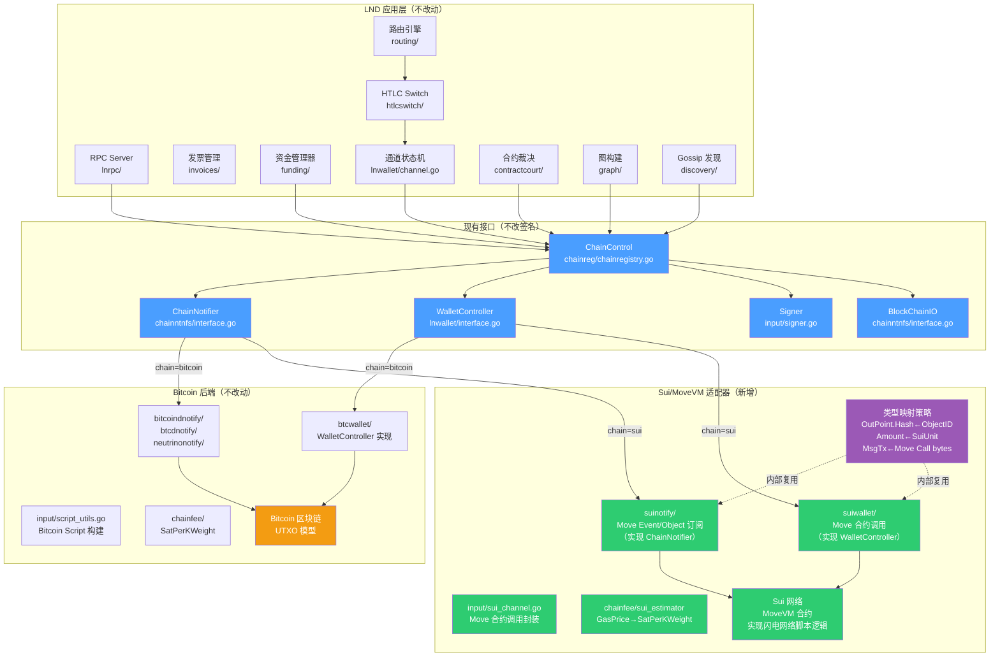
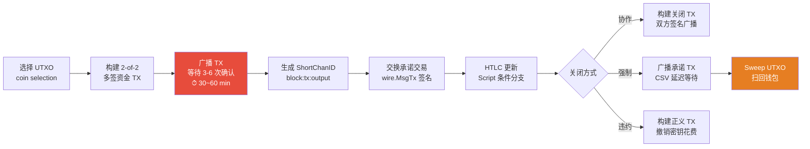
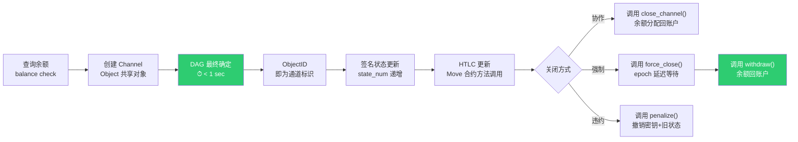
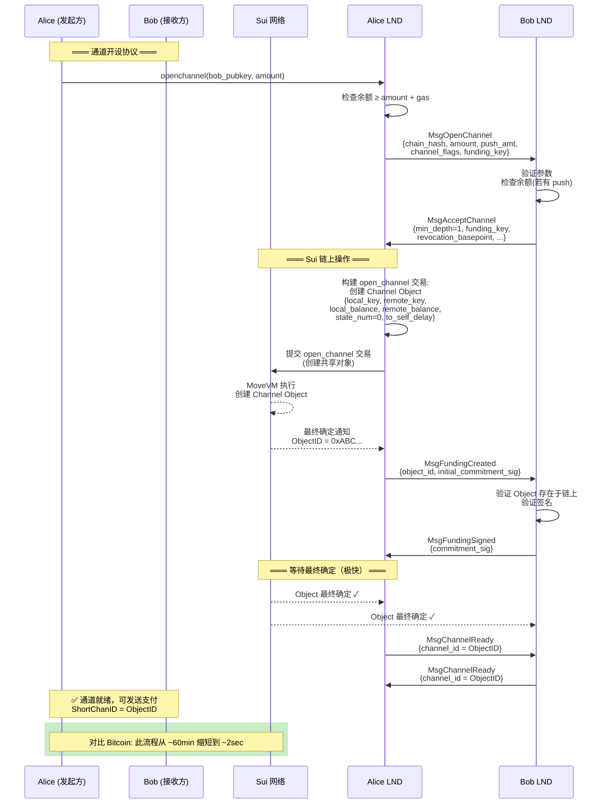
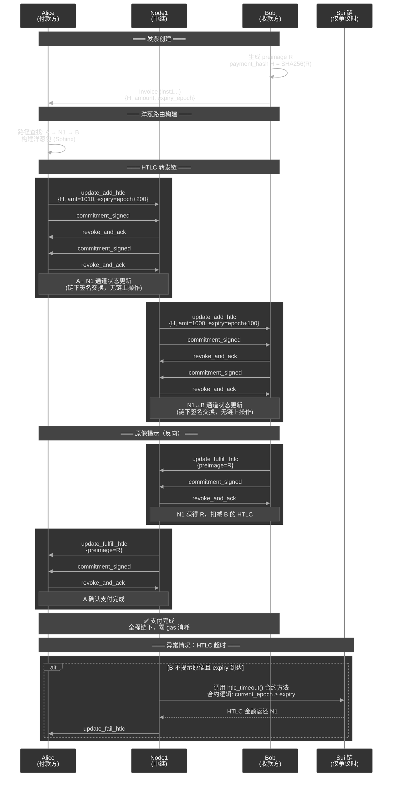
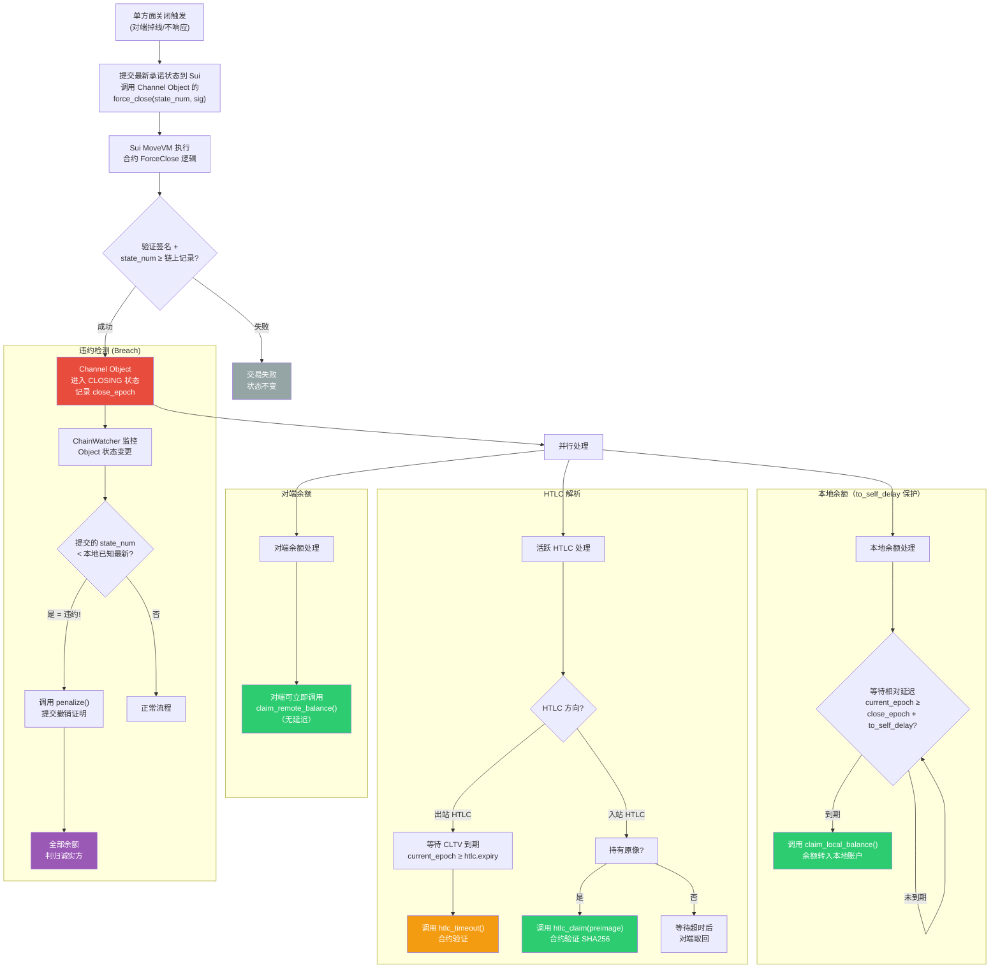
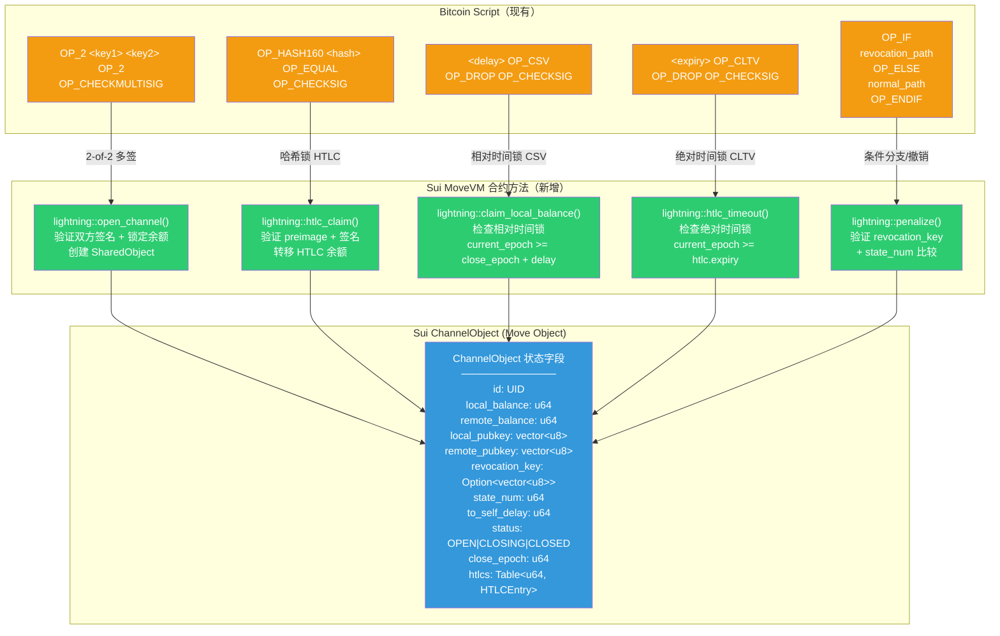
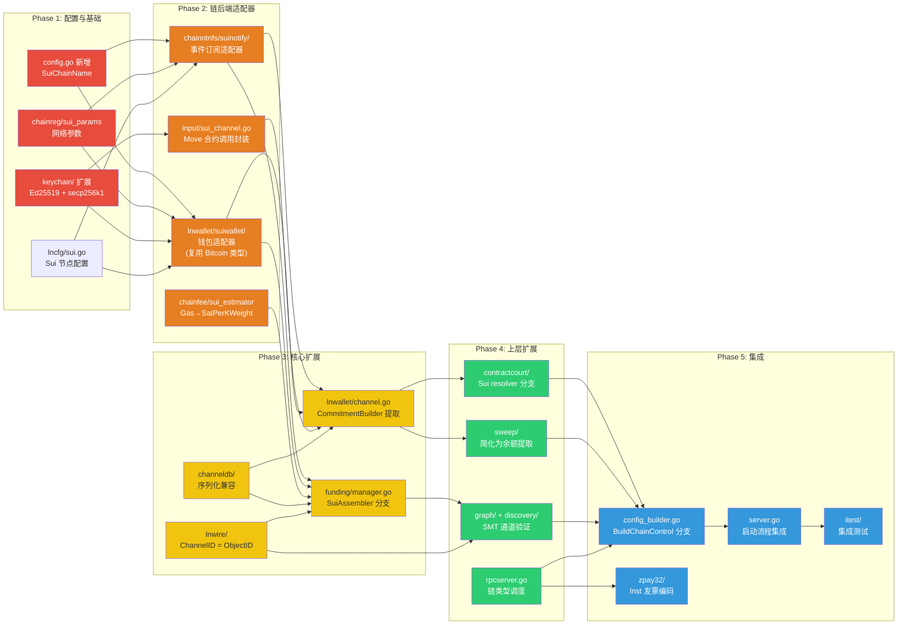
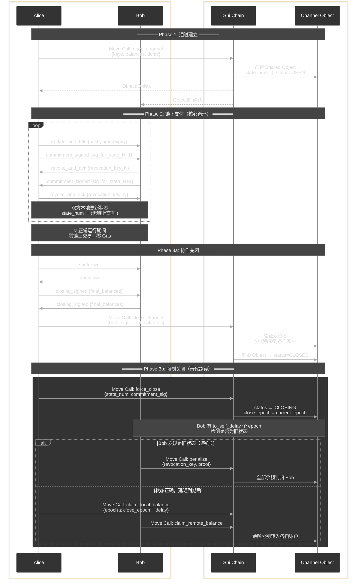

# 计划：闪电网络适配 Sui/MoveVM — 改造重构文档

## 0. Overview

将 LND 闪电网络改造为同时支持 **Bitcoin + Sui (MoveVM) 双系统**。利用 Sui 成熟的 MoveVM 智能合约能力实现闪电网络核心逻辑，通道以 32 字节 `ObjectID` 标识。

> **背景与策略调整**：为了实现并行开发，在 Sui 通用虚拟机（MoveVM）完全集成前，先行将 LND 集成到 **Sui 网络**。原本在 Bitcoin 上的闪电网络脚本逻辑（如多签、HTLC、时间锁、违约惩罚）将直接通过 **MoveVM 合约** 实现。
>
> **适配策略**：从"在 Setu 侧新增硬编码原语"调整为**"在 Sui 侧部署 Move 闪电网络合约"**。LND 通过适配器调用 Sui 上的 Move 合约来执行通道生命周期管理（`open_channel`、`close_channel`、`force_close`、`htlc_claim`、`penalize` 等）。

改造策略：**零侵入适配器模式（Adapter Pattern）** 。不新增抽象层、不改现有接口签名，而是在接口实现层做 Sui/MoveVM 适配器 —— 适配器内部复用 Bitcoin 类型（如 `wire.OutPoint.Hash` 存储 ObjectID、`btcutil.Amount` 做单位映射、`wire.MsgTx` 承载 Move Call 序列化字节），在实现边界做语义转换。现有 Bitcoin 代码路径完全不受影响，Sui 作为新的 `ChainControl` 实现插入，通过 `lncli --chain=sui` 选择。

核心改造工作量分布：**lnd 针对 Sui/MoveVM 的后端适配器实现（35%）→ Sui 侧 Move 闪电网络合约实现（20%）→ 上层模块扩展（25%）→ 配置/启动/测试集成（20%）**。

---

## 1. 流程交互图

如下 8 张图分别覆盖了：

1. **架构总览** — 双链抽象层分层与模块关系
2. **通道生命周期对比** — Bitcoin vs Sui (MoveVM) 的流程差异一目了然
3. **开通道序列** — 详细的双方+链交互时序
4. **多跳 HTLC 支付** — 正常流转与异常超时的完整序列
5. **强制关闭与争议解决** — 含违约惩罚的完整决策流程
6. **Bitcoin Script → MoveVM 合约方法映射** — 每个 Bitcoin 合约操作如何翻译为 Move 合约调用
7. **改造阶段依赖** — 5 个 Phase 的执行顺序与依赖
8. **链上/链下数据流全景** — 完整的通道生命周期交互泳道

### 1. 适配器模式双链架构总览



---

### 2. 通道生命周期对比（Bitcoin vs Sui）

- 图1：Bitcoin 闪电网络通道生命周期



- 图2：Sui 闪电网络通道生命周期



---

### 3. 开通道序列交互图（Sui 适配）



---

### 4. 多跳 HTLC 支付序列图



---

### 5. 强制关闭与争议解决流程图



---

### 6. Bitcoin Script → Sui MoveVM 合约方法映射

> **说明**：原本在 Bitcoin 上的脚本逻辑被映射为 Sui Move 模块中的具体函数。LND 适配器通过调用这些合约方法来触发链上状态变更。



---

### 7. 模块改造优先级与依赖关系



---

### 8. 数据流：链上 vs 链下交互全景



---

## 2. 改造步骤

**1. 配置扩展 + Sui 网络参数（零侵入）**

不新增 `chaintype/` 抽象层。LND 已有 `--chain` 和 `--network` 双维参数（`lncli --chain=bitcoin --network=mainnet`），天然支持多链扩展。改造步骤：

| 文件                              | 修改内容                                                        |
| --------------------------------- | --------------------------------------------------------------- |
| `config.go`                       | 新增 `SuiChainName = "sui"` 常量 + `Sui *lncfg.Chain` 配置项 |
| `lncfg/sui.go`（新建）           | Sui 节点配置结构体（RPC 地址、PackageID、epoch 间隔等）         |
| `chainreg/sui_params.go`（新建） | `SuiNetParams`（网络 ID、创世哈希、默认端口等）                |
| `chainreg/chainregistry.go`       | `switch` 分支新增 `"sui"` case                                 |

**核心设计原则 — 适配器边界类型映射**：

Sui 适配器 in 实现 LND 现有接口时，内部复用 Bitcoin 类型做语义映射，不改接口签名：

| Bitcoin 类型                 | Sui 适配器内部用法                         | 说明         |
| ---------------------------- | ------------------------------------------- | ------------ |
| `wire.OutPoint{Hash, Index}` | `Hash` ← ObjectID (32B), `Index` = 0        | 通道标识     |
| `btcutil.Amount`             | 直接存储 Sui 最小单位（int64 Mist）             | 金额映射     |
| `wire.MsgTx`                 | `Payload` 字段承载 Move Call 序列化字节    | 交易包装     |
| `chainfee.SatPerKWeight`     | 内部做 GasPrice → SatPerKWeight 换算        | 费率映射     |
| `chainhash.Hash`             | 直接存储 Sui Transaction Digest / ObjectID           | 32B 通用     |
| `lnwire.ShortChannelID`      | 8 字节存 ObjectID 截断 + TLV 扩展存完整 32B | 路由协议兼容 |

**2. 链后端接口 — 保持不变，仅新增 Sui 实现**

**不修改**现有接口签名。LND 的核心链后端接口签名保持原样，Sui 适配器作为新实现，内部做语义转换：

- **`ChainNotifier`** — 适配器将 `RegisterConfirmationsNtfn(txid *chainhash.Hash, ...)` 中的 `txid` 解释为 Transaction Digest，订阅交易最终确定事件
- **`BlockChainIO`** — 适配器将 `GetUtxo(outpoint *wire.OutPoint, ...)` 解释为查询 Channel Object 状态
- **`Signer`** — 适配器将 `SignOutputRaw(tx *wire.MsgTx, ...)` 中的 tx 解释为 Move Call 序列化载体，对内容做 Sui 签名
- **`WalletController`** — 改动最大的适配器；在实现内部做 UTXO → 余额的语义转换（`ListUnspentWitness` 返回一个"虚拟 UTXO"）

**3. 扩展 `ChainControl` + `config_builder.go`**

修改 `chainreg/chainregistry.go` 中的 `ChainControl` 结构体：

- 新增 `ChainName string` 字段（`"bitcoin"` 或 `"sui"`）
- 在 `config_builder.go` 的 `BuildChainControl` 函数中新增 `"sui"` 分支，创建 Sui 适配器实例注入 `ChainControl`
- 创建 `chainreg/sui_params.go` 定义 `SuiNetParams`（网络 ID、创世哈希、默认端口、epoch 间隔）

**4. 实现 Sui 链通知后端 `chainntnfs/suinotify/`**

实现 `ChainNotifier` 接口，核心映射关系：

| Bitcoin 概念                                | Sui 实现                                           |
| ------------------------------------------- | --------------------------------------------------- |
| `RegisterConfirmationsNtfn(txid, numConfs)` | 订阅交易最终确定事件 |
| `RegisterSpendNtfn(outpoint)`               | 订阅 Channel Object 状态变更（通过 Move Event 触发）   |
| `RegisterBlockEpochNtfn()`                  | 订阅 Sui Checkpoint/Epoch 推进事件                            |
| 区块重组检测                                | 大幅简化（DAG 无经典重组）                          |
| `GetBlock()` / `GetBlockHash()`             | 查询 Checkpoint 信息                      |

**5. 实现 Sui 钱包 `lnwallet/suiwallet/`**

实现适配后的 `WalletController` 接口：

| Bitcoin 操作                           | Sui 操作                                                              |
| -------------------------------------- | ---------------------------------------------------------------------- |
| `ListUnspentWitness()` — 列出 UTXO     | `GetBalance()` — 查询账户余额                                          |
| `LeaseOutput(OutPoint)` — 锁 UTXO      | `ReserveBalance(amount)` — 预留余额                                    |
| `SendOutputs([]*wire.TxOut)` — 构建 TX | `MoveCall(package, module, func, args)` — 调用合约                                      |
| `FundPsbt()` / `SignPsbt()`            | `BuildMoveCall()` / `SignTransaction()` — 构建 Sui 交易 |
| 币选择（`selectInputs`）               | 不需要（直接从余额扣减）                                               |
| 找零地址生成                           | 不需要                                                                 |

密钥管理方面：复用 [derivation.go](../keychain/derivation.go) 的 `KeyFamily` 体系，新增 Sui coinType，密钥衍生支持 secp256k1 和 Ed25519 双路径。

**6. Sui 链上通道逻辑 — 基于 MoveVM 合约实现**

原本在 Bitcoin 上的脚本逻辑由 Sui 上的 Move 合约替代。

**6a. Move 模块 `lightning` 核心函数**：

```move
public entry fun open_channel(...) // 创建 Channel SharedObject
public entry fun close_channel(...) // 协作关闭
public entry fun force_close(...) // 强制关闭
public entry fun htlc_claim(...) // HTLC 成功路径
public entry fun htlc_timeout(...) // HTLC 超时路径
public entry fun penalize(...) // 违约惩罚路径
```

在 Go 侧创建 `input/sui_channel.go`，封装上述合约调用的构建函数。

**7. 通道标识体系重设计**

- 修改 [channel_id.go](../lnwire/channel_id.go) — `NewChanIDFromOutPoint` 在 Sui 链上直接使用 ObjectID 的前 32 字节
- 修改 [short_channel_id.go](../lnwire/short_channel_id.go) — Sui 模式下 `ShortChannelID` 使用 ObjectID（32 字节）
- 更新 [channel.go](../lnwallet/channel.go) — `FundingOutpoint` 字段改为 `chaintype.ChannelPoint`
- 修改 [channel_edge_info.go](../graph/db/models/channel_edge_info.go) — 重命名/扩展字段以支持 Sui 公钥格式

**8. 通道状态机适配**

[channel.go](../lnwallet/channel.go) 的改造策略是**分离协议逻辑与链上操作**：

- 提取接口 `CommitmentBuilder`：Bitcoin 实现构建 承诺交易，Sui 实现构建 Move Call 状态更新
- 提取接口 `ScriptEngine`：Sui 实现调用 Move 合约逻辑
- 保留状态编号（`StateNum`）、HTLC 管理（`UpdateLog`）等核心来协议逻辑不变

**9. 资金管理器适配**

修改 [manager.go](../funding/manager.go)：

- `waitForFundingConfirmation` — Sui 模式下等待交易 Finalized
- 资金交易构建切换到新的 `chanfunding.SuiAssembler`（直接调用 open_channel 合约）

**10. 合约裁决适配**

修改 [contractcourt](../contractcourt/) 所有 resolver 以调用对应的 Move 合约方法。

**11. Sweep 模块简化**

在 [sweep](../sweep/) 中新增 Sui 模式，简化为调用合约将余额提取回个人账户。

**12. 图与发现适配**

- 修改 [builder.go](../graph/builder.go) — Sui 查询 Channel Object 是否仍存在
- 修改 [gossiper.go](../discovery/gossiper.go) — Sui 验证 Channel Object 存在 + 双方 key 匹配

**13. 费率体系适配**

- 在 [chainfee](../chainfee/) 中新增 `SuiEstimator`
- 修改 [rates.go](../chainfee/rates.go) — 新增 `GasPrice` 类型

**14. RPC 与发票适配**

- 修改 [rpcserver.go](../rpcserver.go) 中的 `GetInfo` — 返回 `"sui"`
- 修改 [zpay32](../zpay32/) — 新增 Sui HRP

**15. 配置与启动**

- 修改 [config.go](../config.go) — 新增 `Sui *lncfg.Chain`
- 修改 [config_builder.go](../config_builder.go) — `BuildChainControl` 新增 Sui 分支
- 修改 [server.go](../server.go) — 根据链类型初始化对应子系统

---

## 3. Sui 必须支持的完整能力清单

### P0 — 核心能力（无此能力则无法运行闪电网络）

| #   | 能力                         | 详细需求                                                                                     | 对应 LND 模块                                   |
| --- | ---------------------------- | -------------------------------------------------------------------------------------------- | ----------------------------------------------- |
| 1   | **Move 闪电网络合约**      | 实现 open_channel/close_channel/force_close/htlc_claim/timeout/penalize | `input/sui_channel.go` + Move 合约 |
| 2   | **共享对象 (Shared Object)** | Channel Object 需双方都能通过合约操作                                        | `lnwallet/suiwallet/`                          |
| 3   | **哈希锁 (Hashlock)**        | Move 合约内置 SHA256 原像验证逻辑                                              | HTLC 合约                                       |
| 4   | **时间参考**         | 合约能读取当前 epoch 或 clock，用于时间锁比较判断                                              | CSV/CLTV 等价                                   |
| 5   | **状态版本控制**          | Channel Object 需有单调递增的 `state_num`，防止旧状态重放                                    | 承诺状态同步                                    |
| 6   | **事件订阅 API**             | 按 ObjectID 或 PackageID 订阅状态变更事件                             | `chainntnfs/suinotify/`                        |
| 7   | **最终性通知**               | 交易提交后能回调通知最终确定状态                                                             | 确认流程    |
| 8   | **多签名验证**               | Move 合约内置 secp256k1 签名验证                           | 交易授权                                 |
| 9   | **对象查询 API**             | 按 ObjectID 查询完整对象状态                                      | `BlockChainIO` 等价                             |
| 10  | **原子性状态更新**           | 合约执行的状态变更要么全部生效、要么全部回滚                                                 | 通道状态一致性                                  |
| 11  | **Go SDK**             | 支持 Sui 交易构建、签名、提交与 Event 订阅                             | [keychain](../keychain/) + 适配层                        |

---

## 4. 验证

- **单元测试**: 每个新增的 Sui 实现独立测试，mock Sui RPC
- **合约测试**: 使用 `sui move test` 验证合约逻辑
- **集成测试**: 修改 [itest](../itest/) 框架，覆盖开通道、支付、关闭、惩罚等全流程
- **命令**: `make itest tags=sui`
- **手动检查**: `lncli --chain=sui getinfo`

## 5. 决策记录

- **适配策略**: 采用**适配器模式（Adapter Pattern）**。LND 通过适配器调用 Sui 上的 Move 合约来替代原本的 Bitcoin 脚本逻辑。
- **并行开发**: 在 Setu 通用 VM 就绪前，先行集成 Sui 以推进上层逻辑开发。
- **ObjectID**: Sui 上使用 32 字节 ObjectID 直接标识通道。
