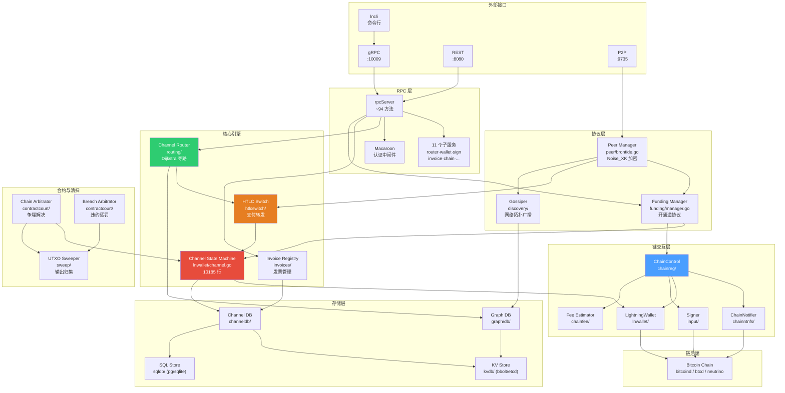
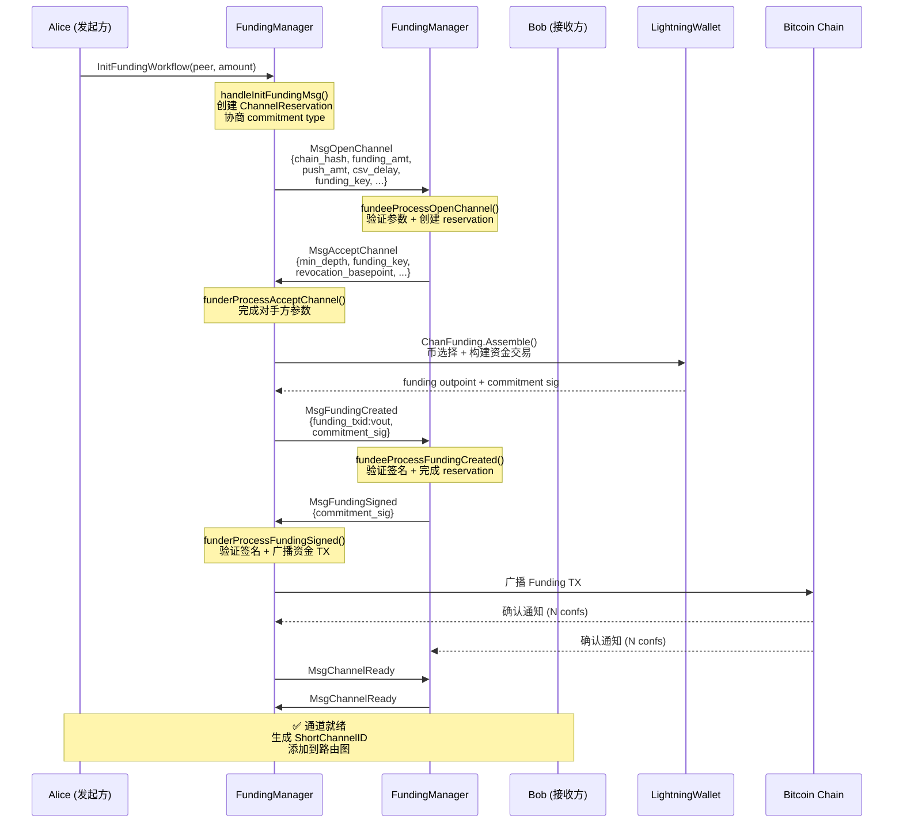
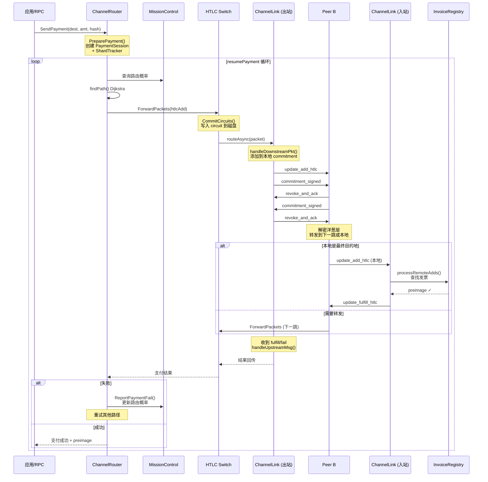
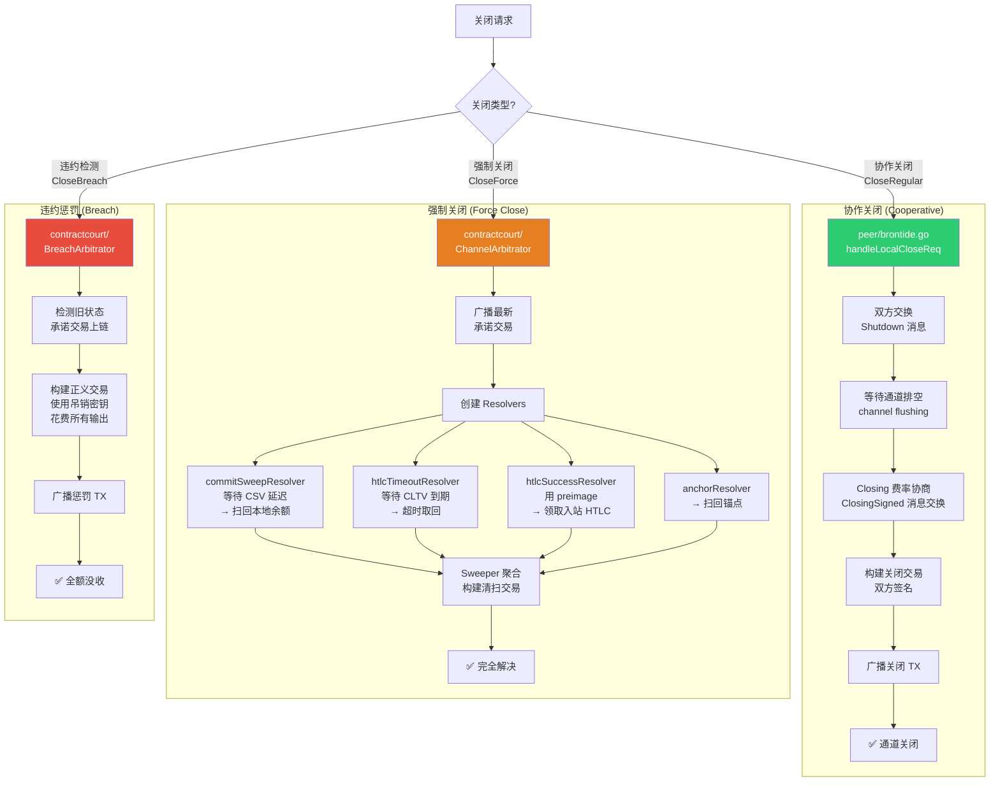
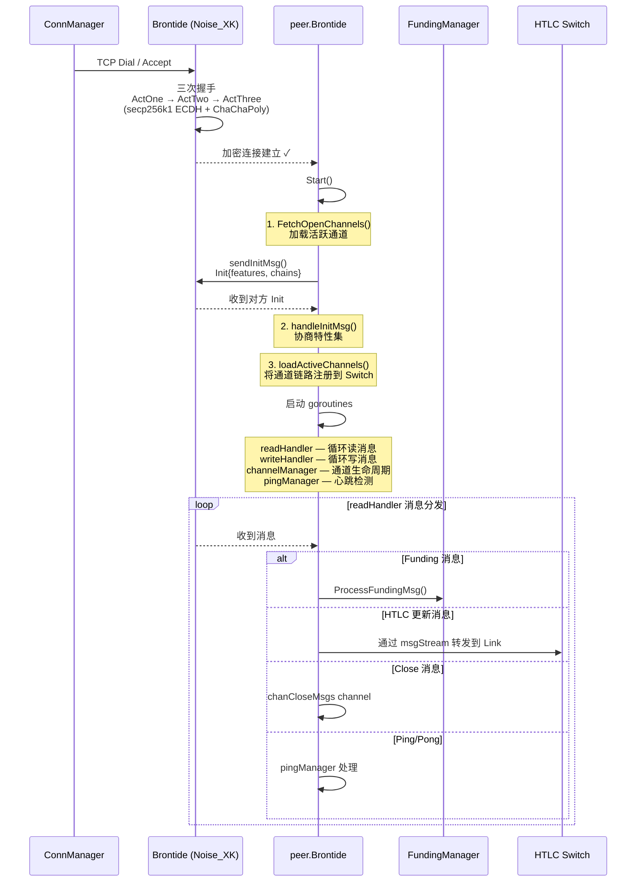
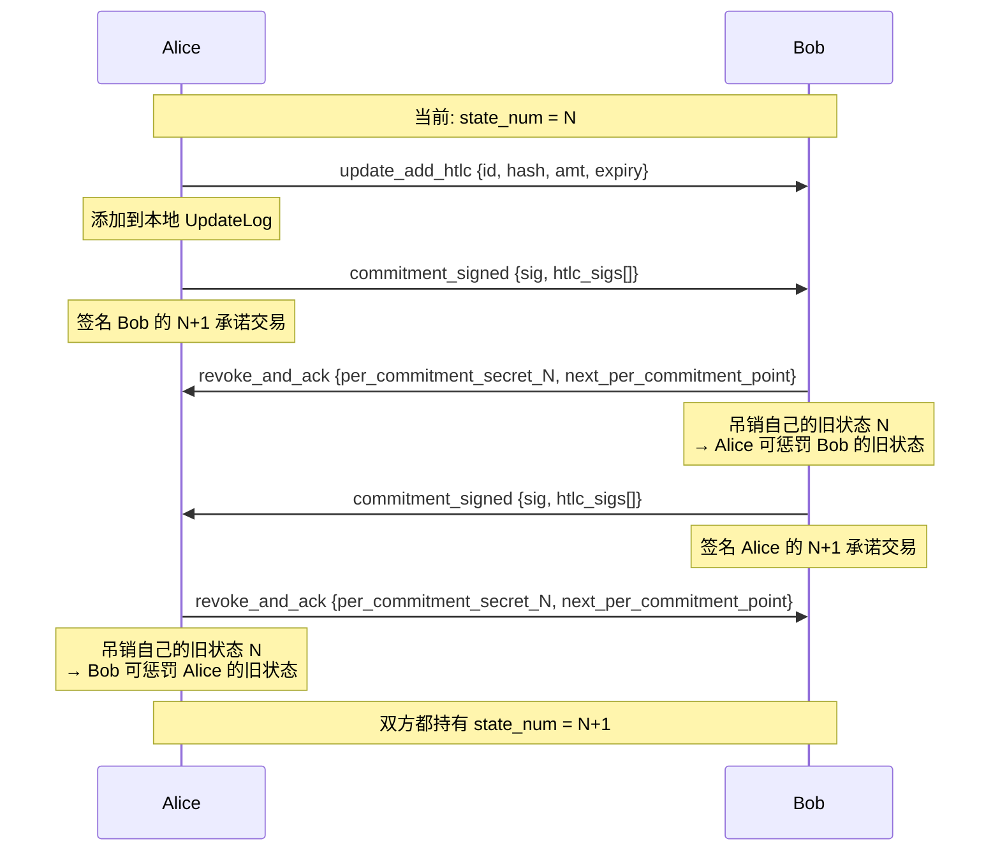
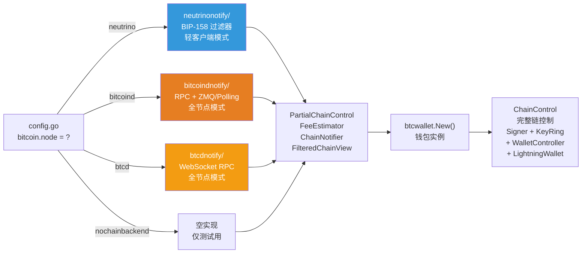

# LND 工程架构与核心流程文档

> Lightning Network Daemon — 比特币闪电网络节点的完整 Go 实现

---

## 1. 目录结构总览

```
lnd/
├── cmd/lnd/              # lnd 可执行入口
├── cmd/lncli/            # lncli 命令行客户端入口
│
├── ── 核心子系统 ──
├── lnwallet/             # 闪电网络钱包核心 (~58k行): 通道状态机, 承诺交易, 签名
│   ├── btcwallet/        #   btcwallet 实现 WalletController
│   ├── chainfee/         #   费率估算器 (SatPerKWeight)
│   ├── chanfunding/      #   通道资金来源抽象 (coin selection, PSBT)
│   └── chancloser/       #   协作关闭状态机 (RBF coop close)
├── contractcourt/        # 合约仲裁庭 (~34k行): 链上争端解决, HTLC 超时/成功裁决
├── htlcswitch/           # HTLC 交换机 (~38k行): 支付转发, circuit 管理
├── routing/              # 路由引擎 (~35k行): Dijkstra 寻路, Mission Control
├── funding/              # 通道建资协议 (~13k行): 开通道消息协调
├── channeldb/            # 通道数据库 (~54k行): 通道/支付/发票持久化
├── graph/                # 网络图管理 (~42k行): 通道图构建与查询
│   └── db/models/        #   图数据模型 (ChannelEdgeInfo, LightningNode)
├── discovery/            # Gossip 发现 (~20k行): 网络拓扑广播与同步
├── peer/                 # 对等节点管理 (~9k行): Brontide 连接生命周期
├── invoices/             # 发票管理 (~16k行): BOLT-11 发票 CRUD
├── sweep/                # UTXO 清扫器 (~14k行): 强制关闭输出归集
│
├── ── 链交互层 ──
├── chainntnfs/           # 链通知接口: 确认/花费/区块事件订阅
│   ├── bitcoindnotify/   #   bitcoind 实现 (RPC + ZMQ)
│   ├── btcdnotify/       #   btcd 实现 (WebSocket)
│   └── neutrinonotify/   #   neutrino 轻客户端实现 (BIP-158)
├── chainreg/             # 链注册: 网络参数, 链后端初始化入口
├── chainio/              # 区块数据分发 (Blockbeat 机制)
│
├── ── 密码学与脚本 ──
├── input/                # 交易输入脚本 (~14k行): Bitcoin Script 构建, 签名描述符
├── keychain/             # 密钥链: HD 密钥派生 (m/1017'/coinType'/keyFamily'/0/index)
├── brontide/             # 加密传输: BOLT-8 Noise_XK 握手
├── shachain/             # SHA 链: 吊销密钥高效派生
├── aezeed/               # aezeed 密码种子 (助记词)
│
├── ── 协议与编解码 ──
├── lnwire/               # 线协议 (~25k行): BOLT P2P 消息编解码
├── lnrpc/                # gRPC API (~102k行): 对外 RPC + 11 个子服务
│   ├── invoicesrpc/      #   发票子服务
│   ├── routerrpc/        #   路由子服务
│   ├── walletrpc/        #   钱包子服务
│   └── ...               #   signrpc, chainrpc, peersrpc, autopilotrpc 等
├── zpay32/               # BOLT-11 发票 bech32 编解码
├── tlv/                  # TLV 编解码库
├── record/               # TLV 记录类型 (AMP, 自定义记录)
│
├── ── 基础设施 ──
├── kvdb/                 # 键值数据库抽象 (bbolt, etcd, SQL)
├── sqldb/                # SQL 后端 (PostgreSQL, SQLite)
├── lncfg/                # 配置结构定义与验证
├── build/                # 构建配置, 日志级别, 版本
├── fn/                   # 函数式工具库 (Option/Result/Either)
├── signal/               # OS 信号处理
├── clock/                # 可替换时钟接口
├── queue/                # 队列数据结构
├── pool/                 # 读/写缓冲区池
│
├── ── 辅助功能 ──
├── autopilot/            # 自动开通道代理
├── watchtower/           # 瞭望塔 (离线代理惩罚广播)
├── tor/                  # Tor 集成
├── nat/                  # NAT 穿越
├── chanbackup/           # 通道静态备份 (SCB)
├── macaroons/            # Macaroon 认证
├── healthcheck/          # 节点健康检查
├── monitoring/           # Prometheus 监控
├── cluster/              # 集群模式 (etcd leader 选举)
│
├── ── 自定义扩展 ──
├── actor/                # Actor 并发模型框架 (独立 go.mod)
├── onionmessage/         # BOLT-12 洋葱消息
├── protofsm/             # 协议有限状态机框架
│
├── ── 测试 ──
├── itest/                # 集成测试套件 (端到端)
├── lntest/               # 集成测试框架 (NetworkHarness)
├── lnmock/               # Mock 实现
│
├── ── 顶层核心文件 ──
├── config.go             # 主配置结构 + 参数校验
├── config_builder.go     # ImplementationCfg + DatabaseBuilder + ChainControlBuilder
├── lnd.go                # Main() 函数: 完整启动链路
├── server.go             # server struct: ~40 个子系统组装与启动
├── rpcserver.go          # RPC 服务器: ~94 个 RPC 方法
└── log.go                # 日志子系统注册
```

---

## 2. 系统架构图



---

## 3. 启动流程

从二进制启动到服务就绪的完整调用链：

```mermaid
flowchart TD
    A["cmd/lnd/main.go<br/>main()"] --> B["signal.Intercept()<br/>注册 OS 信号"]
    B --> C["lnd.LoadConfig()<br/>解析配置 + 校验"]
    C --> D["cfg.ImplementationConfig()<br/>构建 DatabaseBuilder<br/>+ WalletConfigBuilder<br/>+ ChainControlBuilder"]
    D --> E["lnd.Main()"]

    E --> F["DB.Init()<br/>数据库预初始化"]
    F --> G["NewTLSManager()<br/>TLS 证书管理"]
    G --> H["rpcperms.NewInterceptorChain()<br/>RPC 权限拦截"]
    H --> I["grpc.NewServer()<br/>创建 gRPC 服务"]
    I --> J["newRPCServer()<br/>创建 RPC 服务器壳"]
    J --> K["startGrpcListen()<br/>监听 :10009"]
    K --> L["startRestProxy()<br/>REST 代理 :8080"]

    L --> M["BuildDatabase()<br/>打开所有数据库实例<br/>GraphDB/ChanDB/InvoiceDB/..."]
    M --> N["BuildWalletConfig()"]

    subgraph "钱包解锁"
        N --> N1{"钱包是否存在?"}
        N1 -->|不存在| N2["等待 RPC: InitWallet/GenSeed"]
        N1 -->|已存在| N3["等待 RPC: UnlockWallet"]
        N2 --> N4["创建 aezeed 种子<br/>+ 初始化 btcwallet"]
        N3 --> N4
        N4 --> N5["Macaroon 服务初始化"]
        N5 --> N6["NewPartialChainControl()<br/>按 bitcoin.node 选择后端:<br/>neutrino / bitcoind / btcd"]
    end

    N6 --> O["BuildChainControl()<br/>btcwallet.New()<br/>+ keychain<br/>+ NewLightningWallet()"]

    O --> P["DeriveKey(NodeKey)<br/>派生节点身份密钥"]
    P --> Q["newServer()<br/>创建 ~40 个子系统"]
    Q --> R["rpcServer.addDeps()<br/>注入运行时依赖"]
    R --> S["等待链同步<br/>Wallet.IsSynced()"]

    S --> T["server.Start()<br/>按依赖序启动 ~35 个子系统"]
    T --> U["SetServerActive()<br/>RPC 状态: ServerActive"]
    U --> V["阻塞等待 ShutdownChannel"]

    style A fill:#3498db,color:#fff
    style E fill:#3498db,color:#fff
    style N6 fill:#e67e22,color:#fff
    style O fill:#e67e22,color:#fff
    style Q fill:#e74c3c,color:#fff
    style T fill:#e74c3c,color:#fff
```



### 3.1 子系统启动顺序（server.Start）

```
 1. customMessageServer     — 自定义消息服务
 2. onionMessageServer      — 洋葱消息 (BOLT-12)
 3. sigPool                 — 签名协程池
 4. writePool / readPool    — 读写协程池
 5. cc.ChainNotifier        — 链通知器 ⭐
 6. cc.BestBlockTracker     — 最佳区块追踪
 7. channelNotifier         — 通道变更通知
 8. peerNotifier            — 对等节点通知
 9. htlcNotifier            — HTLC 事件通知
10. towerClientMgr          — 瞭望塔客户端
11. txPublisher             — 交易发布器
12. sweeper                 — UTXO 清扫器 (Blockbeat)
13. utxoNursery             — UTXO 托管
14. breachArbitrator        — 违约仲裁 ⭐
15. fundingMgr              — 资金管理器 ⭐
16. htlcSwitch              — HTLC 交换机 ⭐ (必须在 chainArb 之前)
17. interceptableSwitch     — 可拦截交换
18. chainArb                — 链仲裁器 ⭐ (Blockbeat)
19. graphDB                 — 图数据库
20. graphBuilder            — 图构建器 ⭐
21. chanRouter              — 通道路由器 ⭐
22. authGossiper            — Gossip 认证 ⭐ (依赖 chanRouter)
23. invoices                — 发票注册表 ⭐
24. sphinx                  — 洋葱处理器
25. chanStatusMgr           — 通道状态管理
26. chanEventStore          — 通道事件存储
27. chanSubSwapper          — 通道备份同步
28. connMgr                 — 连接管理器 (最后启动)
29. establishPersistentConnections — 建立持久连接
```

---

## 4. 核心接口定义

### 4.1 ChainNotifier（链通知器）

```go
// chainntnfs/interface.go
type ChainNotifier interface {
    RegisterConfirmationsNtfn(txid *chainhash.Hash, pkScript []byte,
        numConfs, heightHint uint32, opts ...NotifierOption,
    ) (*ConfirmationEvent, error)

    RegisterSpendNtfn(outpoint *wire.OutPoint, pkScript []byte,
        heightHint uint32,
    ) (*SpendEvent, error)

    RegisterBlockEpochNtfn(epoch *BlockEpoch) (*BlockEpochEvent, error)

    Start() error
    Started() bool
    Stop() error
}
```

三种实现：`bitcoindnotify`（RPC+ZMQ）、`btcdnotify`（WebSocket）、`neutrinonotify`（BIP-158 过滤器）。

### 4.2 WalletController（钱包控制器）

```go
// lnwallet/interface.go — ~30+ 方法，核心方法:
type WalletController interface {
    // 余额与地址
    ConfirmedBalance(confs int32, ...) (btcutil.Amount, error)
    NewAddress(addrType AddressType, change bool, ...) (btcutil.Address, error)
    IsOurAddress(a btcutil.Address) bool

    // UTXO 管理
    ListUnspentWitness(minConfs, maxConfs int32, ...) ([]*Utxo, error)
    LeaseOutput(id wtxmgr.LockID, op wire.OutPoint, d time.Duration) (time.Time, []byte, btcutil.Amount, error)
    ReleaseOutput(id wtxmgr.LockID, op wire.OutPoint) error

    // 交易构建
    SendOutputs(outputs []*wire.TxOut, feeRate chainfee.SatPerKWeight, ...) (*wire.MsgTx, error)
    PublishTransaction(tx *wire.MsgTx, label string) error

    // PSBT 工作流
    FundPsbt(packet *psbt.Packet, ...) (int32, error)
    SignPsbt(packet *psbt.Packet) ([]uint32, error)
    FinalizePsbt(packet *psbt.Packet, ...) error

    // 签名
    // ... (完整列表见 lnwallet/interface.go:245-563)
}
```

### 4.3 Signer（签名器）

```go
// input/signer.go
type Signer interface {
    MuSig2Signer  // 7 个 MuSig2 方法

    SignOutputRaw(tx *wire.MsgTx, signDesc *SignDescriptor) (Signature, error)
    ComputeInputScript(tx *wire.MsgTx, signDesc *SignDescriptor) (*Script, error)
}
```

### 4.4 BlockChainIO（区块链查询）

```go
// lnwallet/interface.go
type BlockChainIO interface {
    GetBestBlock() (*chainhash.Hash, int32, error)
    GetUtxo(op *wire.OutPoint, pkScript []byte, heightHint uint32, ...) (*wire.TxOut, error)
    GetBlockHash(blockHeight int64) (*chainhash.Hash, error)
    GetBlock(blockHash *chainhash.Hash) (*wire.MsgBlock, error)
    GetBlockHeader(blockHash *chainhash.Hash) (*wire.BlockHeader, error)
}
```

### 4.5 ChainControl（链控制聚合）

```go
// chainreg/chainregistry.go
type ChainControl struct {
    *PartialChainControl                    // FeeEstimator, ChainNotifier, ChainView, HealthCheck

    ChainIO          lnwallet.BlockChainIO
    Signer           input.Signer
    KeyRing          keychain.SecretKeyRing
    Wc               lnwallet.WalletController
    MsgSigner        lnwallet.MessageSigner
    Wallet           *lnwallet.LightningWallet
    BestBlockTracker chainntnfs.BestBlockTracker
}
```

---

## 5. 核心流程详解

### 5.1 开通道流程



**关键代码位置：**

- 入口: `funding/manager.go` → `InitFundingWorkflow` (L4763)
- 消息调度: `reservationCoordinator` (L1035)
- 状态机: `channelOpeningState` — `markedOpen` → `channelReadySent` → `addedToGraph`

### 5.2 HTLC 支付流程



**关键代码位置：**

- 入口: `routing/router.go` → `SendPayment` (L903) → `sendPayment` (L1263)
- 转发: `htlcswitch/switch.go` → `ForwardPackets` (L678)
- 链路: `htlcswitch/link.go` → `handleDownstreamPkt` (L1685) / `handleUpstreamMsg` (L1789)
- 发票: `invoices/` → `InvoiceRegistry.NotifyExitHopHtlc`

### 5.3 通道关闭流程



**仲裁器状态机：**
`StateDefault` → `StateContractClosed` → `StateWaitingFullResolution` → `StateFullyResolved`

### 5.4 Peer 连接流程



**关键代码位置：**

- 连接: `peer/brontide.go` → `Start()` (L795)
- 消息分发: `readHandler` (L2076) 按类型 switch
- 通道管理: `channelManager` (L2959)

---

## 6. 通道状态机

通道状态机是 LND 最核心的组件，位于 `lnwallet/channel.go`（10185 行）。

### 6.1 承诺交易结构

```
                    Funding TX (2-of-2 multisig)
                            │
                    ┌───────┴───────┐
                    ▼               ▼
              Alice Commit TX    Bob Commit TX
              (Bob 持有签名)     (Alice 持有签名)
                    │               │
            ┌───────┼───────┐       │
            ▼       ▼       ▼       ▼
        to_local  HTLC   to_remote  ...
        (CSV延迟) outputs (立即)
                    │
            ┌───────┴───────┐
            ▼               ▼
      HTLC-Success TX  HTLC-Timeout TX
      (preimage + sig)  (CLTV + sig)
            │               │
            ▼               ▼
         to_local        to_local
         (CSV延迟)       (CSV延迟)
```

### 6.2 状态更新协议



### 6.3 密钥派生体系

```
HD Root (aezeed)
└── m/1017'/coinType'/keyFamily'/0/index
    │
    ├── KeyFamily 0: MultiSig       — 资金输出 2-of-2 密钥
    ├── KeyFamily 1: RevocationBase  — 吊销基点
    ├── KeyFamily 2: HtlcBase        — HTLC 密钥
    ├── KeyFamily 3: PaymentBase     — 支付密钥
    ├── KeyFamily 4: DelayBase       — 延迟密钥
    ├── KeyFamily 5: RevocationRoot  — 吊销树根 (shachain)
    ├── KeyFamily 6: NodeKey         — 节点网络身份
    ├── KeyFamily 7: BaseEncryption  — 加密密钥
    ├── KeyFamily 8: TowerSession    — 瞭望塔会话
    └── KeyFamily 9: TowerID         — 瞭望塔身份
```

---

## 7. 数据库架构

### 7.1 DatabaseInstances

```go
// config_builder.go
type DatabaseInstances struct {
    GraphDB         *graphdb.ChannelGraph    // 网络图 (节点+通道边)
    ChanStateDB     *channeldb.DB            // 通道状态 (OpenChannel, ClosedChannel)
    HeightHintDB    kvdb.Backend             // 区块高度提示缓存
    InvoiceDB       invoices.InvoiceDB       // 发票存储
    PaymentsDB      paymentsdb.DB            // 支付记录
    MacaroonDB      kvdb.Backend             // Macaroon 令牌
    DecayedLogDB    kvdb.Backend             // 重放保护日志
    TowerClientDB   wtclient.DB              // 瞭望塔客户端
    TowerServerDB   watchtower.DB            // 瞭望塔服务端
    WalletDB        btcwallet.LoaderOption   // 钱包数据库
    NativeSQLStore  sqldb.DB                 // 原生 SQL 存储
}
```

### 7.2 核心数据模型

**OpenChannel（活跃通道）** — `channeldb/channel.go`:

```
OpenChannel {
    ChainHash          — 链标识 (32 bytes)
    FundingOutpoint    — 资金交易输出点 (txid:vout)
    ShortChannelID     — 短通道 ID (block:tx:output)
    ChannelType        — 通道类型位掩码
    IsInitiator        — 是否为发起方
    Capacity           — 通道容量 (satoshis)
    LocalChanCfg       — 本地通道配置 (keys, csv_delay, ...)
    RemoteChanCfg      — 远端通道配置
    LocalCommitment    — 本地当前承诺状态
    RemoteCommitment   — 远端当前承诺状态
    RevocationProducer — 吊销密钥生成器 (shachain)
    RevocationStore    — 对方吊销密钥存储
    FundingTxn         — 完整资金交易
}
```

**ChannelEdgeInfo（图边信息）** — `graph/db/models/`:

```
ChannelEdgeInfo {
    ChannelID          — 短通道 ID (uint64)
    ChainHash          — 链标识
    ChannelPoint       — 资金交易输出
    Capacity           — 通道容量
    NodeKey1Bytes      — 节点 1 公钥
    NodeKey2Bytes      — 节点 2 公钥
    BitcoinKey1Bytes   — 节点 1 Bitcoin 签名密钥
    BitcoinKey2Bytes   — 节点 2 Bitcoin 签名密钥
}
```

---

## 8. RPC 服务结构

### 8.1 主服务

`rpcServer` 实现 `lnrpc.LightningServer` 接口，约 **94 个 RPC 方法**，分类：

| 类别 | 方法 | 示例                                                             |
| ---- | ---- | ---------------------------------------------------------------- |
| 钱包 | ~15  | `WalletBalance`, `SendCoins`, `NewAddress`, `ListUnspent`        |
| 通道 | ~12  | `OpenChannel`, `CloseChannel`, `ListChannels`, `PendingChannels` |
| 支付 | ~8   | `SendPaymentSync`, `DecodePayReq`, `ListPayments`                |
| 发票 | ~6   | `AddInvoice`, `LookupInvoice`, `ListInvoices`                    |
| 图   | ~6   | `DescribeGraph`, `GetNodeInfo`, `GetChanInfo`, `QueryRoutes`     |
| 对等 | ~4   | `ConnectPeer`, `ListPeers`, `DisconnectPeer`                     |
| 信息 | ~5   | `GetInfo`, `GetDebugInfo`, `GetRecoveryInfo`                     |
| 消息 | ~4   | `SignMessage`, `VerifyMessage`, `SendCustomMessage`              |
| 其他 | ~34  | `SubscribeChannelEvents`, `SubscribeInvoices`, ...               |

### 8.2 子服务

| 子服务        | 包              | 方法数 | 职责                                |
| ------------- | --------------- | ------ | ----------------------------------- |
| RouterRPC     | `routerrpc`     | ~10    | 支付发送、费率查询、Mission Control |
| WalletKitRPC  | `walletrpc`     | ~20    | 高级钱包操作、PSBT、密钥管理        |
| SignRPC       | `signrpc`       | ~5     | 任意交易签名、MuSig2                |
| InvoicesRPC   | `invoicesrpc`   | ~5     | 扩展发票管理（hold invoices）       |
| ChainRPC      | `chainrpc`      | ~3     | 链上事件订阅                        |
| PeersRPC      | `peersrpc`      | ~2     | 节点公告更新                        |
| NeutrinoRPC   | `neutrinorpc`   | ~3     | Neutrino 轻客户端状态               |
| AutopilotRPC  | `autopilotrpc`  | ~3     | 自动驾驶控制                        |
| WatchtowerRPC | `watchtowerrpc` | ~2     | 瞭望塔服务端                        |
| WtclientRPC   | `wtclientrpc`   | ~5     | 瞭望塔客户端                        |
| DevRPC        | `devrpc`        | ~2     | 开发调试                            |

---

## 9. 链后端选择



网络参数 (`chainreg/chainparams.go`):

| 网络     | chaincfg.Params       | RPC 端口 | CoinType |
| -------- | --------------------- | -------- | -------- |
| mainnet  | `MainNetParams`       | 8334     | 0        |
| testnet3 | `TestNet3Params`      | 18334    | 1        |
| testnet4 | `TestNet4Params`      | 48334    | 1        |
| simnet   | `SimNetParams`        | 18556    | 1        |
| signet   | `SigNetParams`        | 38332    | 1        |
| regtest  | `RegressionNetParams` | 18334    | 1        |

---

## 10. 命令行参数

### 10.1 lnd 守护进程 (config.go)

```toml
[Application Options]
  --lnddir=~/.lnd          # 数据目录
  --listen=:9735           # P2P 监听
  --rpclisten=:10009       # gRPC 监听
  --restlisten=:8080       # REST 监听
  --debuglevel=info        # 日志级别

[Bitcoin]
  bitcoin.mainnet=true     # 网络选择 (mainnet/testnet3/testnet4/regtest/simnet/signet)
  bitcoin.node=bitcoind    # 后端类型 (btcd/bitcoind/neutrino)
  bitcoin.timelockdelta=80 # CLTV delta
  bitcoin.basefee=1000     # 基础费率 (msat)
  bitcoin.feerate=1        # 比例费率 (ppm)

[Bitcoind]
  bitcoind.rpchost=localhost:8332
  bitcoind.rpcuser=xxx
  bitcoind.rpcpass=xxx
  bitcoind.zmqpubrawblock=tcp://127.0.0.1:28332
  bitcoind.zmqpubrawtx=tcp://127.0.0.1:28333
```

### 10.2 lncli 客户端 (cmd/commands/main.go)

```bash
lncli --chain=bitcoin --network=mainnet getinfo
#      ^^^^^^           ^^^^^^^^
#      链选择            网络选择

# 已有参数:
#   --chain, -c    链名称 (默认 "bitcoin"), 环境变量 LNCLI_CHAIN
#   --network, -n  网络 (mainnet/testnet/testnet4/regtest/simnet/signet), 环境变量 LNCLI_NETWORK
#   --rpcserver    gRPC 服务地址
#   --lnddir       LND 数据目录
#   --macaroonpath macaroon 文件路径
```

macaroon 路径格式: `~/.lnd/data/chain/<chain>/<network>/admin.macaroon`

---

## 11. 核心代码量统计

| 排名 | 包            | 行数       | 说明                 |
| ---- | ------------- | ---------- | -------------------- |
| 1    | lnrpc         | ~102k      | gRPC 定义 + 生成代码 |
| 2    | lnwallet      | ~58k       | 钱包核心 + 状态机    |
| 3    | channeldb     | ~54k       | 数据持久化           |
| 4    | graph         | ~42k       | 网络图管理           |
| 5    | htlcswitch    | ~38k       | HTLC 转发引擎        |
| 6    | routing       | ~35k       | 路由寻路             |
| 7    | contractcourt | ~34k       | 合约仲裁             |
| 8    | lnwire        | ~25k       | 线协议消息           |
| 9    | discovery     | ~20k       | Gossip 协议          |
| 10   | invoices      | ~16k       | 发票管理             |
| —    | **总计**      | **~425k+** | —                    |
