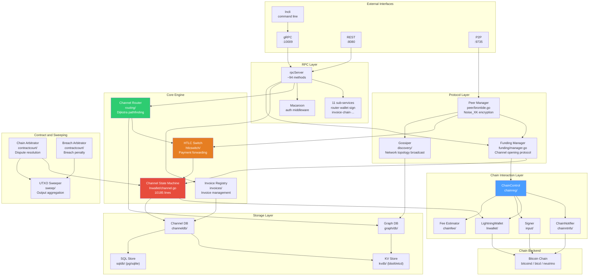
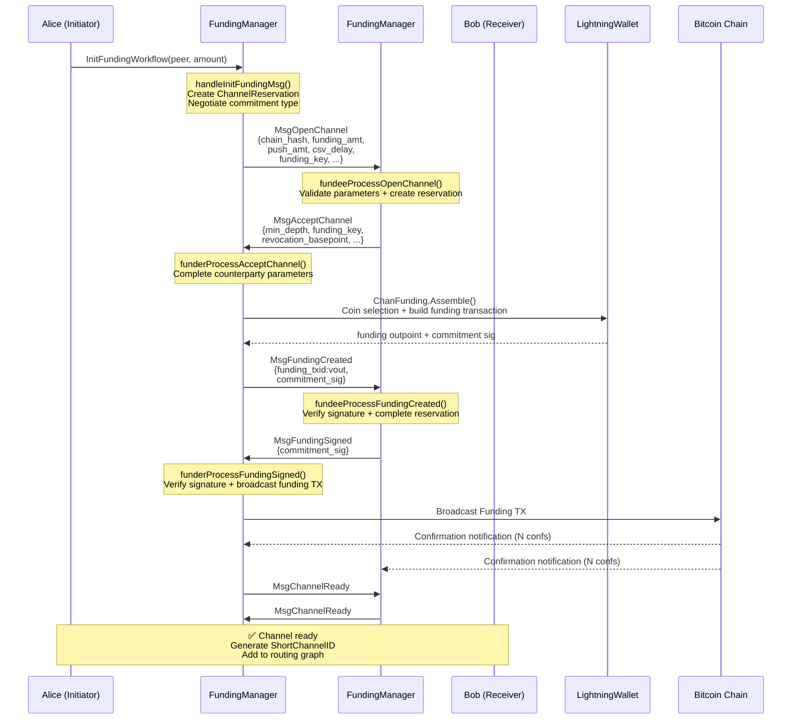
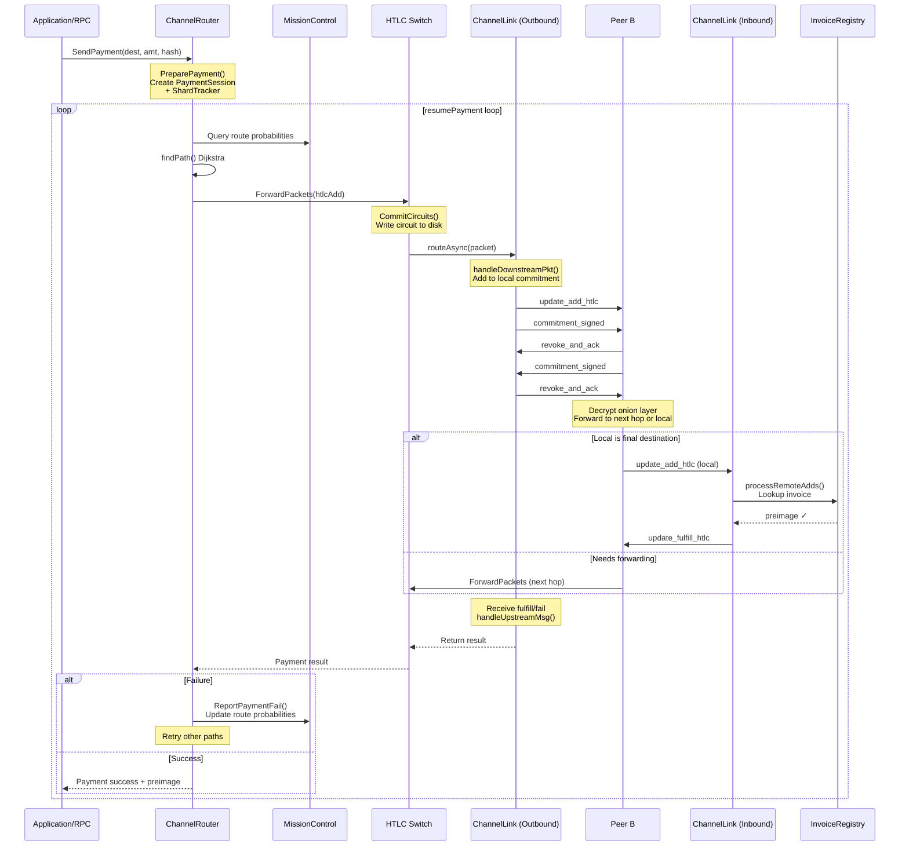
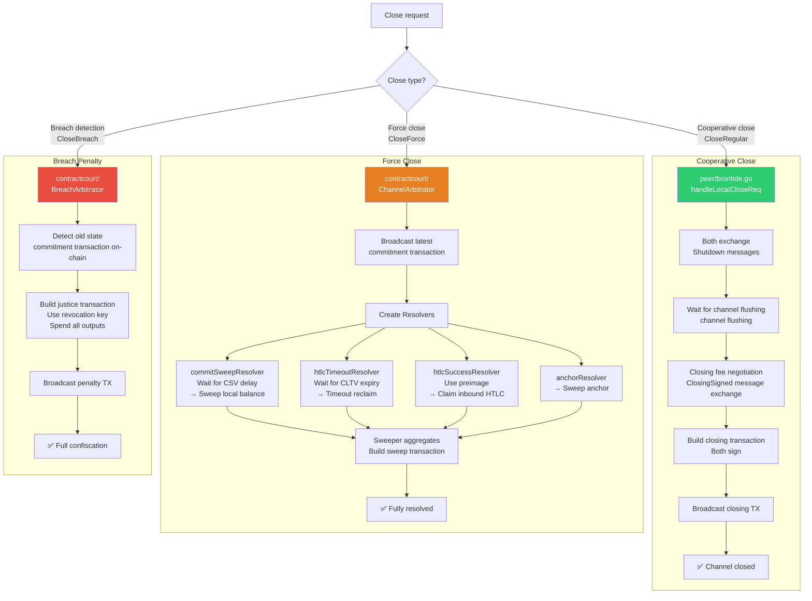
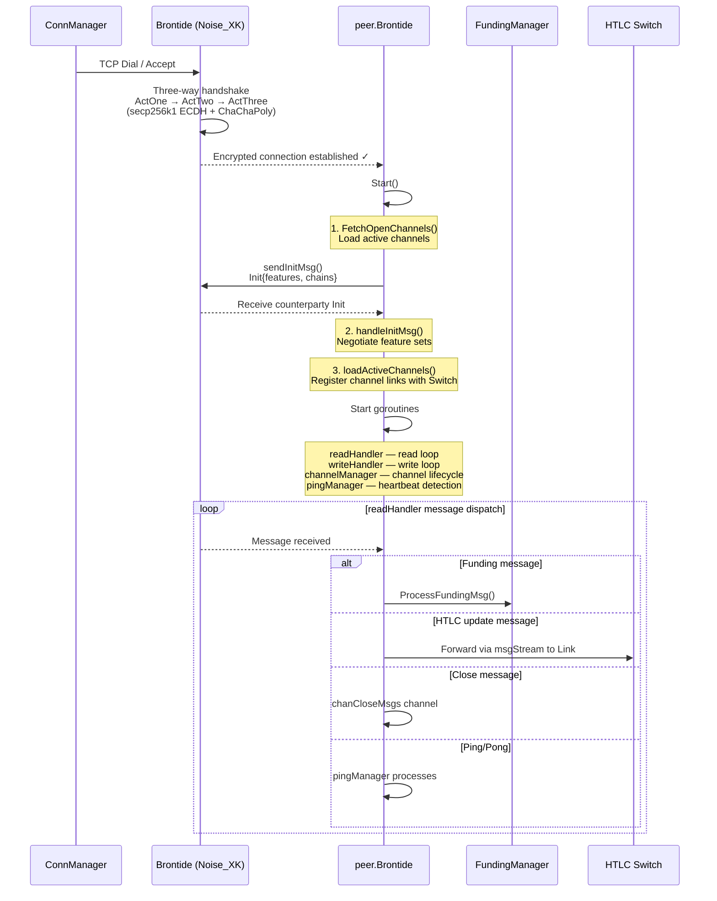
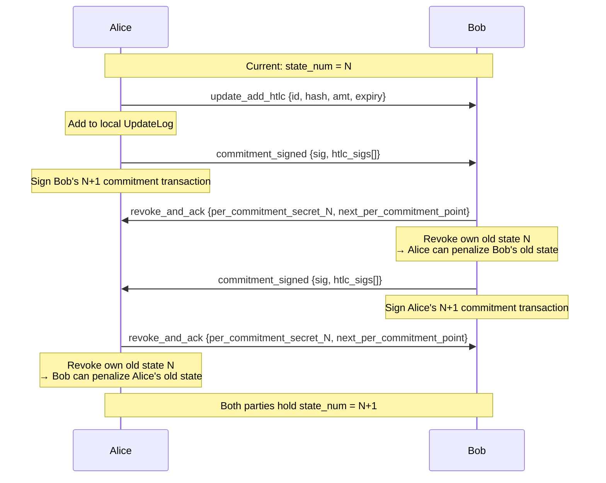
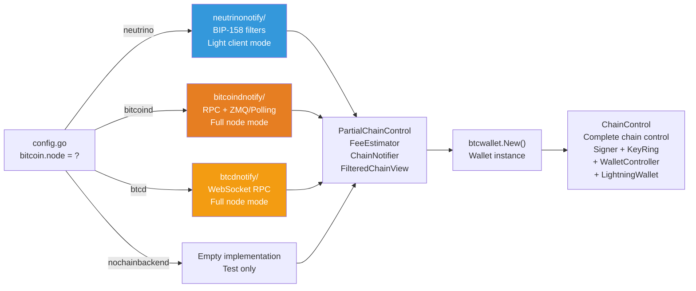

# LND Engineering Architecture and Core Process Documentation

> Lightning Network Daemon — A complete Go implementation of a Bitcoin Lightning Network node

---

## 1. Directory Structure Overview

```
lnd/
├── cmd/lnd/              # lnd executable entry point
├── cmd/lncli/            # lncli command-line client entry point
│
├── ── Core Subsystems ──
├── lnwallet/             # Lightning Network wallet core (~58k lines): channel state machine, commitment transactions, signatures
│   ├── btcwallet/        #   btcwallet implementation of WalletController
│   ├── chainfee/         #   fee estimator (SatPerKWeight)
│   ├── chanfunding/      #   channel funding source abstraction (coin selection, PSBT)
│   └── chancloser/       #   cooperative close state machine (RBF coop close)
├── contractcourt/        # Contract arbitration court (~34k lines): on-chain dispute resolution, HTLC timeout/success adjudication
├── htlcswitch/           # HTLC switch (~38k lines): payment forwarding, circuit management
├── routing/              # Routing engine (~35k lines): Dijkstra pathfinding, Mission Control
├── funding/              # Channel funding protocol (~13k lines): channel opening message coordination
├── channeldb/            # Channel database (~54k lines): channel/payment/invoice persistence
├── graph/                # Network graph management (~42k lines): channel graph construction and queries
│   └── db/models/        #   Graph data models (ChannelEdgeInfo, LightningNode)
├── discovery/            # Gossip discovery (~20k lines): network topology broadcast and synchronization
├── peer/                 # Peer management (~9k lines): Brontide connection lifecycle
├── invoices/             # Invoice management (~16k lines): BOLT-11 invoice CRUD
├── sweep/                # UTXO sweeper (~14k lines): force close output aggregation
│
├── ── Chain Interaction Layer ──
├── chainntnfs/           # Chain notification interfaces: confirmation/spend/block event subscription
│   ├── bitcoindnotify/   #   bitcoind implementation (RPC + ZMQ)
│   ├── btcdnotify/       #   btcd implementation (WebSocket)
│   └── neutrinonotify/   #   neutrino light client implementation (BIP-158)
├── chainreg/             # Chain registry: network parameters, chain backend initialization entry
├── chainio/              # Block data distribution (Blockbeat mechanism)
│
├── ── Cryptography and Scripts ──
├── input/                # Transaction input scripts (~14k lines): Bitcoin Script construction, signature descriptors
├── keychain/             # Key chain: HD key derivation (m/1017'/coinType'/keyFamily'/0/index)
├── brontide/             # Encrypted transport: BOLT-8 Noise_XK handshake
├── shachain/             # SHA chain: efficient revocation key derivation
├── aezeed/               # aezeed cipher seed (mnemonic)
│
├── ── Protocol and Encoding ──
├── lnwire/               # Wire protocol (~25k lines): BOLT P2P message encoding/decoding
├── lnrpc/                # gRPC API (~102k lines): external RPC + 11 sub-services
│   ├── invoicesrpc/      #   Invoice sub-service
│   ├── routerrpc/        #   Router sub-service
│   ├── walletrpc/        #   Wallet sub-service
│   └── ...               #   signrpc, chainrpc, peersrpc, autopilotrpc, etc.
├── zpay32/               # BOLT-11 invoice bech32 encoding/decoding
├── tlv/                  # TLV encoding/decoding library
├── record/               # TLV record types (AMP, custom records)
│
├── ── Infrastructure ──
├── kvdb/                 # Key-value database abstraction (bbolt, etcd, SQL)
├── sqldb/                # SQL backend (PostgreSQL, SQLite)
├── lncfg/                # Configuration structure definition and validation
├── build/                # Build configuration, log levels, version
├── fn/                   # Functional tools library (Option/Result/Either)
├── signal/               # OS signal handling
├── clock/                # Replaceable clock interface
├── queue/                # Queue data structures
├── pool/                 # Read/write buffer pools
│
├── ── Auxiliary Features ──
├── autopilot/            # Automatic channel opening agent
├── watchtower/           # Watchtower (offline agent for penalty broadcast)
├── tor/                  # Tor integration
├── nat/                  # NAT traversal
├── chanbackup/           # Channel static backup (SCB)
├── macaroons/            # Macaroon authentication
├── healthcheck/          # Node health checks
├── monitoring/           # Prometheus monitoring
├── cluster/              # Cluster mode (etcd leader election)
│
├── ── Custom Extensions ──
├── actor/                # Actor concurrency model framework (separate go.mod)
├── onionmessage/         # BOLT-12 onion messages
├── protofsm/             # Protocol finite state machine framework
│
├── ── Testing ──
├── itest/                # Integration test suite (end-to-end)
├── lntest/               # Integration test framework (NetworkHarness)
├── lnmock/               # Mock implementations
│
├── ── Top-Level Core Files ──
├── config.go             # Main configuration structure + parameter validation
├── config_builder.go     # ImplementationCfg + DatabaseBuilder + ChainControlBuilder
├── lnd.go                # Main() function: complete startup chain
├── server.go             # server struct: ~40 subsystem assembly and startup
├── rpcserver.go          # RPC server: ~94 RPC methods
└── log.go                # Log subsystem registration
```

---

## 2. System Architecture Diagram



---

## 3. Startup Process

Complete call chain from binary startup to service readiness:

```mermaid
flowchart TD
    A["cmd/lnd/main.go<br/>main()"] --> B["signal.Intercept()<br/>Register OS signals"]
    B --> C["lnd.LoadConfig()<br/>Parse config + validation"]
    C --> D["cfg.ImplementationConfig()<br/>Build DatabaseBuilder<br/>+ WalletConfigBuilder<br/>+ ChainControlBuilder"]
    D --> E["lnd.Main()"]

    E --> F["DB.Init()<br/>Database pre-initialization"]
    F --> G["NewTLSManager()<br/>TLS certificate management"]
    G --> H["rpcperms.NewInterceptorChain()<br/>RPC permission interceptor"]
    H --> I["grpc.NewServer()<br/>Create gRPC service"]
    I --> J["newRPCServer()<br/>Create RPC server shell"]
    J --> K["startGrpcListen()<br/>Listen on :10009"]
    K --> L["startRestProxy()<br/>REST proxy :8080"]

    L --> M["BuildDatabase()<br/>Open all database instances<br/>GraphDB/ChanDB/InvoiceDB/..."]
    M --> N["BuildWalletConfig()"]

    subgraph "Wallet Unlock"
        N --> N1{"Wallet exists?"}
        N1 -->|No| N2["Wait for RPC: InitWallet/GenSeed"]
        N1 -->|Exists| N3["Wait for RPC: UnlockWallet"]
        N2 --> N4["Create aezeed seed<br/>+ initialize btcwallet"]
        N3 --> N4
        N4 --> N5["Macaroon service initialization"]
        N5 --> N6["NewPartialChainControl()<br/>Select backend based on bitcoin.node:<br/>neutrino / bitcoind / btcd"]
    end

    N6 --> O["BuildChainControl()<br/>btcwallet.New()<br/>+ keychain<br/>+ NewLightningWallet()"]

    O --> P["DeriveKey(NodeKey)<br/>Derive node identity key"]
    P --> Q["newServer()<br/>Create ~40 subsystems"]
    Q --> R["rpcServer.addDeps()<br/>Inject runtime dependencies"]
    R --> S["Wait for chain sync<br/>Wallet.IsSynced()"]

    S --> T["server.Start()<br/>Start ~35 subsystems in dependency order"]
    T --> U["SetServerActive()<br/>RPC status: ServerActive"]
    U --> V["Block waiting for ShutdownChannel"]

    style A fill:#3498db,color:#fff
    style E fill:#3498db,color:#fff
    style N6 fill:#e67e22,color:#fff
    style O fill:#e67e22,color:#fff
    style Q fill:#e74c3c,color:#fff
    style T fill:#e74c3c,color:#fff
```



### 3.1 Subsystem Startup Order (server.Start)

```
 1. customMessageServer     — Custom message service
 2. onionMessageServer      — Onion messages (BOLT-12)
 3. sigPool                 — Signature goroutine pool
 4. writePool / readPool    — Read/write goroutine pools
 5. cc.ChainNotifier        — Chain notifier ⭐
 6. cc.BestBlockTracker     — Best block tracker
 7. channelNotifier         — Channel change notifications
 8. peerNotifier            — Peer notifications
 9. htlcNotifier            — HTLC event notifications
10. towerClientMgr          — Watchtower client manager
11. txPublisher             — Transaction publisher
12. sweeper                 — UTXO sweeper (Blockbeat)
13. utxoNursery             — UTXO nursery
14. breachArbitrator        — Breach arbitrator ⭐
15. fundingMgr              — Funding manager ⭐
16. htlcSwitch              — HTLC switch ⭐ (must be before chainArb)
17. interceptableSwitch     — Interceptable switch
18. chainArb                — Chain arbitrator ⭐ (Blockbeat)
19. graphDB                 — Graph database
20. graphBuilder            — Graph builder ⭐
21. chanRouter              — Channel router ⭐
22. authGossiper            — Gossip authenticator ⭐ (depends on chanRouter)
23. invoices                — Invoice registry ⭐
24. sphinx                  — Onion processor
25. chanStatusMgr           — Channel status manager
26. chanEventStore          — Channel event store
27. chanSubSwapper          — Channel backup synchronization
28. connMgr                 — Connection manager (started last)
29. establishPersistentConnections — Establish persistent connections
```

---

## 4. Core Interface Definitions

### 4.1 ChainNotifier

```go
// chainntnfs/interface.go
type ChainNotifier interface {
    RegisterConfirmationsNtfn(txid *chainhash.Hash, pkScript []byte,
        numConfs, heightHint uint32, opts ...NotifierOption,
    ) (*ConfirmationEvent, error)

    RegisterSpendNtfn(outpoint *wire.OutPoint, pkScript []byte,
        heightHint uint32,
    ) (*SpendEvent, error)

    RegisterBlockEpochNtfn(epoch *BlockEpoch) (*BlockEpochEvent, error)

    Start() error
    Started() bool
    Stop() error
}
```

Three implementations: `bitcoindnotify` (RPC+ZMQ), `btcdnotify` (WebSocket), `neutrinonotify` (BIP-158 filters).

### 4.2 WalletController

```go
// lnwallet/interface.go — ~30+ methods, core methods:
type WalletController interface {
    // Balance and addresses
    ConfirmedBalance(confs int32, ...) (btcutil.Amount, error)
    NewAddress(addrType AddressType, change bool, ...) (btcutil.Address, error)
    IsOurAddress(a btcutil.Address) bool

    // UTXO management
    ListUnspentWitness(minConfs, maxConfs int32, ...) ([]*Utxo, error)
    LeaseOutput(id wtxmgr.LockID, op wire.OutPoint, d time.Duration) (time.Time, []byte, btcutil.Amount, error)
    ReleaseOutput(id wtxmgr.LockID, op wire.OutPoint) error

    // Transaction building
    SendOutputs(outputs []*wire.TxOut, feeRate chainfee.SatPerKWeight, ...) (*wire.MsgTx, error)
    PublishTransaction(tx *wire.MsgTx, label string) error

    // PSBT workflow
    FundPsbt(packet *psbt.Packet, ...) (int32, error)
    SignPsbt(packet *psbt.Packet) ([]uint32, error)
    FinalizePsbt(packet *psbt.Packet, ...) error

    // Signing
    // ... (full list at lnwallet/interface.go:245-563)
}
```

### 4.3 Signer

```go
// input/signer.go
type Signer interface {
    MuSig2Signer  // 7 MuSig2 methods

    SignOutputRaw(tx *wire.MsgTx, signDesc *SignDescriptor) (Signature, error)
    ComputeInputScript(tx *wire.MsgTx, signDesc *SignDescriptor) (*Script, error)
}
```

### 4.4 BlockChainIO

```go
// lnwallet/interface.go
type BlockChainIO interface {
    GetBestBlock() (*chainhash.Hash, int32, error)
    GetUtxo(op *wire.OutPoint, pkScript []byte, heightHint uint32, ...) (*wire.TxOut, error)
    GetBlockHash(blockHeight int64) (*chainhash.Hash, error)
    GetBlock(blockHash *chainhash.Hash) (*wire.MsgBlock, error)
    GetBlockHeader(blockHash *chainhash.Hash) (*wire.BlockHeader, error)
}
```

### 4.5 ChainControl

```go
// chainreg/chainregistry.go
type ChainControl struct {
    *PartialChainControl                    // FeeEstimator, ChainNotifier, ChainView, HealthCheck

    ChainIO          lnwallet.BlockChainIO
    Signer           input.Signer
    KeyRing          keychain.SecretKeyRing
    Wc               lnwallet.WalletController
    MsgSigner        lnwallet.MessageSigner
    Wallet           *lnwallet.LightningWallet
    BestBlockTracker chainntnfs.BestBlockTracker
}
```

---

## 5. Detailed Core Processes

### 5.1 Channel Opening Process



**Key code locations:**

- Entry: `funding/manager.go` → `InitFundingWorkflow` (L4763)
- Message dispatching: `reservationCoordinator` (L1035)
- State machine: `channelOpeningState` — `markedOpen` → `channelReadySent` → `addedToGraph`

### 5.2 HTLC Payment Process



**Key code locations:**

- Entry: `routing/router.go` → `SendPayment` (L903) → `sendPayment` (L1263)
- Forwarding: `htlcswitch/switch.go` → `ForwardPackets` (L678)
- Link: `htlcswitch/link.go` → `handleDownstreamPkt` (L1685) / `handleUpstreamMsg` (L1789)
- Invoice: `invoices/` → `InvoiceRegistry.NotifyExitHopHtlc`

### 5.3 Channel Closing Process



**Arbitrator state machine:**
`StateDefault` → `StateContractClosed` → `StateWaitingFullResolution` → `StateFullyResolved`

### 5.4 Peer Connection Process



**Key code locations:**

- Connection: `peer/brontide.go` → `Start()` (L795)
- Message dispatch: `readHandler` (L2076) switch by type
- Channel management: `channelManager` (L2959)

---

## 6. Channel State Machine

The channel state machine is LND's most core component, located in `lnwallet/channel.go` (10185 lines).

### 6.1 Commitment Transaction Structure

```
                    Funding TX (2-of-2 multisig)
                            │
                    ┌───────┴───────┐
                    ▼               ▼
              Alice Commit TX    Bob Commit TX
              (Bob holds sig)    (Alice holds sig)
                    │               │
            ┌───────┼───────┐       │
            ▼       ▼       ▼       ▼
        to_local  HTLC   to_remote  ...
        (CSV delay) outputs (immediate)
                    │
            ┌───────┴───────┐
            ▼               ▼
      HTLC-Success TX  HTLC-Timeout TX
      (preimage + sig)  (CLTV + sig)
            │               │
            ▼               ▼
         to_local        to_local
         (CSV delay)     (CSV delay)
```

### 6.2 State Update Protocol



### 6.3 Key Derivation Hierarchy

```
HD Root (aezeed)
└── m/1017'/coinType'/keyFamily'/0/index
    │
    ├── KeyFamily 0: MultiSig       — Funding output 2-of-2 keys
    ├── KeyFamily 1: RevocationBase  — Revocation base point
    ├── KeyFamily 2: HtlcBase        — HTLC keys
    ├── KeyFamily 3: PaymentBase     — Payment keys
    ├── KeyFamily 4: DelayBase       — Delay keys
    ├── KeyFamily 5: RevocationRoot  — Revocation tree root (shachain)
    ├── KeyFamily 6: NodeKey         — Node network identity
    ├── KeyFamily 7: BaseEncryption  — Encryption keys
    ├── KeyFamily 8: TowerSession    — Watchtower session
    └── KeyFamily 9: TowerID         — Watchtower identity
```

---

## 7. Database Architecture

### 7.1 DatabaseInstances

```go
// config_builder.go
type DatabaseInstances struct {
    GraphDB         *graphdb.ChannelGraph    // Network graph (nodes + channel edges)
    ChanStateDB     *channeldb.DB            // Channel state (OpenChannel, ClosedChannel)
    HeightHintDB    kvdb.Backend             // Block height hint cache
    InvoiceDB       invoices.InvoiceDB       // Invoice storage
    PaymentsDB      paymentsdb.DB            // Payment records
    MacaroonDB      kvdb.Backend             // Macaroon tokens
    DecayedLogDB    kvdb.Backend             // Replay protection log
    TowerClientDB   wtclient.DB              // Watchtower client
    TowerServerDB   watchtower.DB            // Watchtower server
    WalletDB        btcwallet.LoaderOption   // Wallet database
    NativeSQLStore  sqldb.DB                 // Native SQL store
}
```

### 7.2 Core Data Models

**OpenChannel (active channel)** — `channeldb/channel.go`:

```
OpenChannel {
    ChainHash          — Chain identifier (32 bytes)
    FundingOutpoint    — Funding transaction output point (txid:vout)
    ShortChannelID     — Short channel ID (block:tx:output)
    ChannelType        — Channel type bitmask
    IsInitiator        — Whether initiator
    Capacity           — Channel capacity (satoshis)
    LocalChanCfg       — Local channel configuration (keys, csv_delay, ...)
    RemoteChanCfg      — Remote channel configuration
    LocalCommitment    — Local current commitment state
    RemoteCommitment   — Remote current commitment state
    RevocationProducer — Revocation key producer (shachain)
    RevocationStore    — Counterparty revocation key store
    FundingTxn         — Full funding transaction
}
```

**ChannelEdgeInfo (graph edge information)** — `graph/db/models/`:

```
ChannelEdgeInfo {
    ChannelID          — Short channel ID (uint64)
    ChainHash          — Chain identifier
    ChannelPoint       — Funding transaction output
    Capacity           — Channel capacity
    NodeKey1Bytes      — Node 1 public key
    NodeKey2Bytes      — Node 2 public key
    BitcoinKey1Bytes   — Node 1 Bitcoin signing key
    BitcoinKey2Bytes   — Node 2 Bitcoin signing key
}
```

---

## 8. RPC Service Structure

### 8.1 Main Service

`rpcServer` implements the `lnrpc.LightningServer` interface, with approximately **94 RPC methods**, categorized as:

| Category | Methods | Examples                                                          |
| -------- | ------- | ----------------------------------------------------------------- |
| Wallet   | ~15     | `WalletBalance`, `SendCoins`, `NewAddress`, `ListUnspent`        |
| Channel  | ~12     | `OpenChannel`, `CloseChannel`, `ListChannels`, `PendingChannels` |
| Payment  | ~8      | `SendPaymentSync`, `DecodePayReq`, `ListPayments`                |
| Invoice  | ~6      | `AddInvoice`, `LookupInvoice`, `ListInvoices`                    |
| Graph    | ~6      | `DescribeGraph`, `GetNodeInfo`, `GetChanInfo`, `QueryRoutes`     |
| Peer     | ~4      | `ConnectPeer`, `ListPeers`, `DisconnectPeer`                     |
| Info     | ~5      | `GetInfo`, `GetDebugInfo`, `GetRecoveryInfo`                     |
| Message  | ~4      | `SignMessage`, `VerifyMessage`, `SendCustomMessage`              |
| Other    | ~34     | `SubscribeChannelEvents`, `SubscribeInvoices`, ...                |

### 8.2 Sub-services

| Sub-service   | Package           | Methods | Responsibility                             |
| ------------- | ----------------- | ------- | ------------------------------------------ |
| RouterRPC     | `routerrpc`       | ~10     | Payment sending, fee queries, Mission Control |
| WalletKitRPC  | `walletrpc`       | ~20     | Advanced wallet ops, PSBT, key management  |
| SignRPC       | `signrpc`         | ~5      | Arbitrary transaction signing, MuSig2      |
| InvoicesRPC   | `invoicesrpc`     | ~5      | Extended invoice management (hold invoices)|
| ChainRPC      | `chainrpc`        | ~3      | On-chain event subscription                 |
| PeersRPC      | `peersrpc`        | ~2      | Node announcement updates                  |
| NeutrinoRPC   | `neutrinorpc`     | ~3      | Neutrino light client status               |
| AutopilotRPC  | `autopilotrpc`    | ~3      | Autopilot control                          |
| WatchtowerRPC | `watchtowerrpc`   | ~2      | Watchtower server                          |
| WtclientRPC   | `wtclientrpc`     | ~5      | Watchtower client                          |
| DevRPC        | `devrpc`          | ~2      | Development debugging                      |

---

## 9. Chain Backend Selection



Network parameters (`chainreg/chainparams.go`):

| Network   | chaincfg.Params       | RPC Port | CoinType |
| --------- | --------------------- | -------- | -------- |
| mainnet   | `MainNetParams`       | 8334     | 0        |
| testnet3  | `TestNet3Params`      | 18334    | 1        |
| testnet4  | `TestNet4Params`      | 48334    | 1        |
| simnet    | `SimNetParams`        | 18556    | 1        |
| signet    | `SigNetParams`        | 38332    | 1        |
| regtest   | `RegressionNetParams` | 18334    | 1        |

---

## 10. Command Line Parameters

### 10.1 lnd Daemon (config.go)

```toml
[Application Options]
  --lnddir=~/.lnd          # Data directory
  --listen=:9735           # P2P listen
  --rpclisten=:10009       # gRPC listen
  --restlisten=:8080       # REST listen
  --debuglevel=info        # Log level

[Bitcoin]
  bitcoin.mainnet=true     # Network selection (mainnet/testnet3/testnet4/regtest/simnet/signet)
  bitcoin.node=bitcoind    # Backend type (btcd/bitcoind/neutrino)
  bitcoin.timelockdelta=80 # CLTV delta
  bitcoin.basefee=1000     # Base fee (msat)
  bitcoin.feerate=1        # Proportional fee (ppm)

[Bitcoind]
  bitcoind.rpchost=localhost:8332
  bitcoind.rpcuser=xxx
  bitcoind.rpcpass=xxx
  bitcoind.zmqpubrawblock=tcp://127.0.0.1:28332
  bitcoind.zmqpubrawtx=tcp://127.0.0.1:28333
```

### 10.2 lncli Client (cmd/commands/main.go)

```bash
lncli --chain=bitcoin --network=mainnet getinfo
#      ^^^^^^           ^^^^^^^^
#      chain selection   network selection

# Existing parameters:
#   --chain, -c    Chain name (default "bitcoin"), environment variable LNCLI_CHAIN
#   --network, -n  Network (mainnet/testnet/testnet4/regtest/simnet/signet), environment variable LNCLI_NETWORK
#   --rpcserver    gRPC server address
#   --lnddir       LND data directory
#   --macaroonpath macaroon file path
```

Macaroon path format: `~/.lnd/data/chain/<chain>/<network>/admin.macaroon`

---

## 11. Core Code Statistics

| Rank | Package        | Lines      | Description                |
| ---- | -------------- | ---------- | -------------------------- |
| 1    | lnrpc          | ~102k      | gRPC definitions + generated code |
| 2    | lnwallet       | ~58k       | Wallet core + state machine |
| 3    | channeldb      | ~54k       | Data persistence            |
| 4    | graph          | ~42k       | Network graph management    |
| 5    | htlcswitch     | ~38k       | HTLC forwarding engine      |
| 6    | routing        | ~35k       | Route finding               |
| 7    | contractcourt  | ~34k       | Contract arbitration        |
| 8    | lnwire         | ~25k       | Wire protocol messages      |
| 9    | discovery      | ~20k       | Gossip protocol             |
| 10   | invoices       | ~16k       | Invoice management          |
| —    | **Total**      | **~425k+** | —                           |