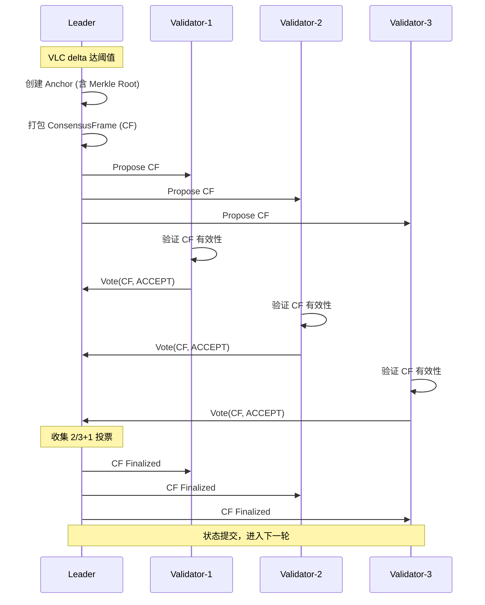

# Setu 架构与技术说明文档

## 1. 项目概述

**Setu** 是 Hetu Project 下一代高性能分布式共识网络，设计目标为高吞吐量、低延迟的交易处理系统。项目融合了以下核心技术：

- **DAG-BFT 共识**：基于有向无环图的拜占庭容错共识协议
- **VLC 混合时钟**：向量逻辑时钟实现分布式事件因果排序
- **TEE 可信执行**：基于 AWS Nitro Enclaves 的安全计算环境
- **对象账户模型**：类似 Sui 的面向对象状态管理
- **Merkle 状态承诺**：Binary + Sparse Merkle Trees 实现可验证状态

---

## 2. 系统架构总览

```
┌─────────────────────────────────────────────────────────────────────────────┐
│                              Setu Network                                   │
├─────────────────────────────────┬───────────────────────────────────────────┤
│         Validator Nodes         │           Solver Nodes                    │
│                                 │                                           │
│  ┌──────────────────────────┐   │   ┌──────────────────────────┐            │
│  │    ConsensusEngine       │   │   │      TeeExecutor         │            │
│  │  ┌────────┐ ┌─────────┐  │   │   │                          │            │
│  │  │  DAG   │ │   VLC   │  │   │   │  ┌────────────────────┐  │            │
│  │  └────────┘ └─────────┘  │   │   │  │   EnclaveRuntime   │  │            │
│  │  ┌────────────────────┐  │   │   │  │  (Mock / Nitro)    │  │            │
│  │  │  ValidatorSet      │  │   │   │  └────────────────────┘  │            │
│  │  │  (Leader Election) │  │   │   │                          │            │
│  │  └────────────────────┘  │   │   └──────────────────────────┘            │
│  │  ┌────────────────────┐  │   │                                           │
│  │  │   AnchorBuilder    │  │   │   ┌──────────────────────────┐            │
│  │  │  (Merkle Roots)    │  │   │   │   SolverNetworkClient    │            │
│  │  └────────────────────┘  │   │   └──────────────────────────┘            │
│  └──────────────────────────┘   │                                           │
│                                 │                                           │
│  ┌──────────────────────────┐   │                                           │
│  │  GlobalStateManager      │   │                                           │
│  │  (Sparse Merkle Trees)   │   │                                           │
│  └──────────────────────────┘   │                                           │
├─────────────────────────────────┴───────────────────────────────────────────┤
│                           P2P Network (Anemo/QUIC)                          │
└─────────────────────────────────────────────────────────────────────────────┘
```

### 2.1 节点类型

| 节点类型      | 职责                                           | 数量(MVP) |
| ------------- | ---------------------------------------------- | --------- |
| **Validator** | 验证协调节点：验证事件、维护 DAG、参与共识投票 | 7         |
| **Solver**    | TEE 执行节点：执行交易、生成证明、状态转换     | 21        |

---

## 3. 核心组件详解

### 3.1 Consensus Engine（共识引擎）

共识引擎是系统的核心协调器，整合 DAG、VLC 和投票机制。

```
┌─────────────────────────────────────────────────────────────┐
│                     ConsensusEngine                          │
│  ┌──────────────┐  ┌──────────────┐  ┌──────────────┐      │
│  │     DAG      │  │     VLC      │  │ ValidatorSet │      │
│  └──────────────┘  └──────────────┘  └──────┬───────┘      │
│                                              │               │
│                                    ┌─────────▼─────────┐    │
│                                    │  ProposerElection │    │
│                                    │  (RotatingProposer│    │
│                                    │   or Reputation)  │    │
│                                    └───────────────────┘    │
│  ┌──────────────────────────────────────────────────┐      │
│  │              ConsensusManager (Folder)            │      │
│  │  - Creates CFs when VLC delta reaches threshold   │      │
│  │  - Manages voting and finalization               │      │
│  └──────────────────────────────────────────────────┘      │
└─────────────────────────────────────────────────────────────┘
```

**核心职责**：

- 接收 Solver 提交的事件（附带 TEE 执行证明）
- 维护 VLC 时钟同步
- 执行 Leader 选举（轮转/声誉）
- 当 VLC delta 达阈值时触发 Anchor 创建
- 管理 ConsensusFrame 投票与最终确定

### 3.2 DAG Manager（DAG 管理器）

采用三层存储架构：DAG → Cache → Store

```
┌─────────────────────────────────────────┐
│              DagManager                  │
├─────────────────────────────────────────┤
│  ┌─────────────────────────────────┐   │
│  │  DAG (In-Memory)                │   │  ← 热数据，快速访问
│  │  - 事件依赖图                    │   │
│  │  - 拓扑排序                      │   │
│  └─────────────────────────────────┘   │
│  ┌─────────────────────────────────┐   │
│  │  RecentEventCache               │   │  ← 最近事件缓存
│  │  - 快速查询最近 N 个事件         │   │
│  │  - 支持 depth 索引               │   │
│  └─────────────────────────────────┘   │
│  ┌─────────────────────────────────┐   │
│  │  EventStore (Persistent)        │   │  ← 持久化存储
│  │  - RocksDB / Memory             │   │
│  │  - 支持历史查询                  │   │
│  └─────────────────────────────────┘   │
└─────────────────────────────────────────┘
```

### 3.3 Validator Node（验证节点）

```
┌─────────────────────────────────────────┐
│              Validator                   │
├─────────────────────────────────────────┤
│  ┌─────────────────────────────────┐   │
│  │  Verifier                        │   │
│  │  - Quick check（格式/签名）       │   │
│  │  - VLC verification（时钟验证）   │   │
│  │  - TEE proof verification        │   │
│  │  - Parent verification（父事件） │   │
│  └─────────────────────────────────┘   │
│  ┌─────────────────────────────────┐   │
│  │  DAG Manager                     │   │
│  │  - Add events to DAG             │   │
│  │  - Maintain topological order    │   │
│  │  - Track event dependencies      │   │
│  └─────────────────────────────────┘   │
│  ┌─────────────────────────────────┐   │
│  │  Sampling Verifier               │   │
│  │  - Probabilistic re-execution    │   │
│  │  - Fraud detection               │   │
│  └─────────────────────────────────┘   │
│  ┌─────────────────────────────────┐   │
│  │  Router (setu-router-core)       │   │
│  │  - Route transfers to Solvers    │   │
│  │  - Load balancing                │   │
│  └─────────────────────────────────┘   │
└─────────────────────────────────────────┘
```

### 3.4 Solver Node（执行节点）

```
┌─────────────────────────────────────────┐
│                Solver                    │
├─────────────────────────────────────────┤
│  ┌─────────────────────────────────┐   │
│  │  Dependency Tracker              │   │
│  │  - Find parent events            │   │
│  │  - Build dependency graph        │   │
│  │  - Track resource conflicts      │   │
│  └─────────────────────────────────┘   │
│  ┌─────────────────────────────────┐   │
│  │  Executor (RuntimeExecutor)      │   │
│  │  - Execute transfers             │   │
│  │  - Apply state changes           │   │
│  │  - Generate execution result     │   │
│  └─────────────────────────────────┘   │
│  ┌─────────────────────────────────┐   │
│  │  TEE Environment                 │   │
│  │  - Secure execution (Nitro)      │   │
│  │  - Generate attestation          │   │
│  │  - Proof generation              │   │
│  └─────────────────────────────────┘   │
│  ┌─────────────────────────────────┐   │
│  │  VLC Manager                     │   │
│  │  - Update logical clock          │   │
│  │  - Create VLC snapshots          │   │
│  └─────────────────────────────────┘   │
└─────────────────────────────────────────┘
```

**Solver 执行流程**：

```
1. Receive Transfer
       ↓
2. Find Dependencies (parent events)
       ↓
3. Execute in TEE (optional)
       ↓
4. Apply State Changes
       ↓
5. Generate TEE Proof
       ↓
6. Update VLC
       ↓
7. Create Event
       ↓
8. Send to Validator
```

### 3.5 TEE Enclave（可信执行环境）

```
┌─────────────────────────────────────────────────────────────────────────┐
│                          Setu Enclave                                   │
├─────────────────────────────────────────────────────────────────────────┤
│  ┌─────────────────────────────────────────────────────────────────┐   │
│  │                     EnclaveRuntime Trait                         │   │
│  │  • execute_stf()     - 运行无状态转换函数 (STF)                  │   │
│  │  • generate_attestation() - 创建 TEE 证明                       │   │
│  │  • verify_attestation()   - 验证证明 (for validators)           │   │
│  └─────────────────────────────────────────────────────────────────┘   │
│                              │                                         │
│              ┌───────────────┼───────────────┐                         │
│              ▼                               ▼                         │
│  ┌───────────────────────┐      ┌───────────────────────┐             │
│  │     MockEnclave       │      │    NitroEnclave       │             │
│  │   (开发/测试模式)      │      │   (生产模式)           │             │
│  │                       │      │                       │             │
│  │  • 无真实 TEE         │      │  • AWS Nitro TEE      │             │
│  │  • 模拟证明           │      │  • 真实 attestation   │             │
│  │  • 快速执行           │      │  • PCR 度量           │             │
│  └───────────────────────┘      └───────────────────────┘             │
└─────────────────────────────────────────────────────────────────────────┘
```

**无状态转换函数 (STF)**：

```
STF: (pre_state_root, events) → (post_state_root, state_diff, attestation)
```

### 3.6 Setu Runtime（运行时）

当前为轻量级实现，为未来 Move VM 集成做准备：

```
Validator → Solver → Runtime → State Store
```

**支持的交易类型**：

| 类型         | 说明                                          |
| ------------ | --------------------------------------------- |
| **Transfer** | 全量转账（所有权转移）/ 部分转账（拆分 Coin） |
| **Query**    | 余额查询 / 对象查询 / 所有权对象列表          |

**状态变更追踪**：

```rust
pub struct StateChange {
    pub change_type: StateChangeType, // Create/Update/Delete
    pub object_id: ObjectId,
    pub old_state: Option<Vec<u8>>,   // 序列化旧状态
    pub new_state: Option<Vec<u8>>,   // 序列化新状态
}
```

### 3.7 Merkle 状态树

采用 **BLAKE3** 哈希算法，性能提升显著：

| 指标           | SHA256    | BLAKE3    | 提升    |
| -------------- | --------- | --------- | ------- |
| 小数据 (< 1KB) | ~400 MB/s | ~1.2 GB/s | **3x**  |
| 大数据 (SIMD)  | ~400 MB/s | ~8+ GB/s  | **20x** |

**树结构**：

- **Sparse Merkle Tree (SMT)**: 256-bit 键空间，对象状态存储
- **Incremental SMT**: O(log N) 更新复杂度
- **Binary Merkle Tree**: 事件列表承诺
- **Subnet Aggregation Tree**: 聚合所有子网状态根

---

## 4. 共识流程详解

### 4.1 总体流程

```
1. Event Submission（事件提交）
   Client → Validator → TaskPreparer → SolverTask

2. TEE Execution（TEE 执行）
   SolverTask → Solver → TEE (EnclaveRuntime) → TeeExecutionResult

3. Event Verification（事件验证）
   TeeExecutionResult → Validator → TeeVerifier → Event added to DAG

4. DAG Folding / Anchor Creation（DAG 折叠 / Anchor 创建）
   VLC delta threshold reached → AnchorBuilder → Anchor with Merkle roots

5. Consensus Finalization（共识最终确定）
   ConsensusFrame proposal → Explicit voting (quorum 2/3+1) → CF finalized → State committed
```

### 4.2 关键概念

| 概念                    | 说明                             |
| ----------------------- | -------------------------------- |
| **Event**               | 原子状态变更单元，附带 TEE 证明  |
| **Anchor**              | 检查点，包含事件集合和 Merkle 根 |
| **ConsensusFrame (CF)** | 共识投票单元                     |
| **VLC**                 | 向量逻辑时钟，用于因果排序       |

### 4.3 VLC（向量逻辑时钟）

VLC 融合三种时间概念：

- **Vector Clock**: 捕获分布式事件因果关系
- **Logical Time**: 单调递增逻辑时间戳
- **Physical Time**: 物理时钟（辅助调试监控）

```rust
// VLC 主要操作
vc.increment("node1");           // 本地事件递增
vc.merge(&other_vc);             // 合并远程时钟
vc.happens_before(&other_vc);    // 判断因果关系
vc.is_concurrent(&other_vc);     // 判断并发
```

### 4.4 共识投票流程



---

## 5. 数据类型定义

### 5.1 核心类型

```rust
// Event（事件）
pub struct Event {
    pub id: EventId,
    pub event_type: EventType,
    pub payload: EventPayload,
    pub status: EventStatus,
    pub vlc: VLCSnapshot,
    pub parents: Vec<EventId>,
    pub execution_result: Option<ExecutionResult>,
}

// Anchor（锚点/检查点）
pub struct Anchor {
    pub id: AnchorId,
    pub events: Vec<EventId>,
    pub merkle_roots: AnchorMerkleRoots,
    pub vlc_snapshot: VLCSnapshot,
}

// ConsensusFrame（共识帧）
pub struct ConsensusFrame {
    pub id: CFId,
    pub anchor: Anchor,
    pub status: CFStatus,
    pub votes: Vec<Vote>,
}

// Object（对象）
pub struct Object {
    pub id: ObjectId,
    pub object_type: ObjectType,
    pub ownership: Ownership,
    pub metadata: ObjectMetadata,
    pub data: Vec<u8>,
}

// Coin（代币对象）
pub struct Coin {
    pub id: ObjectId,
    pub owner: Address,
    pub coin_type: CoinType,
    pub balance: Balance,
    pub state: CoinState,
}
```

### 5.2 对象模型

Setu 采用 **面向对象账户模型**（类似 Sui）：

| 对象类型          | 说明                  |
| ----------------- | --------------------- |
| **Coin**          | 可转账资产            |
| **Profile**       | 用户身份档案          |
| **Credential**    | 凭证（KYC/会员/成就） |
| **RelationGraph** | 社交关系图            |

```rust
// 对象所有权
pub enum Ownership {
    AddressOwned(Address),      // 地址拥有
    ObjectOwned(ObjectId),      // 对象拥有
    Shared,                     // 共享对象
    Immutable,                  // 不可变对象
}
```

---

## 6. 项目结构

```
Setu/
├── consensus/              # DAG-BFT 共识实现
│   ├── dag.rs             # DAG 数据结构
│   ├── engine.rs          # 主共识引擎
│   ├── anchor_builder.rs  # Anchor 创建（含 Merkle 树）
│   ├── folder.rs          # ConsensusManager (CF 管理)
│   ├── vlc.rs             # VLC 集成
│   └── liveness/          # 活性检测
│
├── types/                  # 核心类型定义
│   ├── event.rs           # Event, EventId, EventStatus
│   ├── consensus.rs       # Anchor, ConsensusFrame, Vote
│   ├── object.rs          # Object 模型 (Coin, Profile, etc.)
│   └── merkle.rs          # Merkle 树类型
│
├── storage/                # 存储层
│   ├── memory/            # 内存实现 (DashMap)
│   ├── rocks/             # RocksDB 持久化
│   └── state/             # GlobalStateManager, StateProvider
│
├── crates/
│   ├── setu-vlc/          # VLC 混合逻辑时钟库
│   ├── setu-merkle/       # Merkle 树 (Binary + Sparse)
│   ├── setu-keys/         # 密钥管理
│   ├── setu-enclave/      # TEE 抽象层 (Mock + Nitro)
│   ├── setu-network-anemo/# Anemo P2P 网络
│   ├── setu-transport/    # HTTP/WS/gRPC 传输层
│   ├── setu-protocol/     # 协议消息定义
│   ├── setu-runtime/      # 运行时执行环境
│   ├── setu-router-core/  # 路由核心逻辑
│   └── setu-core/         # 共享核心工具
│
├── setu-validator/         # Validator 节点二进制
├── setu-solver/            # Solver 节点二进制
├── setu-cli/               # CLI 工具
├── setu-rpc/               # RPC 层
├── setu-benchmark/         # TPS 基准测试工具
│
├── api/                    # HTTP API 层
├── docker/                 # Docker 部署配置
├── scripts/                # 部署和测试脚本
└── docs/                   # 设计文档
```

---

## 7. 技术栈

| 领域       | 技术选型                        |
| ---------- | ------------------------------- |
| **语言**   | Rust 1.75+ (2021 edition)       |
| **共识**   | DAG-BFT + VLC                   |
| **网络**   | Anemo (基于 QUIC)               |
| **存储**   | RocksDB / PostgreSQL            |
| **哈希**   | BLAKE3 (128-bit security)       |
| **签名**   | Ed25519 / secp256k1 / Secp256r1 |
| **TEE**    | AWS Nitro Enclaves              |
| **序列化** | bincode / serde                 |

---

## 8. 配置参数

### 8.1 Validator 配置

| 变量                  | 默认值        | 说明          |
| --------------------- | ------------- | ------------- |
| `VALIDATOR_ID`        | `validator-1` | 唯一标识符    |
| `VALIDATOR_HTTP_PORT` | `8080`        | HTTP API 端口 |
| `VALIDATOR_P2P_PORT`  | `9000`        | P2P 网络端口  |
| `VALIDATOR_DB_PATH`   | (memory)      | RocksDB 路径  |
| `VALIDATOR_KEY_FILE`  | -             | 密钥文件路径  |

### 8.2 Solver 配置

| 变量                | 默认值          | 说明           |
| ------------------- | --------------- | -------------- |
| `SOLVER_ID`         | `solver-{uuid}` | 唯一标识符     |
| `SOLVER_PORT`       | `9001`          | 监听端口       |
| `SOLVER_CAPACITY`   | `100`           | 最大并发任务数 |
| `VALIDATOR_ADDRESS` | `127.0.0.1`     | Validator 地址 |
| `AUTO_REGISTER`     | `true`          | 启动时自动注册 |

### 8.3 共识配置

| 参数                  | 默认值 | 说明                 |
| --------------------- | ------ | -------------------- |
| `vlc_delta_threshold` | `10`   | 触发折叠的 VLC delta |
| `min_events_per_cf`   | `1`    | 每 CF 最小事件数     |
| `max_events_per_cf`   | `1000` | 每 CF 最大事件数     |
| `vote_timeout_ms`     | `5000` | 投票超时(毫秒)       |

---

## 9. API 接口

### 9.1 HTTP 端点

| 端点                        | 方法 | 说明        |
| --------------------------- | ---- | ----------- |
| `/health`                   | GET  | 健康检查    |
| `/api/v1/transfer`          | POST | 提交转账    |
| `/api/v1/balance/{address}` | GET  | 查询余额    |
| `/api/v1/object/{id}`       | GET  | 查询对象    |
| `/api/v1/events`            | GET  | 列出事件    |
| `/api/v1/register/solver`   | POST | 注册 Solver |

### 9.2 RPC 服务

- **ConsensusService**: 事件提交、CF 提议、投票
- **SyncService**: Validator 间事件/CF 同步
- **DiscoveryService**: 节点发现与管理

---

## 10. 性能指标

### 10.1 目标性能 (MVP)

| 指标       | 目标值            | 说明             |
| ---------- | ----------------- | ---------------- |
| TPS        | 200,000 - 300,000 | DAG-BFT 共识     |
| 延迟       | 50 - 100ms        | 端到端确认       |
| Validators | 7                 | BFT 共识法定人数 |
| Solvers    | 21                | 水平扩展         |

### 10.2 基准测试结果

启用 BLAKE3 优化后（单 Validator + 单 Solver）：

| 指标     | 优化前 (SHA256) | 优化后 (BLAKE3) | 提升       |
| -------- | --------------- | --------------- | ---------- |
| TPS      | 10,714          | 14,634          | **+36.6%** |
| P99 延迟 | 23.70ms         | 16.56ms         | **-30%**   |

---

## 11. 与 LND 闪电网络集成

Setu 设计支持与 LND 闪电网络的双链集成，详见 [lnd-and-setu-integration.md](./lnd-and-setu-integration.md)。

### 核心适配策略

由于 Setu 当前不具备通用可编程虚拟机，采用 **硬编码 Lightning Channel EventType** 的方式：

- `ChannelOpen` - 通道开设
- `ChannelClose` - 协作关闭
- `ChannelForceClose` - 强制关闭
- `HTLCClaim` - HTLC 声明
- `ChannelPenalize` - 违约惩罚

### 类型映射

| LND 类型             | Setu 映射             |
| -------------------- | --------------------- |
| `wire.OutPoint.Hash` | `ObjectID` (32 bytes) |
| `btcutil.Amount`     | Setu Unit 映射        |
| `wire.MsgTx`         | Event 序列化字节      |
| `ShortChanID`        | `ObjectID`            |

---

## 12. 部署指南

### 12.1 本地开发

```bash
# 构建所有组件
cargo build --release

# 运行测试
cargo test --all

# 启动 Validator
VALIDATOR_ID=validator-1 \
VALIDATOR_HTTP_PORT=8080 \
./target/release/setu-validator

# 启动 Solver
SOLVER_ID=solver-1 \
SOLVER_PORT=9001 \
./target/release/setu-solver
```

### 12.2 Docker 部署

```bash
cd docker

# 构建镜像
./scripts/build.sh

# 启动多 Validator 集群
docker-compose -f docker-compose.multi-validator.yml up -d

# 查看日志
docker-compose logs -f
```

### 12.3 CLI 操作

```bash
# 查询余额
./target/release/setu balance --address <ADDRESS>

# 转账
./target/release/setu transfer --from <FROM> --to <TO> --amount 100
```

---

## 13. 未来规划

| 阶段        | 内容                     |
| ----------- | ------------------------ |
| **Phase 1** | MVP 完成，单子网共识稳定 |
| **Phase 2** | 多子网架构，水平扩展     |
| **Phase 3** | Move VM 集成，通用可编程 |
| **Phase 4** | 生产级 TEE (AWS Nitro)   |
| **Phase 5** | 跨链桥接，生态扩展       |

---

## 参考资料

- [Setu README](../../Setu/README.md)
- [LND 与 Setu 集成文档](./lnd-and-setu-integration.md)
- [Setu Runtime README](../../Setu/crates/setu-runtime/README.md)
- [Setu Merkle README](../../Setu/crates/setu-merkle/README.md)
