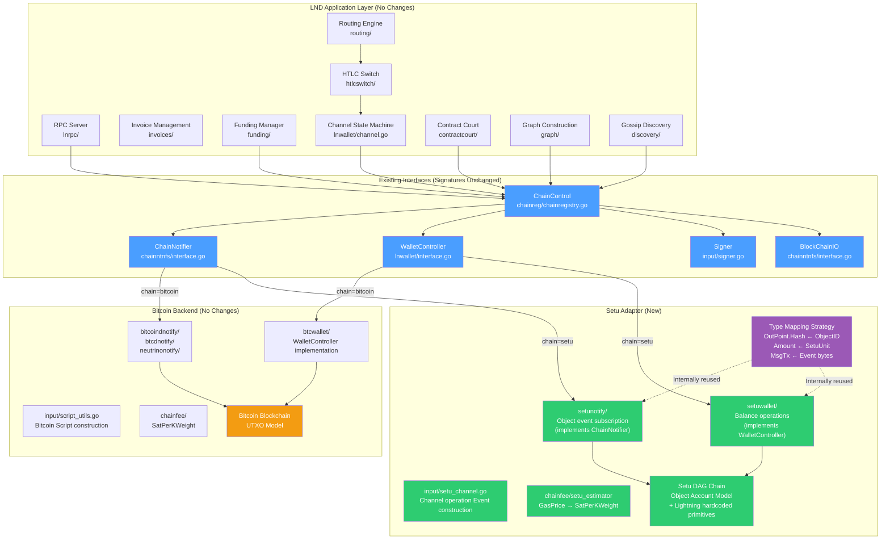
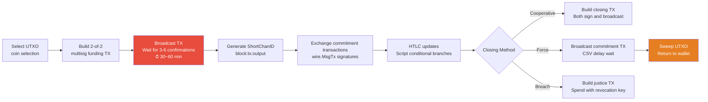
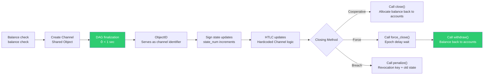
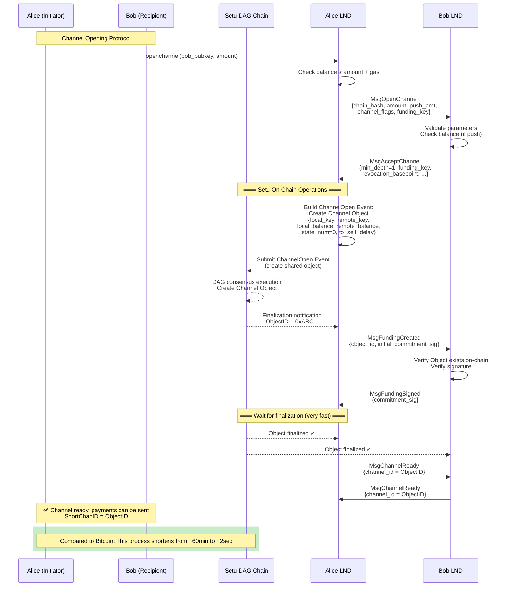
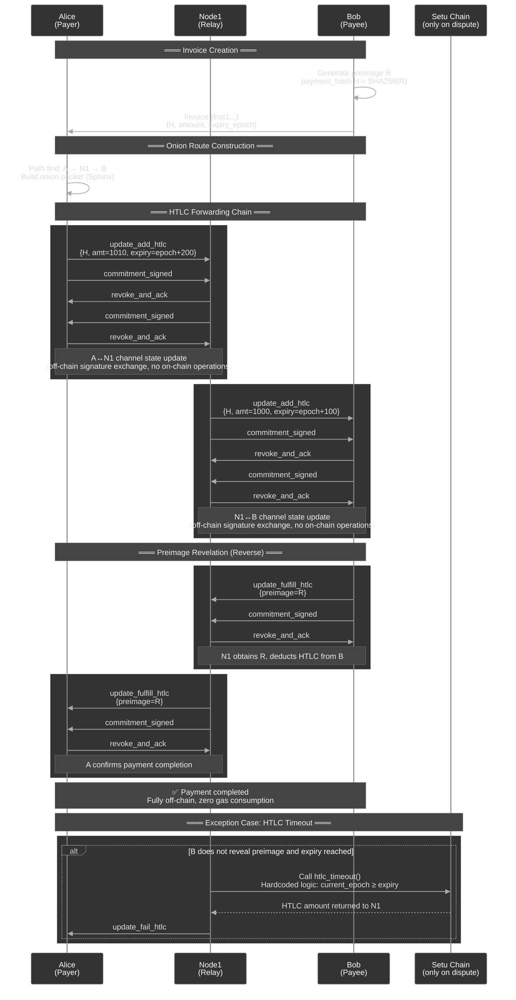
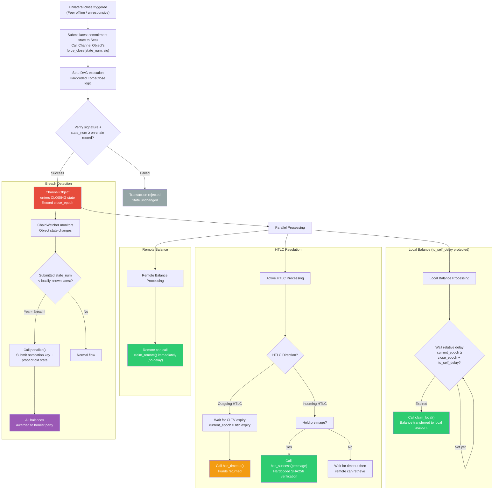
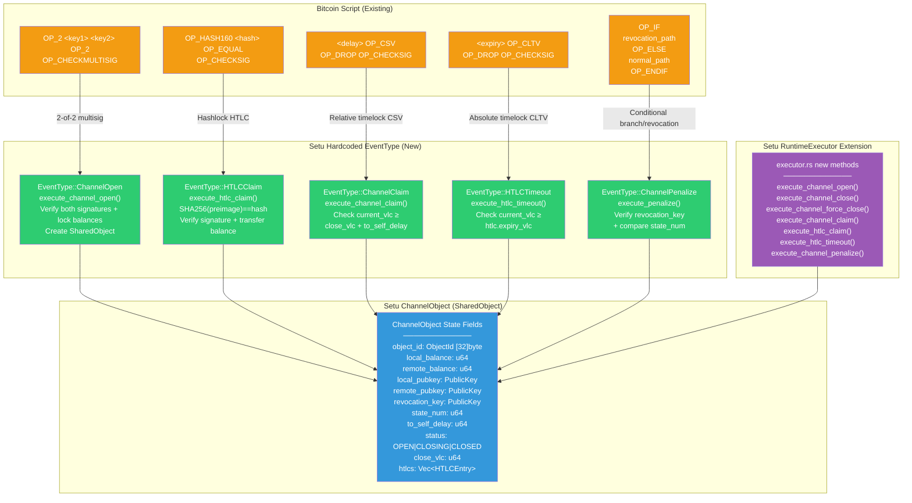
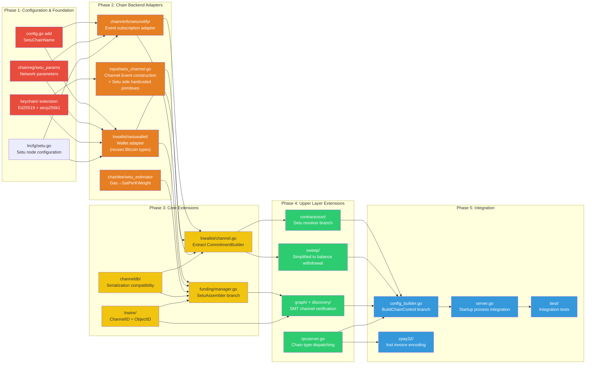
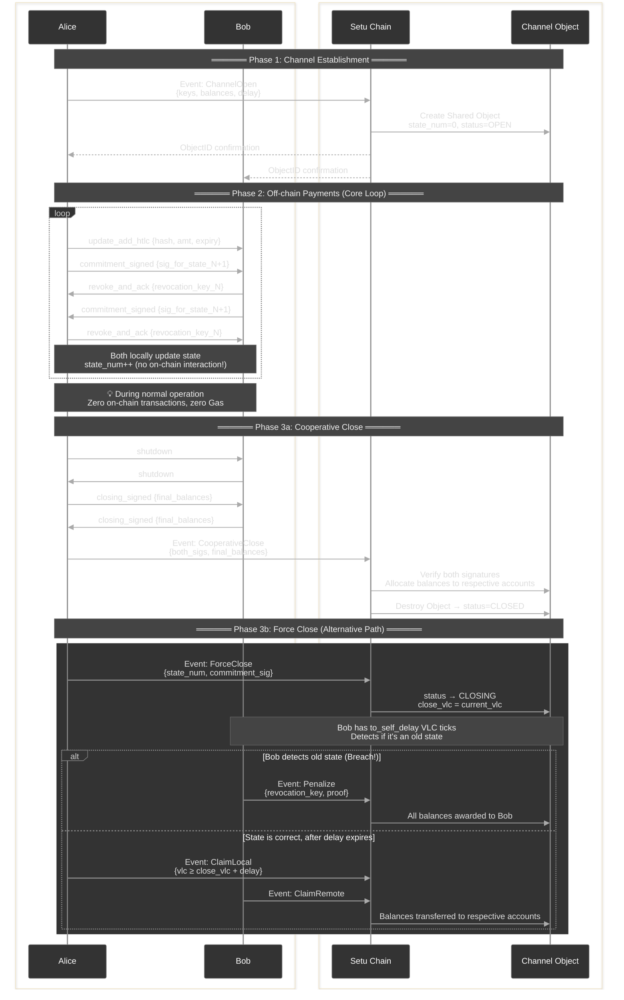

# Plan: Lightning Network Adaptation for Setu — Refactoring Document

## 0. Overview

Refactor LND Lightning Network to simultaneously support a **Bitcoin + Setu dual system**. Setu is a DAG ledger based on the object-account model, with cryptography supporting secp256k1, Ed25519, and Secp256r1, and channels identified by a 32-byte `ObjectID`.

> **⚠️ Key Fact: Setu currently lacks a general-purpose programmable virtual machine.** Setu's `setu-runtime` is a **pseudo-implementation** (pre-simplified) of a Move VM, supporting only hardcoded operations such as Transfer (full/partial), Query (balance/object queries), SubnetRegister, and UserRegister. The "custom 10-opcode interpreter (ProgramTx)" described in previous design documents **is not yet implemented**; the `RuntimeExecutor` of `setu-runtime` currently has only two execution paths: `execute_transfer()` and `execute_query()`.
>
> **Adaptation Strategy Adjustment**: Shift from "building Lightning Network contracts based on ProgramTx opcodes" to **"adding hardcoded Lightning Channel EventTypes and corresponding execution logic on the Setu side"**. This effectively implements native channel lifecycle management operations (`ChannelOpen`, `ChannelClose`, `ChannelForceClose`, `HTLCClaim`, `ChannelPenalize`, etc.) directly at the Setu Validator/Runtime layer, rather than through generic VM instruction orchestration.

Refactoring Strategy: **Zero-intrusion Adapter Pattern**. No new abstraction layers, no changes to existing interface signatures; instead, implement Setu adapters at the interface implementation level — the Setu adapter internally reuses Bitcoin types (e.g., `wire.OutPoint.Hash` to store ObjectID, `btcutil.Amount` for unit mapping, `wire.MsgTx` to carry Setu Event serialized bytes) and performs semantic conversion at the implementation boundaries. Existing Bitcoin code paths remain completely unaffected; Setu is inserted as a new `ChainControl` implementation, selectable via `lncli --chain=setu`.

Core refactoring workload distribution: **Setu backend adapter implementation in lnd (35%) → Hardcoded Lightning primitives on the Setu chain side (20%) → Upper module extensions (25%) → Configuration/startup/testing integration (20%)**.

---

## 1. Process Interaction Diagrams

The following 8 diagrams cover:

1. **Architecture Overview** — Layer and module relationships in the dual-chain abstraction
2. **Channel Lifecycle Comparison** — Clear side-by-side difference between Bitcoin and Setu processes
3. **Channel Opening Sequence** — Detailed interaction timeline between both parties and the chain
4. **Multi-hop HTLC Payment** — Full sequence for normal flow and exceptional timeout
5. **Force Close & Dispute Resolution** — Complete decision flow including breach penalty
6. **Bitcoin Script → Setu Hardcoded EventType Mapping** — How each Bitcoin contract operation translates to Setu native operations
7. **Refactoring Phase Dependencies** — Execution order and dependencies of 5 phases
8. **On-chain/Off-chain Data Flow Panorama** — Full channel lifecycle interaction swimlane

### 1. Adapter Pattern Dual-Chain Architecture Overview



---

### 2. Channel Lifecycle Comparison (Bitcoin vs Setu)

- Figure 1: Bitcoin Lightning Channel Lifecycle



- Figure 2: Setu Lightning Channel Lifecycle



---

### 3. Channel Opening Sequence Diagram (Setu Adaptation)



---

### 4. Multi-hop HTLC Payment Sequence Diagram



---

### 5. Force Close and Dispute Resolution Flowchart



---

### 6. Bitcoin Script → Setu Hardcoded Lightning Primitive Mapping

> **Note**: Since Setu currently has no general-purpose VM (`setu-runtime` is only a simplified precursor to Move VM), contract logic cannot be implemented via opcode orchestration. Instead, new hardcoded Lightning Channel operation types (new `EventType` + corresponding execution functions) are added in Setu's `RuntimeExecutor` and executed directly by the Validator.



---

### 7. Module Refactoring Priority and Dependencies



---

### 8. Data Flow: On-chain vs Off-chain Interaction Panorama



---

## 2. Refactoring Steps

**1. Configuration Extension + Setu Network Parameters (Zero Intrusion)**

No new `chaintype/` abstraction layer. LND already has the `--chain` and `--network` dual parameters (`lncli --chain=bitcoin --network=mainnet`), naturally supporting multi-chain extension. Modification steps:

| File                              | Modification Content                                                                        |
| --------------------------------- | ------------------------------------------------------------------------------------------- |
| `config.go`                       | Add `SetuChainName = "setu"` constant + `Setu *lncfg.Chain` config item                     |
| `lncfg/setu.go` (new)             | Setu node configuration struct (RPC address, SDK path, epoch interval, etc.)                |
| `chainreg/setu_params.go` (new)   | `SetuNetParams` (network ID, genesis hash, default ports, etc.)                             |
| `chainreg/chainregistry.go`       | Add `"setu"` case in `switch` branch                                                        |

**Core Design Principle — Type Mapping at Adapter Boundary**:

When Setu adapters implement existing LND interfaces, they internally reuse Bitcoin types for semantic mapping without changing interface signatures:

| Bitcoin Type                  | Internal Usage in Setu Adapter                    | Description                |
| ----------------------------- | ------------------------------------------------- | -------------------------- |
| `wire.OutPoint{Hash, Index}`  | `Hash` ← ObjectID (32B), `Index` = 0              | Channel identifier         |
| `btcutil.Amount`              | Directly store Setu minimum unit (int64)          | Amount mapping             |
| `wire.MsgTx`                  | `Payload` field carries Setu Event serialized bytes | Transaction wrapper        |
| `chainfee.SatPerKWeight`      | Internally convert GasPrice → SatPerKWeight        | Fee rate mapping           |
| `chainhash.Hash`              | Directly store Setu TxDigest / ObjectID            | 32B universal              |
| `lnwire.ShortChannelID`       | Store truncated ObjectID in 8 bytes + TLV extension for full 32B | Routing protocol compatibility |

**2. Chain Backend Interfaces — Unchanged, Only New Setu Implementation**

**Do not modify** existing interface signatures. LND's core chain backend interface signatures remain as-is; the Setu adapter acts as a new implementation, performing semantic conversion internally:

- **`ChainNotifier`** — Adapter interprets `txid` in `RegisterConfirmationsNtfn(txid *chainhash.Hash, ...)` as ObjectID, subscribes to object finalization events
- **`BlockChainIO`** — Adapter interprets `GetUtxo(outpoint *wire.OutPoint, ...)` as querying Channel Object state
- **`Signer`** — Adapter interprets `tx` in `SignOutputRaw(tx *wire.MsgTx, ...)` as the serialization carrier for Setu Events, and signs the content with Setu signature scheme
- **`WalletController`** — The most modified adapter; internally performs semantic conversion from UTXO → balance (returns a "virtual UTXO" in `ListUnspentWitness`)

**3. Extend `ChainControl` + `config_builder.go`**

Modify `ChainControl` struct in `chainreg/chainregistry.go`:

- Add `ChainName string` field (`"bitcoin"` or `"setu"`)
- Add `"setu"` branch in `BuildChainControl` function in `config_builder.go` to create Setu adapter instances and inject into `ChainControl`
- Create `chainreg/setu_params.go` defining `SetuNetParams` (network ID, genesis hash, default ports, epoch interval)

**4. Implement Setu Chain Notification Backend `chainntnfs/setunotify/`**

Implement the `ChainNotifier` interface, core mapping:

| Bitcoin Concept                              | Setu Implementation                                                      |
| --------------------------------------------- | ------------------------------------------------------------------------ |
| `RegisterConfirmationsNtfn(txid, numConfs)`   | Subscribe to object finalization events (DAG finality usually 1 confirmation) |
| `RegisterSpendNtfn(outpoint)`                  | Subscribe to Channel Object state changes (balance changes/object destruction) |
| `RegisterBlockEpochNtfn()`                     | Subscribe to Setu epoch advancement events                               |
| Reorg detection                               | Greatly simplified (DAG has no classic reorgs)                           |
| `GetBlock()` / `GetBlockHash()`                | Query epoch information / DAG round data                                 |

**5. Implement Setu Wallet `lnwallet/setuwallet/`**

Implement the adapted `WalletController` interface:

| Bitcoin Operation                           | Setu Operation                                                           |
| -------------------------------------------- | ------------------------------------------------------------------------ |
| `ListUnspentWitness()` — list UTXOs          | `GetBalance()` — query account balance                                   |
| `LeaseOutput(OutPoint)` — lock UTXO          | `ReserveBalance(amount)` — reserve balance                               |
| `SendOutputs([]*wire.TxOut)` — build TX      | `Transfer(to, amount)` — call transfer                                   |
| `FundPsbt()` / `SignPsbt()`                  | `BuildChannelEvent()` / `SignChannelEvent()` — build Setu Channel Event  |
| Coin selection (`selectInputs`)              | Not needed (deduct directly from balance)                                |
| Change address generation                     | Not needed                                                               |

Key management: reuse the `KeyFamily` system from [derivation.go] (../../../keychain/derivation.go), add Setu coinType, key derivation supporting both secp256k1 and Ed25519 dual paths.

**6. Setu On-Chain Channel Logic — Based on Hardcoded EventType + RuntimeExecutor Extension**

> ⚠️ Setu currently has no VM/opcodes; `setu-runtime` only supports Transfer/Query/SubnetRegister/UserRegister.
> New hardcoded Lightning Channel execution logic must be added in Rust's `RuntimeExecutor`, rather than through an interpreter.

**6a. Add EventType (Rust side `types/src/event.rs`)**:

```rust
// Add to EventType enum
ChannelOpen,        // Create ChannelObject (SharedObject)
ChannelClose,       // Cooperative close, release balances
ChannelForceClose,  // Unilateral force close, initiate timelock
ChannelClaimLocal,  // Claim to_local output (after relative timelock)
ChannelClaimRemote, // Claim to_remote output
HTLCClaim,          // Preimage unlock of HTLC
HTLCTimeout,        // Timeout recovery of HTLC
ChannelPenalize,    // Revocation penalty (when old state is broadcast)
```

**6b. Add ChannelObject Data Structure (Rust side `types/src/`)**:

```rust
pub struct ChannelData {
    pub channel_id: [u8; 32],
    pub local_key: PublicKey,       // secp256k1
    pub remote_key: PublicKey,
    pub local_balance: u64,
    pub remote_balance: u64,
    pub state_num: u64,
    pub status: ChannelStatus,      // Open | ForceClosing | Closed
    pub revocation_key: Option<PublicKey>,
    pub csv_delay: u64,             // VLC tick count
    pub force_close_vlc: Option<VectorClock>,
    pub htlcs: Vec<HTLCEntry>,
}
pub type ChannelObject = Object<ChannelData>; // SharedObject type

pub struct HTLCEntry {
    pub payment_hash: [u8; 32],
    pub amount: u64,
    pub expiry_vlc: u64,            // VLC logical time as timeout
    pub direction: HTLCDirection,   // Offered | Received
}
```

**6c. RuntimeExecutor Extension (Rust side `crates/setu-runtime/src/executor.rs`)**:

Add the following hardcoded execution functions (at the same level as existing `execute_transfer()`):

| Function                         | Functionality                                          | Corresponding Bitcoin Script         |
| -------------------------------- | ------------------------------------------------------ | ------------------------------------ |
| `execute_channel_open()`         | Create ChannelObject, verify both signatures           | funding tx 2-of-2 multisig           |
| `execute_channel_close()`        | Both sign → allocate balances → delete object          | cooperative close tx                 |
| `execute_channel_force_close()`  | Single sign → record force_close_vlc → lock csv_delay | commitment tx broadcast               |
| `execute_channel_claim_local()`  | Verify `current_vlc ≥ force_close_vlc + csv_delay`    | to_local CSV timelock                 |
| `execute_channel_claim_remote()` | Verify remote signature → release balance              | to_remote immediate output            |
| `execute_htlc_claim()`           | Verify `SHA256(preimage) == payment_hash` → release amount | HTLC success path                   |
| `execute_htlc_timeout()`         | Verify `current_vlc ≥ expiry_vlc` → refund amount      | HTLC timeout path                     |
| `execute_channel_penalize()`     | Verify revocation_key signature → confiscate all balances | breach remedy tx                     |

**6d. Timelock Mapping**:

- **Relative timelock (CSV equivalent)**: `current_vlc_tick ≥ force_close_vlc_tick + csv_delay` (VLC logical time difference)
- **Absolute timelock (CLTV equivalent)**: `current_vlc_tick ≥ expiry_vlc` (VLC logical time point)

Create `input/setu_channel.go` on the Go side to encapsulate construction functions for the above Events (similar to the 3275 lines of Bitcoin Script construction in existing [script_utils.go] (../../../input/script_utils.go)).

**7. Channel Identifier System Redesign**

- Modify [channel_id.go] (../../../lnwire/channel_id.go) — `NewChanIDFromOutPoint` on Setu chain directly uses the first 32 bytes of ObjectID, no XOR transformation needed
- Modify [short_channel_id.go] (../../../lnwire/short_channel_id.go) — In Setu mode, `ShortChannelID` uses ObjectID (32 bytes). Encoding in routing protocol messages needs to be extended to variable length or use TLV extension fields to carry full ObjectID
- Update [channel.go] (../../../lnwallet/channel.go) — Change `FundingOutpoint` field to `chaintype.ChannelPoint`; database schema must support serialization of both Bitcoin OutPoint and Setu ObjectID formats
- Modify [channel_edge_info.go] (../../../graph/db/models/channel_edge_info.go) — Rename `BitcoinKey1Bytes`/`BitcoinKey2Bytes` to `ChainKey1Bytes`/`ChainKey2Bytes`, or keep Bitcoin fields and add `SetuKey1Bytes`/`SetuKey2Bytes`

**8. Channel State Machine Adaptation**

Refactoring strategy for [channel.go] (../../../lnwallet/channel.go) (10185 lines) is to **separate protocol logic from on-chain operations**:

- Extract interface `CommitmentBuilder`: Bitcoin implementation constructs `wire.MsgTx` commitment transactions; Setu implementation constructs Channel Event (ChannelOpen/ChannelClose etc.) state updates
- Extract interface `ScriptEngine`: Bitcoin implementation uses `txscript` to verify/construct scripts; Setu implementation calls RuntimeExecutor's hardcoded Channel logic (no general VM)
- Modify [commitment.go] (../../../lnwallet/commitment.go) — Keep key derivation for `CommitmentKeyRing` generic; delegate signing/verification to `Signer` interface
- Keep core protocol logic unchanged: state number (`StateNum`), HTLC management (`UpdateLog`), revocation key exchange ([shachain] (../../../shachain/))

**9. Funding Manager Adaptation**

Modify [manager.go] (../../../funding/manager.go):

- `waitForFundingConfirmation` — In Setu mode, wait for DAG finalization (1 confirmation), greatly shortening timeout
- Funding transaction construction switches from `chanfunding.WalletAssembler` (UTXO selection) to new `chanfunding.SetuAssembler` (directly create Channel Object + lock balance)
- `ShortChannelID` generation logic: Bitcoin waits for confirmation in a block then encodes position; Setu uses ObjectID after object creation finalization

**10. Contract Court Adaptation**

Modify all resolvers in [contractcourt] (../../../contractcourt/):

- `commitSweepResolver` — Setu: call `claim_local_balance` entry on Channel Object
- `htlcTimeoutResolver` — Setu: call `timeout_claim` entry on HTLC (wait for VLC logical time expiry)
- `htlcSuccessResolver` — Setu: call `preimage_claim` entry on HTLC
- `breachArbitrator` — Setu: call `penalize` entry on Channel Object (submit revocation key + proof of old state)
- `anchorResolver` — Setu: **not needed** (DAG doesn't require fee bump mechanisms)
- Modify [channel_arbitrator.go] (../../../contractcourt/channel_arbitrator.go) to detect object state changes instead of UTXO spends

**11. Sweep Module Simplification**

Add Setu mode in [sweep] (../../../sweep/):

- Remove Bitcoin-specific transaction construction (`wire.NewMsgTx`), weight estimation, RBF/CPFP logic
- "Sweeping" on Setu simplifies to: call `withdraw` function on Channel Object to transfer balance back to personal account
- `FeeRate` changes from `SatPerKWeight` to `chaintype.FeeRate` (Setu: gas price)
- Batch aggregation optimizations are less useful on Setu (cost per call is lower than Bitcoin TX)

**12. Graph and Discovery Adaptation**

- Modify [builder.go] (../../../graph/builder.go) — Channel liveness check: Bitcoin checks UTXO set; Setu queries whether Channel Object still exists in state tree (SMT query)
- Modify [gossiper.go] (../../../discovery/gossiper.go) — Channel verification: Bitcoin verifies on-chain 2-of-2 multisig script; Setu verifies Channel Object existence + both keys match + SMT Merkle proof
- Add Setu verification logic in `chanvalidate/`

**13. Fee Rate System Adaptation**

- Add `SetuEstimator` implementing `Estimator` interface in [chainfee] (../../../chainfee/)
- Bitcoin: `EstimateFeePerKW(numBlocks)` → Setu: `EstimateGasPrice(priority)`
- Modify [rates.go] (../../../chainfee/rates.go) — Add `GasPrice` type and conversion methods
- Remove dust limit checks in Setu mode (account model has no dust concept)

**14. RPC and Invoice Adaptation**

- Modify `GetInfo` in [rpcserver.go] (../../../rpcserver.go) — Return `"bitcoin"` or `"setu"` based on `ChainType`
- Wallet RPCs (`SendCoins`, `NewAddress`, `ListUnspent`) need to dispatch based on chain type
- Modify [zpay32] (../../../zpay32/) — Add Setu HRP (e.g., `lnst` mainnet, `lnsts` testnet)
- Keep amount unit as minimum integer in proto definitions, interpreted by client

**15. Configuration and Startup**

- Modify [config.go] (../../../config.go) — Add `Setu *lncfg.Chain`, `SetuMode *lncfg.SetuNode`
- Add lncfg/setu.go — Setu node configuration (RPC address, SDK path, etc.)
- Modify [config_builder.go] (../../../config_builder.go) — Add Setu branch in `BuildChainControl`
- Modify [server.go] (../../../server.go) — Initialize corresponding subsystems based on chain type

---

## 3. Complete List of Required Setu Capabilities

### P0 — Core Capabilities (Lightning Network cannot run without these)

| #   | Capability                         | Detailed Requirements                                                                                   | Corresponding LND Module                               |
| --- | ---------------------------------- | -------------------------------------------------------------------------------------------------------- | ------------------------------------------------------ |
| 1   | **Hardcoded Channel Logic**        | RuntimeExecutor must add execution functions for: ChannelOpen/Close/ForceClose, HTLCClaim/Timeout, Penalize, etc. | `input/setu_channel.go` + Rust side `executor.rs`      |
| 2   | **Shared Object**                  | Channel Object must be operable by both parties; state updates require both signatures                    | `lnwallet/setuwallet/`                                 |
| 3   | **Hashlock**                       | `execute_htlc_claim()` must have built-in SHA256 preimage verification logic                              | HTLC contract                                          |
| 4   | **VLC Logical Time Query**         | Execution functions can read current VLC tick for timelock comparison                                    | CSV/CLTV equivalent                                    |
| 5   | **Object Version/Sequence Number** | Channel Object must have monotonically increasing `state_num` to prevent replay of old states            | Commitment transaction sequence number                 |
| 6   | **Event Subscription API**         | Subscribe to state change events (creation, update, destruction) by ObjectID; epoch advancement events   | `chainntnfs/setunotify/`                               |
| 7   | **Finality Notification**          | Callback notification of finalization status after transaction submission                                 | Confirmation flow in [manager.go] (../../../funding/manager.go) |
| 8   | **Multi-signature Verification**   | Channel execution functions must have built-in 2-of-2 signature verification (secp256k1 ECDSA or Ed25519) | Funding output 2-of-2                                   |
| 9   | **Object Query API**               | Query full object state (balances, keys, HTLC list, etc.) by ObjectID                                    | Equivalent of `BlockChainIO`                            |
| 10  | **Atomic State Updates**           | Contract execution state changes must either all take effect or all roll back                             | Channel state consistency                               |
| 11  | **Key Management SDK**             | Go SDK supports secp256k1 and Ed25519 key pair generation, HD derivation, signing, verification          | [keychain] (../../../keychain/)                        |
| 12  | **Transaction Construction & Broadcast SDK** | Go SDK supports building Channel Events, signing, submitting to Setu network                        | `lnwallet/setuwallet/`                                 |

### P1 — Important Capabilities (Affect Security and Extensibility)

| #   | Capability                        | Detailed Requirements                                                             | Corresponding LND Module                          |
| --- | --------------------------------- | -------------------------------------------------------------------------------- | ------------------------------------------------- |
| 13  | **Merkle Proof (SMT Proof)**      | Provide Binary+Sparse Merkle Tree proof of object existence/non-existence        | [discovery] (../../../discovery/) channel verification |
| 14  | **Historical State Query**        | Query historical state of Channel Object by epoch (for dispute arbitration)      | [contractcourt] (../../../contractcourt/)         |
| 15  | **Gas Estimation API**            | Estimate gas consumption of Channel Event execution                              | `chainfee/`                                       |
| 16  | **Batch Operations**              | Atomically operate on multiple objects in a single transaction (batch HTLC settlement) | [sweep] (../../../sweep/) batch processing        |
| 17  | **Object Destruction Notification**| Generate subscribable event when Channel Object is destroyed (channel closed)    | Channel liveness check in [builder.go] (../../../graph/builder.go) |
| 18  | **Node Discovery/P2P**            | P2P connection information for Setu network nodes (for LN gossip bootstrapping)  | [chainreg] (../../../chainreg/) DNS seeds         |

### P2 — Optimization Capabilities (Enhance Performance and User Experience)

| #   | Capability                | Detailed Requirements                                                             |
| --- | ------------------------- | -------------------------------------------------------------------------------- |
| 19  | **Light Client Mode**     | Setu light client similar to Neutrino (only verify Merkle proofs, not full state) |
| 20  | **Watchtower Support**    | Third parties can monitor Channel Object state and automatically submit penalty transactions on breach |
| 21  | **Atomic Cross-Chain Operations** | Support atomic swaps / cross-chain HTLC between Bitcoin↔Setu (if dual-chain interoperability is needed) |

---

## 4. Verification

- **Unit Tests**: Each new Setu implementation (`setunotify/`, `setuwallet/`, `setu_channel.go`) independently tested, mocking the Setu SDK
- **Integration Tests**: Modify [itest] (../../../itest/) framework, add Setu devnet backend, cover core scenarios:
  - Open channel → send payment → multi-hop forward → cooperative close
  - Unilateral close → HTLC timeout/success resolution
  - Breach detection → penalty transaction
  - Dual-chain mode: Bitcoin and Setu channels coexist
- **Commands**: `make itest backend=setu` or `go test -tags setu [lnd](http://_vscodecontentref_/118)`
- **Manual Checks**: `lncli --chain=setu getinfo`, `lncli --chain=setu openchannel`

## 5. Decision Records

- **Adaptation Strategy**: Use **Adapter Pattern** rather than adding a new `chaintype/` abstraction layer. Do not change existing interface signatures; Setu adapters reuse Bitcoin types for semantic mapping at the implementation boundaries (`OutPoint.Hash` ← ObjectID, `Amount` ← Setu minimum unit, `MsgTx` ← Setu Event serialized bytes), zero intrusion into existing Bitcoin code paths
- **Cryptography**: Dual support for secp256k1 + Ed25519 (same as Sui); keychain must be extended for dual-path derivation
- **Dual-Chain Support**: Keep Bitcoin; dispatch via `ChainControl` + `--chain=setu` to support Setu simultaneously
- **Contract Language**: Setu currently lacks a general VM; use hardcoded EventType + RuntimeExecutor extension to implement Lightning Channel logic (ChannelOpen/Close/ForceClose/HTLCClaim/Timeout/Penalize); can migrate to Move VM in the future
- **Channel ID**: On Setu, use 32-byte ObjectID directly to identify channels; in routing protocol messages, carry full 32-byte via TLV extension