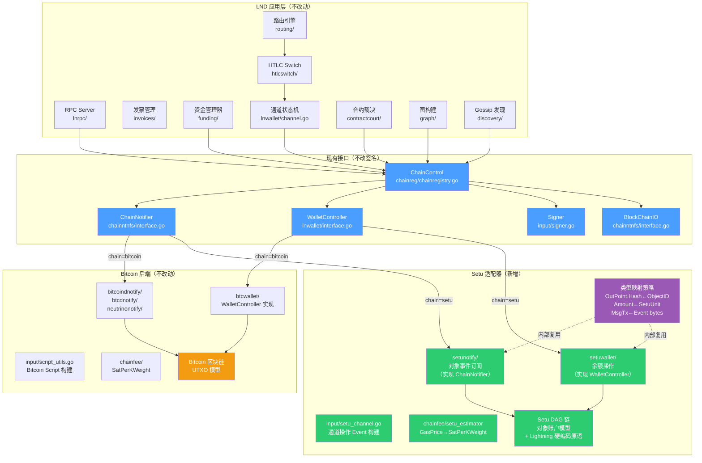
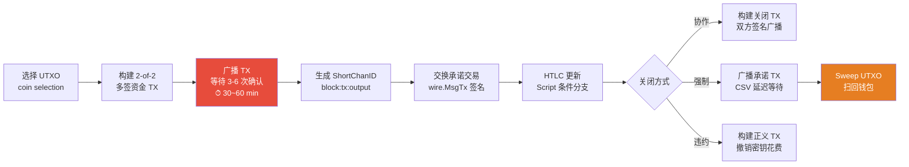
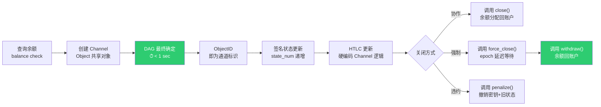
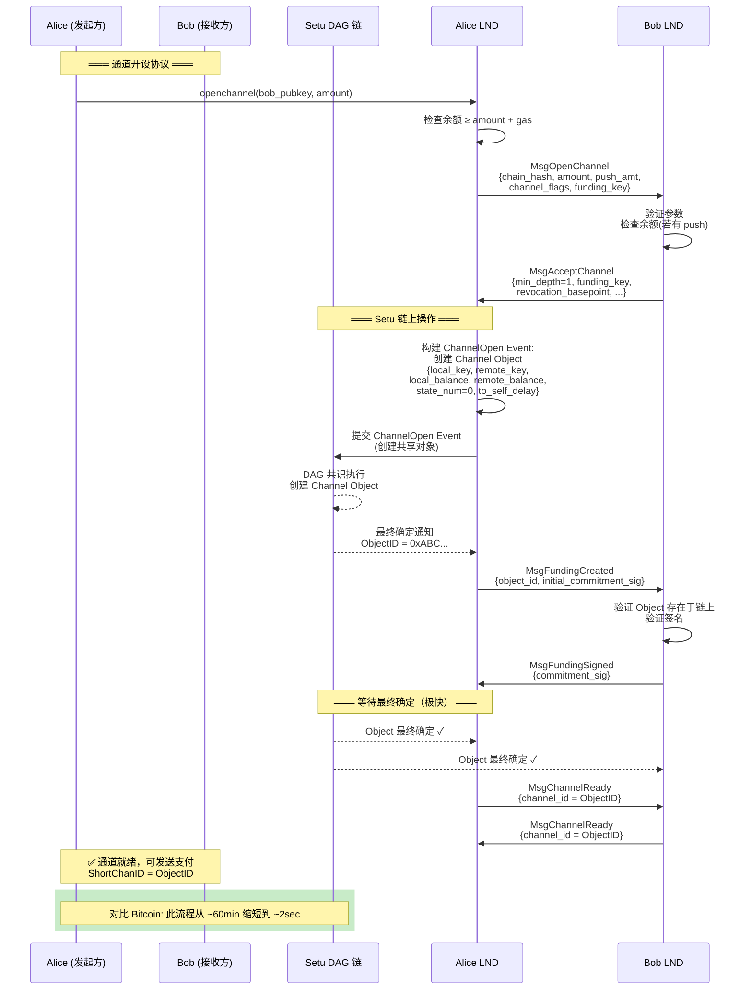
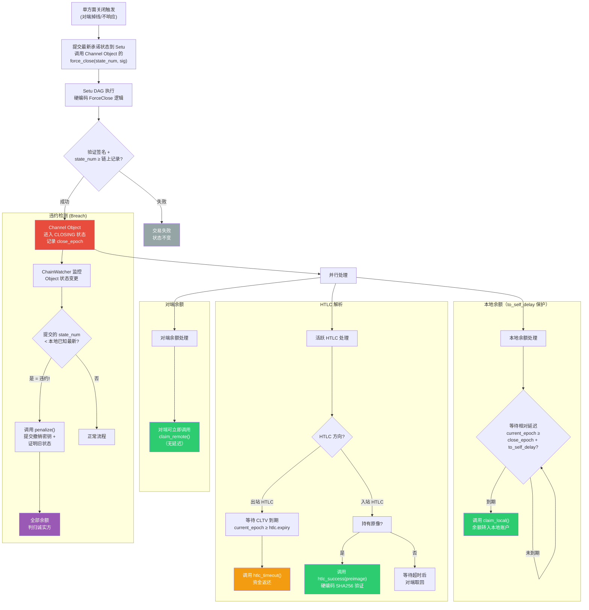
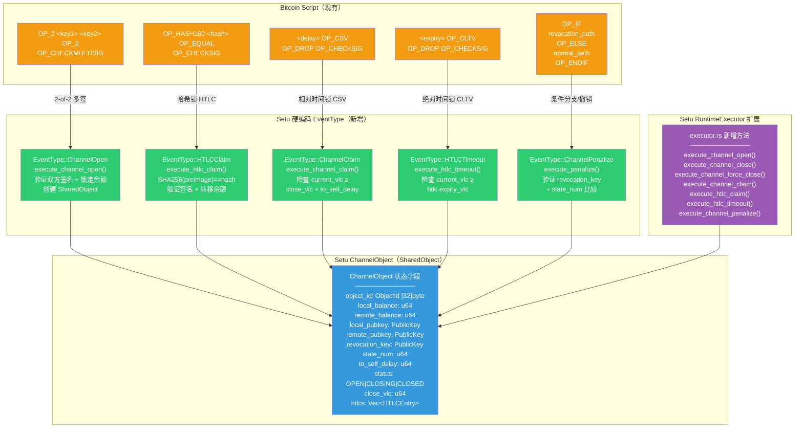
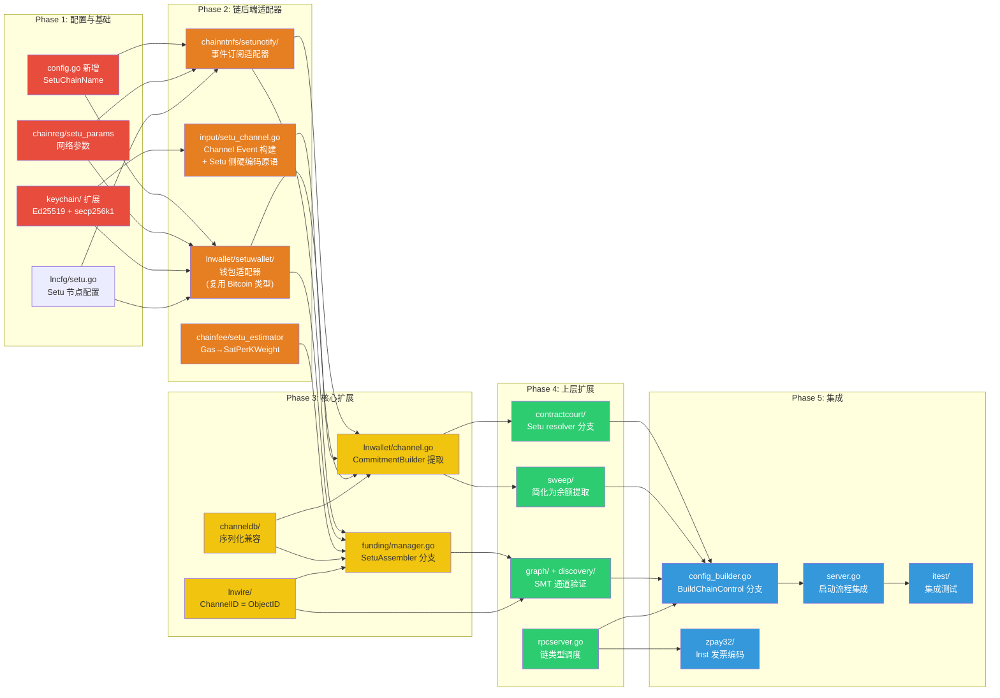
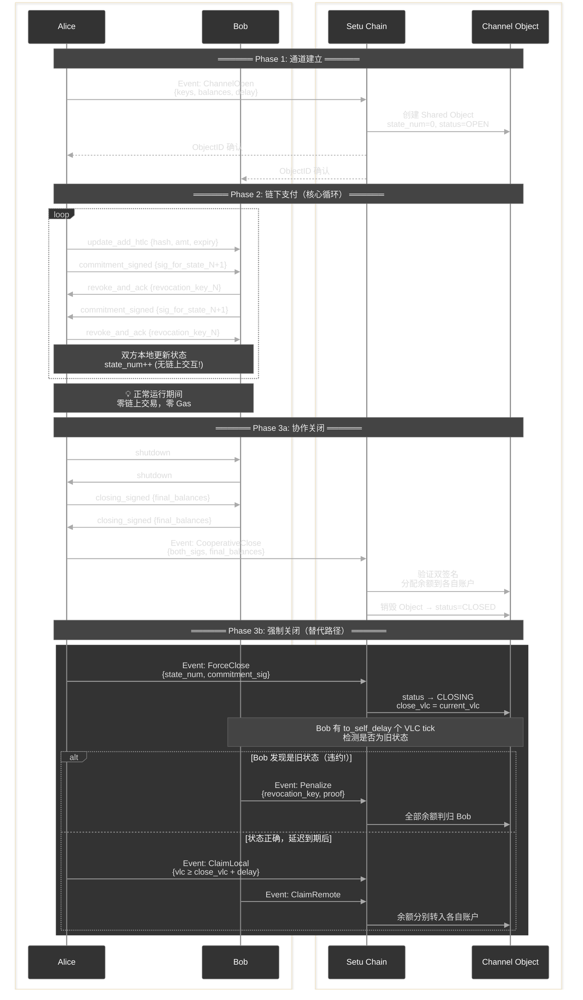

# 计划：闪电网络适配 Setu — 改造重构文档

## 0. Overview

将 LND 闪电网络改造为同时支持 **Bitcoin + Setu 双系统**。Setu 是基于对象账户模型的 DAG 账本，密码学同时支持 secp256k1、Ed25519 和 Secp256r1，通道以 32 字节 `ObjectID` 标识。

> **⚠️ 关键事实：Setu 当前不具备通用可编程虚拟机。** Setu 的 `setu-runtime` 是一个 Move VM 的**前置简化实现**（pseudo-implementation），仅支持 Transfer（全量/部分转账）、Query（余额/对象查询）、SubnetRegister、UserRegister 等硬编码操作。之前设计文档中描述的"自定义 10 操作码解释器（ProgramTx）"**目前尚未实现**，`setu-runtime` 的 `RuntimeExecutor` 仅有 `execute_transfer()` 和 `execute_query()` 两个执行路径。
>
> **适配策略调整**：从"基于 ProgramTx 操作码构建闪电网络合约"调整为**"在 Setu 侧新增硬编码的 Lightning Channel EventType 和对应执行逻辑"**。这相当于在 Setu Validator/Runtime 层直接实现通道生命周期管理的原生操作（`ChannelOpen`、`ChannelClose`、`ChannelForceClose`、`HTLCClaim`、`ChannelPenalize` 等），而非通过通用 VM 指令编排。

改造策略：**零侵入适配器模式（Adapter Pattern）** 。不新增抽象层、不改现有接口签名，而是在接口实现层做 Setu 适配器 —— Setu 适配器内部复用 Bitcoin 类型（如 `wire.OutPoint.Hash` 存储 ObjectID、`btcutil.Amount` 做单位映射、`wire.MsgTx` 承载 Setu Event 序列化字节），在实现边界做语义转换。现有 Bitcoin 代码路径完全不受影响，Setu 作为新的 `ChainControl` 实现插入，通过 `lncli --chain=setu` 选择。

核心改造工作量分布：**lnd 针对 Setu 的后端适配器实现（35%）→ Setu 链侧 Lightning 原语硬编码（20%）→ 上层模块扩展（25%）→ 配置/启动/测试集成（20%）**。

---

## 1. 流程交互图

如下 8 张图分别覆盖了：

1. **架构总览** — 双链抽象层分层与模块关系
2. **通道生命周期对比** — Bitcoin vs Setu 的流程差异一目了然
3. **开通道序列** — 详细的双方+链交互时序
4. **多跳 HTLC 支付** — 正常流转与异常超时的完整序列
5. **强制关闭与争议解决** — 含违约惩罚的完整决策流程
6. **Bitcoin Script → Setu 硬编码 EventType 映射** — 每个 Bitcoin 合约操作如何翻译为 Setu 原生操作
7. **改造阶段依赖** — 5 个 Phase 的执行顺序与依赖
8. **链上/链下数据流全景** — 完整的通道生命周期交互泳道

### 1. 适配器模式双链架构总览



---

### 2. 通道生命周期对比（Bitcoin vs Setu）

- 图1：Bitcoin 闪电网络通道生命周期



- 图2：Setu 闪电网络通道生命周期



---

### 3. 开通道序列交互图（Setu 适配）



---

### 4. 多跳 HTLC 支付序列图


---

### 5. 强制关闭与争议解决流程图



---

### 6. Bitcoin Script → Setu 硬编码 Lightning 原语映射

> **说明**：由于 Setu 当前没有通用 VM（setu-runtime 仅是 Move VM 的前置简化实现），无法通过操作码编排实现合约逻辑。取而代之，在 Setu 的 `RuntimeExecutor` 中新增硬编码的 Lightning Channel 操作类型（新 `EventType` + 对应执行函数），由 Validator 直接执行。



---

### 7. 模块改造优先级与依赖关系



---

### 8. 数据流：链上 vs 链下交互全景



---

## 2. 改造步骤

**1. 配置扩展 + Setu 网络参数（零侵入）**

不新增 `chaintype/` 抽象层。LND 已有 `--chain` 和 `--network` 双维参数（`lncli --chain=bitcoin --network=mainnet`），天然支持多链扩展。改造步骤：

| 文件                              | 修改内容                                                        |
| --------------------------------- | --------------------------------------------------------------- |
| `config.go`                       | 新增 `SetuChainName = "setu"` 常量 + `Setu *lncfg.Chain` 配置项 |
| `lncfg/setu.go`（新建）           | Setu 节点配置结构体（RPC 地址、SDK 路径、epoch 间隔等）         |
| `chainreg/setu_params.go`（新建） | `SetuNetParams`（网络 ID、创世哈希、默认端口等）                |
| `chainreg/chainregistry.go`       | `switch` 分支新增 `"setu"` case                                 |

**核心设计原则 — 适配器边界类型映射**：

Setu 适配器在实现 LND 现有接口时，内部复用 Bitcoin 类型做语义映射，不改接口签名：

| Bitcoin 类型                 | Setu 适配器内部用法                         | 说明         |
| ---------------------------- | ------------------------------------------- | ------------ |
| `wire.OutPoint{Hash, Index}` | `Hash` ← ObjectID (32B), `Index` = 0        | 通道标识     |
| `btcutil.Amount`             | 直接存储 Setu 最小单位（int64）             | 金额映射     |
| `wire.MsgTx`                 | `Payload` 字段承载 Setu Event 序列化字节    | 交易包装     |
| `chainfee.SatPerKWeight`     | 内部做 GasPrice → SatPerKWeight 换算        | 费率映射     |
| `chainhash.Hash`             | 直接存储 Setu TxDigest / ObjectID           | 32B 通用     |
| `lnwire.ShortChannelID`      | 8 字节存 ObjectID 截断 + TLV 扩展存完整 32B | 路由协议兼容 |

**2. 链后端接口 — 保持不变，仅新增 Setu 实现**

**不修改**现有接口签名。LND 的核心链后端接口签名保持原样，Setu 适配器作为新实现，内部做语义转换：

- **`ChainNotifier`** — 适配器将 `RegisterConfirmationsNtfn(txid *chainhash.Hash, ...)` 中的 `txid` 解释为 ObjectID，订阅对象最终确定事件
- **`BlockChainIO`** — 适配器将 `GetUtxo(outpoint *wire.OutPoint, ...)` 解释为查询 Channel Object 状态
- **`Signer`** — 适配器将 `SignOutputRaw(tx *wire.MsgTx, ...)` 中的 tx 解释为 Setu Event 序列化载体，对内容做 Setu 签名
- **`WalletController`** — 改动最大的适配器；在实现内部做 UTXO → 余额的语义转换（`ListUnspentWitness` 返回一个"虚拟 UTXO"）

**3. 扩展 `ChainControl` + `config_builder.go`**

修改 `chainreg/chainregistry.go` 中的 `ChainControl` 结构体：

- 新增 `ChainName string` 字段（`"bitcoin"` 或 `"setu"`）
- 在 `config_builder.go` 的 `BuildChainControl` 函数中新增 `"setu"` 分支，创建 Setu 适配器实例注入 `ChainControl`
- 创建 `chainreg/setu_params.go` 定义 `SetuNetParams`（网络 ID、创世哈希、默认端口、epoch 间隔）
  **4. 实现 Setu 链通知后端 `chainntnfs/setunotify/`**

实现 `ChainNotifier` 接口，核心映射关系：

| Bitcoin 概念                                | Setu 实现                                           |
| ------------------------------------------- | --------------------------------------------------- |
| `RegisterConfirmationsNtfn(txid, numConfs)` | 订阅对象最终确定事件（DAG 最终性通常 1 次确认即可） |
| `RegisterSpendNtfn(outpoint)`               | 订阅 Channel Object 状态变更（余额变化/对象销毁）   |
| `RegisterBlockEpochNtfn()`                  | 订阅 Setu epoch 推进事件                            |
| 区块重组检测                                | 大幅简化（DAG 无经典重组）                          |
| `GetBlock()` / `GetBlockHash()`             | 查询 epoch 信息 / DAG 轮次数据                      |

**5. 实现 Setu 钱包 `lnwallet/setuwallet/`**

实现适配后的 `WalletController` 接口：

| Bitcoin 操作                           | Setu 操作                                                              |
| -------------------------------------- | ---------------------------------------------------------------------- |
| `ListUnspentWitness()` — 列出 UTXO     | `GetBalance()` — 查询账户余额                                          |
| `LeaseOutput(OutPoint)` — 锁 UTXO      | `ReserveBalance(amount)` — 预留余额                                    |
| `SendOutputs([]*wire.TxOut)` — 构建 TX | `Transfer(to, amount)` — 调用转账                                      |
| `FundPsbt()` / `SignPsbt()`            | `BuildChannelEvent()` / `SignChannelEvent()` — 构建 Setu Channel Event |
| 币选择（`selectInputs`）               | 不需要（直接从余额扣减）                                               |
| 找零地址生成                           | 不需要                                                                 |

密钥管理方面：复用 [derivation.go]  (../../../keychain/derivation.go) 的 `KeyFamily` 体系，新增 Setu coinType，密钥衍生支持 secp256k1 和 Ed25519 双路径。

**6. Setu 链上通道逻辑 — 基于硬编码 EventType + RuntimeExecutor 扩展**

> ⚠️ Setu 当前无 VM/操作码，`setu-runtime` 仅支持 Transfer/Query/SubnetRegister/UserRegister。
> 需在 Rust 侧 `RuntimeExecutor` 中新增硬编码 Lightning Channel 执行逻辑，而非通过解释器。

**6a. 新增 EventType（Rust 侧 `types/src/event.rs`）**：

```rust
// 新增到 EventType enum
ChannelOpen,        // 创建 ChannelObject (SharedObject)
ChannelClose,       // 双方协商关闭，释放余额
ChannelForceClose,  // 单方强制关闭，启动时间锁
ChannelClaimLocal,  // to_local 输出认领（相对时间锁后）
ChannelClaimRemote, // to_remote 输出认领
HTLCClaim,          // 原像解锁 HTLC
HTLCTimeout,        // 超时回收 HTLC
ChannelPenalize,    // 撤销惩罚（旧状态广播时）
```

**6b. 新增 ChannelObject 数据结构（Rust 侧 `types/src/`）**：

```rust
pub struct ChannelData {
    pub channel_id: [u8; 32],
    pub local_key: PublicKey,       // secp256k1
    pub remote_key: PublicKey,
    pub local_balance: u64,
    pub remote_balance: u64,
    pub state_num: u64,
    pub status: ChannelStatus,      // Open | ForceClosing | Closed
    pub revocation_key: Option<PublicKey>,
    pub csv_delay: u64,             // VLC tick 计数
    pub force_close_vlc: Option<VectorClock>,
    pub htlcs: Vec<HTLCEntry>,
}
pub type ChannelObject = Object<ChannelData>; // SharedObject 类型

pub struct HTLCEntry {
    pub payment_hash: [u8; 32],
    pub amount: u64,
    pub expiry_vlc: u64,            // VLC logical time 作为超时
    pub direction: HTLCDirection,   // Offered | Received
}
```

**6c. RuntimeExecutor 扩展（Rust 侧 `crates/setu-runtime/src/executor.rs`）**：

新增以下硬编码执行函数（与现有 `execute_transfer()` 同级）：

| 函数                             | 功能                                               | 对应 Bitcoin Script        |
| -------------------------------- | -------------------------------------------------- | -------------------------- |
| `execute_channel_open()`         | 创建 ChannelObject，双方签名验证                   | funding tx 2-of-2 multisig |
| `execute_channel_close()`        | 双方签名 → 按余额分配 → 删除对象                   | cooperative close tx       |
| `execute_channel_force_close()`  | 单方签名 → 记录 force_close_vlc → 锁定 csv_delay   | commitment tx broadcast    |
| `execute_channel_claim_local()`  | 验证 `current_vlc ≥ force_close_vlc + csv_delay`   | to_local CSV 时间锁        |
| `execute_channel_claim_remote()` | 验证远端签名 → 释放余额                            | to_remote 即时输出         |
| `execute_htlc_claim()`           | 验证 `SHA256(preimage) == payment_hash` → 释放金额 | HTLC success 路径          |
| `execute_htlc_timeout()`         | 验证 `current_vlc ≥ expiry_vlc` → 退回金额         | HTLC timeout 路径          |
| `execute_channel_penalize()`     | 验证 revocation_key 签名 → 没收全部余额            | breach remedy tx           |

**6d. 时间锁映射**：

- **相对时间锁（CSV 等价）**：`current_vlc_tick ≥ force_close_vlc_tick + csv_delay`（VLC 逻辑时间差）
- **绝对时间锁（CLTV 等价）**：`current_vlc_tick ≥ expiry_vlc`（VLC 逻辑时间点）

在 Go 侧创建 `input/setu_channel.go`，封装上述 Event 的构建函数（等价于现有 [script_utils.go]  (../../../input/script_utils.go) 的 3275 行 Bitcoin Script 构建）。

**7. 通道标识体系重设计**

- 修改 [channel_id.go]  (../../../lnwire/channel_id.go) — `NewChanIDFromOutPoint` 在 Setu 链上直接使用 ObjectID 的前 32 字节，无需 XOR 变换
- 修改 [short_channel_id.go]  (../../../lnwire/short_channel_id.go) — Setu 模式下 `ShortChannelID` 使用 ObjectID（32 字节）。路由协议消息中的编码需扩展为变长或使用 TLV 扩展字段承载完整 ObjectID
- 更新 [channel.go]  (../../../lnwallet/channel.go) — `FundingOutpoint` 字段改为 `chaintype.ChannelPoint`，数据库 schema 需支持 Bitcoin OutPoint 和 Setu ObjectID 两种格式的序列化
- 修改 [channel_edge_info.go]  (../../../graph/db/models/channel_edge_info.go) — `BitcoinKey1Bytes`/`BitcoinKey2Bytes` 重命名为 `ChainKey1Bytes`/`ChainKey2Bytes`，或保留 Bitcoin 字段并新增 `SetuKey1Bytes`/`SetuKey2Bytes`

**8. 通道状态机适配**

[channel.go]  (../../../lnwallet/channel.go)（10185 行）的改造策略是**分离协议逻辑与链上操作**：

- 提取接口 `CommitmentBuilder`：Bitcoin 实现构建 `wire.MsgTx` 承诺交易，Setu 实现构建 Channel Event（ChannelOpen/ChannelClose 等）状态更新
- 提取接口 `ScriptEngine`：Bitcoin 实现使用 `txscript` 验证/构建脚本，Setu 实现调用 RuntimeExecutor 硬编码 Channel 逻辑（无通用 VM）
- 修改 [commitment.go]  (../../../lnwallet/commitment.go) — `CommitmentKeyRing` 的密钥衍生保留通用逻辑，签名/验证委托给 `Signer` 接口
- 保留状态编号（`StateNum`）、HTLC 管理（`UpdateLog`）、撤销密钥交换（[shachain]  (../../../shachain/)）的核心来协议逻辑不变

**9. 资金管理器适配**

修改 [manager.go]  (../../../funding/manager.go)：

- `waitForFundingConfirmation` — Setu 模式下等待 DAG 最终确定（1 次确认），大幅缩短超时
- 资金交易构建从 `chanfunding.WalletAssembler`（UTXO 选择）切换到新的 `chanfunding.SetuAssembler`（直接创建 Channel Object + 余额锁定）
- `ShortChannelID` 生成逻辑：Bitcoin 等待在区块中确认后编码位置；Setu 在对象创建最终确定后使用 ObjectID

**10. 合约裁决适配**

修改 [contractcourt]  (../../../contractcourt/) 所有 resolver：

- `commitSweepResolver` — Setu: 调用 Channel Object 的 `claim_local_balance` 入口
- `htlcTimeoutResolver` — Setu: 调用 HTLC 的 `timeout_claim` 入口（等待 VLC 逻辑时间到期）
- `htlcSuccessResolver` — Setu: 调用 HTLC 的 `preimage_claim` 入口
- `breachArbitrator` — Setu: 调用 Channel Object 的 `penalize` 入口（提交撤销密钥 + 旧状态证明）
- `anchorResolver` — Setu: **不需要**（DAG 无需费率提升机制）
- 修改 [channel_arbitrator.go]  (../../../contractcourt/channel_arbitrator.go) 检测对象状态变更而非 UTXO 花费

**11. Sweep 模块简化**

在 [sweep]  (../../../sweep/) 中新增 Setu 模式：

- 移除 Bitcoin 特有的交易构建 (`wire.NewMsgTx`)、权重估算、RBF/CPFP 逻辑
- Setu 上的"扫回"简化为：调用 Channel Object 的 `withdraw` 函数将余额转回个人账户
- `FeeRate` 从 `SatPerKWeight` 改为 `chaintype.FeeRate`（Setu: gas price）
- 批量聚合优化在 Setu 上用处不大（每次调用成本低于 Bitcoin TX）

**12. 图与发现适配**

- 修改 [builder.go]  (../../../graph/builder.go) — 通道存活性检查：Bitcoin 检查 UTXO 集合；Setu 查询 Channel Object 是否仍存在于状态树（SMT 查询）
- 修改 [gossiper.go]  (../../../discovery/gossiper.go) — 通道验证：Bitcoin 验证链上 2-of-2 多签脚本；Setu 验证 Channel Object 存在 + 双方 key 匹配 + SMT Merkle 证明
- `chanvalidate/` 新增 Setu 验证逻辑

**13. 费率体系适配**

- 在 [chainfee]  (../../../chainfee/) 中新增 `SetuEstimator` 实现 `Estimator` 接口
- Bitcoin: `EstimateFeePerKW(numBlocks)` → Setu: `EstimateGasPrice(priority)`
- 修改 [rates.go]  (../../../chainfee/rates.go) — 新增 `GasPrice` 类型和转换方法
- 移除 Setu 模式下的 dust 限制检查（账户模型无 dust 概念）

**14. RPC 与发票适配**

- 修改 [rpcserver.go]  (../../../rpcserver.go) 中的 `GetInfo` — 根据 `ChainType` 返回 `"bitcoin"` 或 `"setu"`
- 钱包 RPC（`SendCoins`、`NewAddress`、`ListUnspent`）需按链类型调度
- 修改 [zpay32]  (../../../zpay32/) — 新增 Setu HRP（如 `lnst` 主网、`lnsts` 测试网）
- 金额单位在 proto 定义中保持为最小单位整数，由客户端解释

**15. 配置与启动**

- 修改 [config.go]  (../../../config.go) — 新增 `Setu *lncfg.Chain`、`SetuMode *lncfg.SetuNode`
- 新增 lncfg/setu.go — Setu 节点配置（RPC 地址、SDK 路径等）
- 修改 [config_builder.go]  (../../../config_builder.go) — `BuildChainControl` 新增 Setu 分支
- 修改 [server.go]  (../../../server.go) — 根据链类型初始化对应子系统

---

## 3. Setu 必须支持的完整能力清单

### P0 — 核心能力（无此能力则无法运行闪电网络）

| #   | 能力                         | 详细需求                                                                                     | 对应 LND 模块                                   |
| --- | ---------------------------- | -------------------------------------------------------------------------------------------- | ----------------------------------------------- |
| 1   | **硬编码 Channel 逻辑**      | RuntimeExecutor 需新增：ChannelOpen/Close/ForceClose、HTLCClaim/Timeout、Penalize 等执行函数 | `input/setu_channel.go` + Rust 侧 `executor.rs` |
| 2   | **共享对象 (Shared Object)** | Channel Object 需双方都能操作；状态更新需双方签名授权                                        | `lnwallet/setuwallet/`                          |
| 3   | **哈希锁 (Hashlock)**        | `execute_htlc_claim()` 内置 SHA256 原像验证逻辑                                              | HTLC 合约                                       |
| 4   | **VLC 逻辑时间查询**         | 执行函数能读取当前 VLC tick，用于时间锁比较判断                                              | CSV/CLTV 等价                                   |
| 5   | **对象版本/序列号**          | Channel Object 需有单调递增的 `state_num`，防止旧状态重放                                    | 承诺交易序号                                    |
| 6   | **事件订阅 API**             | 按 ObjectID 订阅状态变更事件（创建、更新、销毁）；epoch 推进事件                             | `chainntnfs/setunotify/`                        |
| 7   | **最终性通知**               | 交易提交后能回调通知最终确定状态                                                             | [manager.go]  (../../../funding/manager.go) 确认流程    |
| 8   | **多签名验证**               | Channel 执行函数内置 2-of-2 签名验证（secp256k1 ECDSA 或 Ed25519）                           | 资金输出 2-of-2                                 |
| 9   | **对象查询 API**             | 按 ObjectID 查询完整对象状态（余额、密钥、HTLC 列表等）                                      | `BlockChainIO` 等价                             |
| 10  | **原子性状态更新**           | 合约执行的状态变更要么全部生效、要么全部回滚                                                 | 通道状态一致性                                  |
| 11  | **密钥管理 SDK**             | Go SDK 支持 secp256k1 和 Ed25519 密钥对生成、HD 衍生、签名、验证                             | [keychain]  (../../../keychain/)                        |
| 12  | **交易构建与广播 SDK**       | Go SDK 支持构建 Channel Event、签名、提交到 Setu 网络                                        | `lnwallet/setuwallet/`                          |

### P1 — 重要能力（影响安全性和可扩展性）

| #   | 能力                        | 详细需求                                                 | 对应 LND 模块                                |
| --- | --------------------------- | -------------------------------------------------------- | -------------------------------------------- |
| 13  | **Merkle 证明 (SMT Proof)** | 提供对象存在性/不存在性的 Binary+Sparse Merkle Tree 证明 | [discovery]  (../../../discovery/) 通道验证          |
| 14  | **历史状态查询**            | 按 epoch 查询 Channel Object 的历史状态（用于争议仲裁）  | [contractcourt]  (../../../contractcourt/)           |
| 15  | **Gas 估算 API**            | 估算 Channel Event 执行的 gas 消耗                       | `chainfee/`                                  |
| 16  | **批量操作**                | 单笔交易中原子性地操作多个对象（批量 HTLC 结算）         | [sweep]  (../../../sweep/) 批量处理                  |
| 17  | **对象销毁通知**            | Channel Object 被销毁时（通道关闭）生成可订阅事件        | [builder.go]  (../../../graph/builder.go) 通道存活性 |
| 18  | **节点发现/P2P**            | Setu 网络节点的 P2P 连接信息（用于 LN gossip 引导）      | [chainreg]  (../../../chainreg/) DNS 种子            |

### P2 — 优化能力（提升性能和用户体验）

| #   | 能力                | 详细需求                                                         |
| --- | ------------------- | ---------------------------------------------------------------- |
| 19  | **轻客户端模式**    | 类似 Neutrino 的 Setu 轻节点（仅验证 Merkle 证明，不存全量状态） |
| 20  | **Watchtower 支持** | 第三方可监控 Channel Object 状态并在违约时自动提交惩罚交易       |
| 21  | **原子跨链操作**    | 支持 Bitcoin↔Setu 的原子交换/跨链 HTLC（如果需要双链互操作）     |

---

## 4. 验证

- **单元测试**: 每个新增的 Setu 实现（`setunotify/`、`setuwallet/`、`setu_channel.go`）独立测试，mock Setu SDK
- **集成测试**: 修改 [itest]  (../../../itest/) 框架，新增 Setu devnet backend，覆盖核心场景：
  - 开通道 → 发送支付 → 多跳转发 → 协作关闭
  - 单方面关闭 → HTLC 超时/成功解析
  - 违约检测 → 惩罚交易
  - 双链模式：Bitcoin 和 Setu 通道共存
- **命令**: `make itest backend=setu` 或 `go test -tags setu [lnd](http://_vscodecontentref_/118).`
- **手动检查**: `lncli --chain=setu getinfo`、`lncli --chain=setu openchannel`

## 5. 决策记录

- **适配策略**: 采用**适配器模式（Adapter Pattern）**而非新增 `chaintype/` 抽象层。不改现有接口签名，Setu 适配器在实现边界复用 Bitcoin 类型做语义映射（`OutPoint.Hash` ← ObjectID、`Amount` ← Setu 最小单位、`MsgTx` ← Setu Event 序列化字节），零侵入现有 Bitcoin 代码路径
- **密码学**: 双支持 secp256k1 + Ed25519（同 Sui），keychain需扩展双路径衍生
- **双链支持**: 保留 Bitcoin，通过 `ChainControl` + `--chain=setu` 调度同时支持 Setu
- **合约语言**: Setu 当前无通用 VM，采用硬编码 EventType + RuntimeExecutor 扩展方式实现 Lightning Channel 逻辑（ChannelOpen/Close/ForceClose/HTLCClaim/Timeout/Penalize），未来可迁移至 Move VM
- **通道 ID**: Setu 上使用 32 字节 ObjectID 直接标识通道，路由协议消息中通过 TLV 扩展承载
