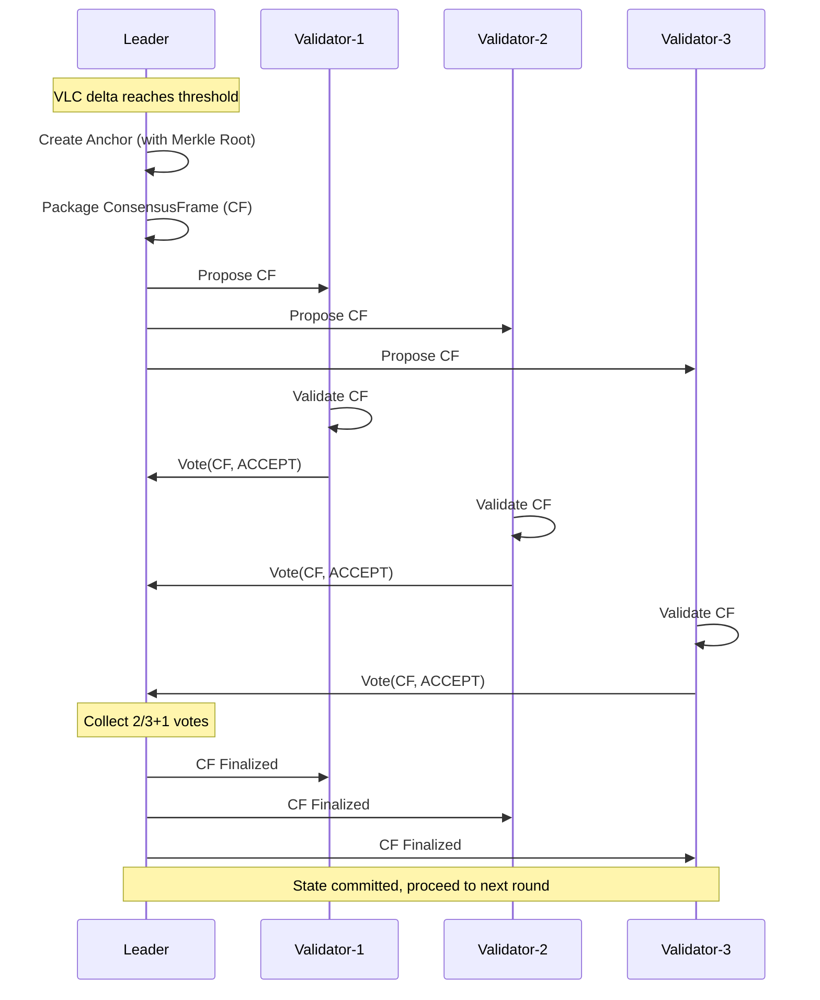

# Setu Architecture and Technical Specification

## 1. Project Overview

**Setu** is the next-generation high-performance distributed consensus network of the Hetu Project, designed as a high-throughput, low-latency transaction processing system. The project integrates the following core technologies:

- **DAG-BFT Consensus**: Directed Acyclic Graph based Byzantine Fault Tolerance consensus protocol
- **VLC Hybrid Clock**: Vector Logical Clock for distributed event causal ordering
- **TEE Trusted Execution**: Secure computing environment based on AWS Nitro Enclaves
- **Object Account Model**: Object-oriented state management similar to Sui
- **Merkle State Commitment**: Binary + Sparse Merkle Trees for verifiable state

---

## 2. System Architecture Overview

```
┌─────────────────────────────────────────────────────────────────────────────┐
│                              Setu Network                                   │
├─────────────────────────────────┬───────────────────────────────────────────┤
│         Validator Nodes         │           Solver Nodes                    │
│                                 │                                           │
│  ┌──────────────────────────┐   │   ┌──────────────────────────┐            │
│  │    ConsensusEngine       │   │   │      TeeExecutor         │            │
│  │  ┌────────┐ ┌─────────┐  │   │   │                          │            │
│  │  │  DAG   │ │   VLC   │  │   │   │  ┌────────────────────┐  │            │
│  │  └────────┘ └─────────┘  │   │   │  │   EnclaveRuntime   │  │            │
│  │  ┌────────────────────┐  │   │   │  │  (Mock / Nitro)    │  │            │
│  │  │  ValidatorSet      │  │   │   │  └────────────────────┘  │            │
│  │  │  (Leader Election) │  │   │   │                          │            │
│  │  └────────────────────┘  │   │   └──────────────────────────┘            │
│  │  ┌────────────────────┐  │   │                                           │
│  │  │   AnchorBuilder    │  │   │   ┌──────────────────────────┐            │
│  │  │  (Merkle Roots)    │  │   │   │   SolverNetworkClient    │            │
│  │  └────────────────────┘  │   │   └──────────────────────────┘            │
│  └──────────────────────────┘   │                                           │
│                                 │                                           │
│  ┌──────────────────────────┐   │                                           │
│  │  GlobalStateManager      │   │                                           │
│  │  (Sparse Merkle Trees)   │   │                                           │
│  └──────────────────────────┘   │                                           │
├─────────────────────────────────┴───────────────────────────────────────────┤
│                           P2P Network (Anemo/QUIC)                          │
└─────────────────────────────────────────────────────────────────────────────┘
```

### 2.1 Node Types

| Node Type     | Responsibilities                               | Quantity (MVP) |
| ------------- | ---------------------------------------------- | -------------- |
| **Validator** | Validation/coordination node: validates events, maintains DAG, participates in consensus voting | 7              |
| **Solver**    | TEE execution node: executes transactions, generates proofs, state transitions | 21             |

---

## 3. Core Components Detailed

### 3.1 Consensus Engine

The consensus engine is the core coordinator of the system, integrating the DAG, VLC, and voting mechanisms.

```
┌─────────────────────────────────────────────────────────────┐
│                     ConsensusEngine                          │
│  ┌──────────────┐  ┌──────────────┐  ┌──────────────┐      │
│  │     DAG      │  │     VLC      │  │ ValidatorSet │      │
│  └──────────────┘  └──────────────┘  └──────┬───────┘      │
│                                              │               │
│                                    ┌─────────▼─────────┐    │
│                                    │  ProposerElection │    │
│                                    │  (RotatingProposer│    │
│                                    │   or Reputation)  │    │
│                                    └───────────────────┘    │
│  ┌──────────────────────────────────────────────────┐      │
│  │              ConsensusManager (Folder)            │      │
│  │  - Creates CFs when VLC delta reaches threshold   │      │
│  │  - Manages voting and finalization               │      │
│  └──────────────────────────────────────────────────┘      │
└─────────────────────────────────────────────────────────────┘
```

**Core Responsibilities**:

- Receive events submitted by Solvers (with TEE execution proofs)
- Maintain VLC clock synchronization
- Execute Leader election (rotation/reputation)
- Trigger Anchor creation when VLC delta reaches threshold
- Manage ConsensusFrame voting and finalization

### 3.2 DAG Manager

Adopts a three-layer storage architecture: DAG → Cache → Store

```
┌─────────────────────────────────────────┐
│              DagManager                  │
├─────────────────────────────────────────┤
│  ┌─────────────────────────────────┐   │
│  │  DAG (In-Memory)                │   │  ← Hot data, fast access
│  │  - Event dependency graph        │   │
│  │  - Topological sorting           │   │
│  └─────────────────────────────────┘   │
│  ┌─────────────────────────────────┐   │
│  │  RecentEventCache               │   │  ← Recent event cache
│  │  - Fast query for recent N events│   │
│  │  - Supports depth indexing       │   │
│  └─────────────────────────────────┘   │
│  ┌─────────────────────────────────┐   │
│  │  EventStore (Persistent)        │   │  ← Persistent storage
│  │  - RocksDB / Memory             │   │
│  │  - Supports historical queries   │   │
│  └─────────────────────────────────┘   │
└─────────────────────────────────────────┘
```

### 3.3 Validator Node

```
┌─────────────────────────────────────────┐
│              Validator                   │
├─────────────────────────────────────────┤
│  ┌─────────────────────────────────┐   │
│  │  Verifier                        │   │
│  │  - Quick check (format/signatures)|   │
│  │  - VLC verification (clock check)│   │
│  │  - TEE proof verification        │   │
│  │  - Parent verification           │   │
│  └─────────────────────────────────┘   │
│  ┌─────────────────────────────────┐   │
│  │  DAG Manager                     │   │
│  │  - Add events to DAG             │   │
│  │  - Maintain topological order    │   │
│  │  - Track event dependencies      │   │
│  └─────────────────────────────────┘   │
│  ┌─────────────────────────────────┐   │
│  │  Sampling Verifier               │   │
│  │  - Probabilistic re-execution    │   │
│  │  - Fraud detection               │   │
│  └─────────────────────────────────┘   │
│  ┌─────────────────────────────────┐   │
│  │  Router (setu-router-core)       │   │
│  │  - Route transfers to Solvers    │   │
│  │  - Load balancing                │   │
│  └─────────────────────────────────┘   │
└─────────────────────────────────────────┘
```

### 3.4 Solver Node

```
┌─────────────────────────────────────────┐
│                Solver                    │
├─────────────────────────────────────────┤
│  ┌─────────────────────────────────┐   │
│  │  Dependency Tracker              │   │
│  │  - Find parent events            │   │
│  │  - Build dependency graph        │   │
│  │  - Track resource conflicts      │   │
│  └─────────────────────────────────┘   │
│  ┌─────────────────────────────────┐   │
│  │  Executor (RuntimeExecutor)      │   │
│  │  - Execute transfers             │   │
│  │  - Apply state changes           │   │
│  │  - Generate execution result     │   │
│  └─────────────────────────────────┘   │
│  ┌─────────────────────────────────┐   │
│  │  TEE Environment                 │   │
│  │  - Secure execution (Nitro)      │   │
│  │  - Generate attestation          │   │
│  │  - Proof generation              │   │
│  └─────────────────────────────────┘   │
│  ┌─────────────────────────────────┐   │
│  │  VLC Manager                     │   │
│  │  - Update logical clock          │   │
│  │  - Create VLC snapshots          │   │
│  └─────────────────────────────────┘   │
└─────────────────────────────────────────┘
```

**Solver Execution Flow**:

```
1. Receive Transfer
       ↓
2. Find Dependencies (parent events)
       ↓
3. Execute in TEE (optional)
       ↓
4. Apply State Changes
       ↓
5. Generate TEE Proof
       ↓
6. Update VLC
       ↓
7. Create Event
       ↓
8. Send to Validator
```

### 3.5 TEE Enclave (Trusted Execution Environment)

```
┌─────────────────────────────────────────────────────────────────────────┐
│                          Setu Enclave                                   │
├─────────────────────────────────────────────────────────────────────────┤
│  ┌─────────────────────────────────────────────────────────────────┐   │
│  │                     EnclaveRuntime Trait                         │   │
│  │  • execute_stf()          - Run stateless transition function    │   │
│  │  • generate_attestation() - Create TEE proof                     │   │
│  │  • verify_attestation()   - Verify proof (for validators)        │   │
│  └─────────────────────────────────────────────────────────────────┘   │
│                              │                                         │
│              ┌───────────────┼───────────────┐                         │
│              ▼                               ▼                         │
│  ┌───────────────────────┐      ┌───────────────────────┐             │
│  │     MockEnclave       │      │    NitroEnclave       │             │
│  │   (Dev/Test mode)      │      │   (Production mode)    │             │
│  │                       │      │                       │             │
│  │  • No real TEE         │      │  • AWS Nitro TEE      │             │
│  │  • Simulated proofs    │      │  • Real attestation   │             │
│  │  • Fast execution      │      │  • PCR measurements   │             │
│  └───────────────────────┘      └───────────────────────┘             │
└─────────────────────────────────────────────────────────────────────────┘
```

**Stateless Transition Function (STF)**:

```
STF: (pre_state_root, events) → (post_state_root, state_diff, attestation)
```

### 3.6 Setu Runtime

Currently a lightweight implementation, preparing for future Move VM integration:

```
Validator → Solver → Runtime → State Store
```

**Supported Transaction Types**:

| Type         | Description                                   |
| ------------ | --------------------------------------------- |
| **Transfer** | Full transfer (ownership shift) / Partial (coin split) |
| **Query**    | Balance query / Object query / Owned objects list |

**State Change Tracking**:

```rust
pub struct StateChange {
    pub change_type: StateChangeType, // Create/Update/Delete
    pub object_id: ObjectId,
    pub old_state: Option<Vec<u8>>,   // Serialized old state
    pub new_state: Option<Vec<u8>>,   // Serialized new state
}
```

### 3.7 Merkle State Tree

Uses the **BLAKE3** hash algorithm, yielding significant performance improvements:

| Metric         | SHA256    | BLAKE3    | Improvement |
| -------------- | --------- | --------- | ----------- |
| Small (< 1KB)  | ~400 MB/s | ~1.2 GB/s | **3x**      |
| Large (SIMD)   | ~400 MB/s | ~8+ GB/s  | **20x**     |

**Tree Structure**:

- **Sparse Merkle Tree (SMT)**: 256-bit key space, object state storage
- **Incremental SMT**: O(log N) update complexity
- **Binary Merkle Tree**: Event list commitment
- **Subnet Aggregation Tree**: Aggregates all subnet state roots

---

## 4. Consensus Flow Details

### 4.1 Overall Flow

```
1. Event Submission
   Client → Validator → TaskPreparer → SolverTask

2. TEE Execution
   SolverTask → Solver → TEE (EnclaveRuntime) → TeeExecutionResult

3. Event Verification
   TeeExecutionResult → Validator → TeeVerifier → Event added to DAG

4. DAG Folding / Anchor Creation
   VLC delta threshold reached → AnchorBuilder → Anchor with Merkle roots

5. Consensus Finalization
   ConsensusFrame proposal → Explicit voting (quorum 2/3+1) → CF finalized → State committed
```

### 4.2 Key Concepts

| Concept                 | Description                      |
| ----------------------- | -------------------------------- |
| **Event**               | Atomic state change unit (w/ TEE proof) |
| **Anchor**              | Checkpoint with event set & Merkle roots |
| **ConsensusFrame (CF)** | Consensus voting unit            |
| **VLC**                 | Vector Logical Clock for causal ordering |

### 4.3 VLC (Vector Logical Clock)

VLC fuses three concepts of time:

- **Vector Clock**: Captures distributed event causal relationships
- **Logical Time**: Monotonically increasing logical timestamp
- **Physical Time**: Physical clock (for auxiliary debugging/monitoring)

```rust
// Key VLC operations
vc.increment("node1");           // Local event increment
vc.merge(&other_vc);             // Merge remote clock
vc.happens_before(&other_vc);    // Determine causality
vc.is_concurrent(&other_vc);     // Determine concurrency
```

### 4.4 Consensus Voting Flow



---

## 5. Data Type Definitions

### 5.1 Core Types

```rust
// Event
pub struct Event {
    pub id: EventId,
    pub event_type: EventType,
    pub payload: EventPayload,
    pub status: EventStatus,
    pub vlc: VLCSnapshot,
    pub parents: Vec<EventId>,
    pub execution_result: Option<ExecutionResult>,
}

// Anchor (Checkpoint)
pub struct Anchor {
    pub id: AnchorId,
    pub events: Vec<EventId>,
    pub merkle_roots: AnchorMerkleRoots,
    pub vlc_snapshot: VLCSnapshot,
}

// ConsensusFrame
pub struct ConsensusFrame {
    pub id: CFId,
    pub anchor: Anchor,
    pub status: CFStatus,
    pub votes: Vec<Vote>,
}

// Object
pub struct Object {
    pub id: ObjectId,
    pub object_type: ObjectType,
    pub ownership: Ownership,
    pub metadata: ObjectMetadata,
    pub data: Vec<u8>,
}

// Coin (Token object)
pub struct Coin {
    pub id: ObjectId,
    pub owner: Address,
    pub coin_type: CoinType,
    pub balance: Balance,
    pub state: CoinState,
}
```

### 5.2 Object Model

Setu adopts an **Object-Oriented Account Model** (similar to Sui):

| Object Type       | Description                 |
| ----------------- | --------------------------- |
| **Coin**          | Transferable asset          |
| **Profile**       | User identity profile       |
| **Credential**    | Credentials (KYC/Membership)|
| **RelationGraph** | Social relation graph       |

```rust
// Object Ownership
pub enum Ownership {
    AddressOwned(Address),      // Owned by an address
    ObjectOwned(ObjectId),      // Owned by an object
    Shared,                     // Shared object
    Immutable,                  // Immutable object
}
```

---

## 6. Project Structure

```
Setu/
├── consensus/              # DAG-BFT consensus implementation
│   ├── dag.rs             # DAG data structures
│   ├── engine.rs          # Main consensus engine
│   ├── anchor_builder.rs  # Anchor creation (w/ Merkle trees)
│   ├── folder.rs          # ConsensusManager (CF management)
│   ├── vlc.rs             # VLC integration
│   └── liveness/          # Liveness detection
│
├── types/                  # Core type definitions
│   ├── event.rs           # Event, EventId, EventStatus
│   ├── consensus.rs       # Anchor, ConsensusFrame, Vote
│   ├── object.rs          # Object Model (Coin, Profile, etc.)
│   └── merkle.rs          # Merkle tree types
│
├── storage/                # Storage layer
│   ├── memory/            # In-memory implementation (DashMap)
│   ├── rocks/             # RocksDB persistence
│   └── state/             # GlobalStateManager, StateProvider
│
├── crates/
│   ├── setu-vlc/          # VLC hybrid logical clock library
│   ├── setu-merkle/       # Merkle Trees (Binary + Sparse)
│   ├── setu-keys/         # Key management
│   ├── setu-enclave/      # TEE abstraction layer (Mock + Nitro)
│   ├── setu-network-anemo/# Anemo P2P network
│   ├── setu-transport/    # HTTP/WS/gRPC transport layer
│   ├── setu-protocol/     # Protocol message definitions
│   ├── setu-runtime/      # Runtime execution environment
│   ├── setu-router-core/  # Routing core logic
│   └── setu-core/         # Shared core utilities
│
├── setu-validator/         # Validator node binary
├── setu-solver/            # Solver node binary
├── setu-cli/               # CLI tool
├── setu-rpc/               # RPC layer
├── setu-benchmark/         # TPS benchmarking tool
│
├── api/                    # HTTP API layer
├── docker/                 # Docker deployment configs
├── scripts/                # Deployment and test scripts
└── docs/                   # Design documents
```

---

## 7. Technology Stack

| Domain       | Technology Choice               |
| ------------ | ------------------------------- |
| **Language** | Rust 1.75+ (2021 edition)       |
| **Consensus**| DAG-BFT + VLC                   |
| **Network**  | Anemo (based on QUIC)           |
| **Storage**  | RocksDB / PostgreSQL            |
| **Hashing**  | BLAKE3 (128-bit security)       |
| **Signatures**| Ed25519 / secp256k1 / Secp256r1 |
| **TEE**      | AWS Nitro Enclaves              |
| **Serialization**| bincode / serde            |

---

## 8. Configuration Parameters

### 8.1 Validator Configuration

| Variable              | Default       | Description   |
| --------------------- | ------------- | ------------- |
| `VALIDATOR_ID`        | `validator-1` | Unique string |
| `VALIDATOR_HTTP_PORT` | `8080`        | HTTP API port |
| `VALIDATOR_P2P_PORT`  | `9000`        | P2P network port |
| `VALIDATOR_DB_PATH`   | (memory)      | RocksDB path  |
| `VALIDATOR_KEY_FILE`  | -             | Key file path |

### 8.2 Solver Configuration

| Variable            | Default         | Description    |
| ------------------- | --------------- | -------------- |
| `SOLVER_ID`         | `solver-{uuid}` | Unique string  |
| `SOLVER_PORT`       | `9001`          | Listen port    |
| `SOLVER_CAPACITY`   | `100`           | Max concurrent tasks |
| `VALIDATOR_ADDRESS` | `127.0.0.1`     | Validator address |
| `AUTO_REGISTER`     | `true`          | Auto-register on start |

### 8.3 Consensus Configuration

| Parameter             | Default | Description          |
| --------------------- | ------- | -------------------- |
| `vlc_delta_threshold` | `10`    | VLC delta to trigger folding|
| `min_events_per_cf`   | `1`     | Min events per CF    |
| `max_events_per_cf`   | `1000`  | Max events per CF    |
| `vote_timeout_ms`     | `5000`  | Vote timeout (ms)    |

---

## 9. APIs

### 9.1 HTTP Endpoints

| Endpoint                    | Method | Description   |
| --------------------------- | ------ | ------------- |
| `/health`                   | GET    | Health check  |
| `/api/v1/transfer`          | POST   | Submit transfer|
| `/api/v1/balance/{address}` | GET    | Query balance |
| `/api/v1/object/{id}`       | GET    | Query object  |
| `/api/v1/events`            | GET    | List events   |
| `/api/v1/register/solver`   | POST   | Register solver|

### 9.2 RPC Services

- **ConsensusService**: Event submission, CF proposals, voting
- **SyncService**: Inter-Validator event/CF synchronization
- **DiscoveryService**: Node discovery and management

---

## 10. Performance Benchmarks

### 10.1 Target Performance (MVP)

| Metric     | Target Value      | Description             |
| ---------- | ----------------- | ----------------------- |
| TPS        | 200,000 - 300,000 | DAG-BFT Consensus       |
| Latency    | 50 - 100ms        | End-to-end confirmation |
| Validators | 7                 | BFT consensus quorum    |
| Solvers    | 21                | Horizontal scaling      |

### 10.2 Benchmark Results

With BLAKE3 optimization enabled (Single Validator + Single Solver):

| Metric     | Pre-Optim (SHA256) | Post-Optim (BLAKE3) | Improvement |
| ---------- | ------------------ | ------------------- | ----------- |
| TPS        | 10,714             | 14,634              | **+36.6%**  |
| P99 Latency| 23.70ms            | 16.56ms             | **-30%**    |

---

## 11. Integration with LND Lightning Network

Setu is designed to support dual-chain integration with the LND Lightning Network. See [lnd-and-setu-integration.md](./lnd-and-setu-integration.md) for details.

### Core Adaptation Strategy

Since Setu currently lacks a general programmable virtual machine, the strategy is to **add hardcoded primitives on the Setu side** (currently adapting to Sui to support parallel development):

- `ChannelOpen` - Open channel
- `ChannelClose` - Cooperative close
- `ChannelForceClose` - Force close
- `HTLCClaim` - HTLC claim
- `ChannelPenalize` - Breach penalty

### Type Mapping

| LND Type             | Setu Mapping          |
| -------------------- | --------------------- |
| `wire.OutPoint.Hash` | `ObjectID` (32 bytes) |
| `btcutil.Amount`     | Setu Unit Mapping     |
| `wire.MsgTx`         | Event Serialized Bytes|
| `ShortChanID`        | `ObjectID`            |

---

## 12. Deployment Guide

### 12.1 Local Development

```bash
# Build all components
cargo build --release

# Run tests
cargo test --all

# Start Validator
VALIDATOR_ID=validator-1 \
VALIDATOR_HTTP_PORT=8080 \
./target/release/setu-validator

# Start Solver
SOLVER_ID=solver-1 \
SOLVER_PORT=9001 \
./target/release/setu-solver
```

### 12.2 Docker Deployment

```bash
cd docker

# Build images
./scripts/build.sh

# Start multi-validator cluster
docker-compose -f docker-compose.multi-validator.yml up -d

# View logs
docker-compose logs -f
```

### 12.3 CLI Operations

```bash
# Query balance
./target/release/setu balance --address <ADDRESS>

# Transfer
./target/release/setu transfer --from <FROM> --to <TO> --amount 100
```

---

## 13. Future Roadmap

| Phase       | Content                               |
| ----------- | ------------------------------------- |
| **Phase 1** | MVP complete, single subnet consensus stable |
| **Phase 2** | Multi-subnet architecture, horizontal scaling |
| **Phase 3** | Move VM integration, general programming |
| **Phase 4** | Production-grade TEE (AWS Nitro)      |
| **Phase 5** | Cross-chain bridging, ecosystem expansion |

---

## References

- [Setu README](../../../Setu/README.md)
- [LND and Setu Integration Doc](./lnd-and-setu-integration.md)
- [Setu Runtime README](../../../Setu/crates/setu-runtime/README.md)
- [Setu Merkle README](../../../Setu/crates/setu-merkle/README.md)
