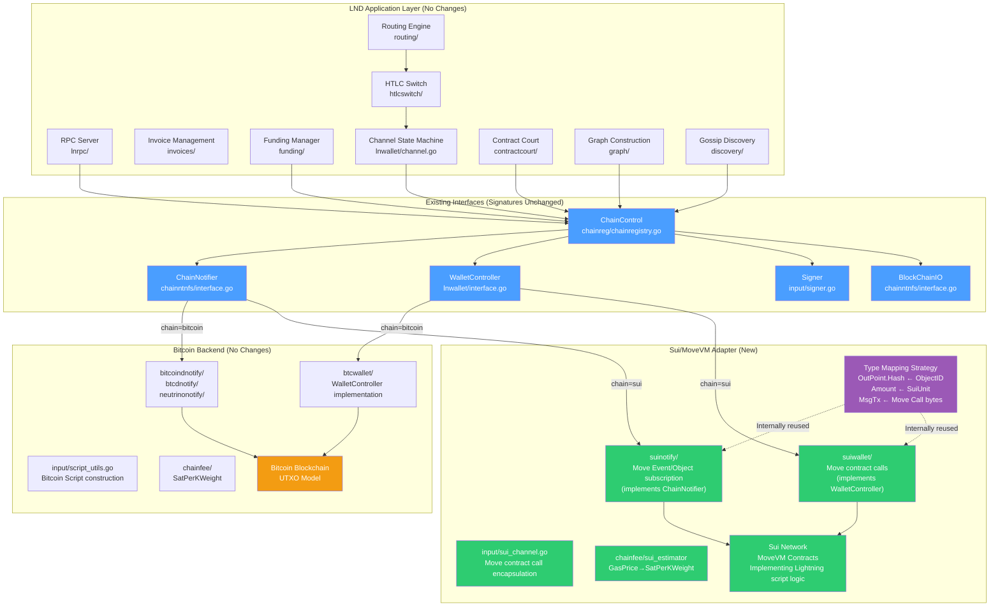
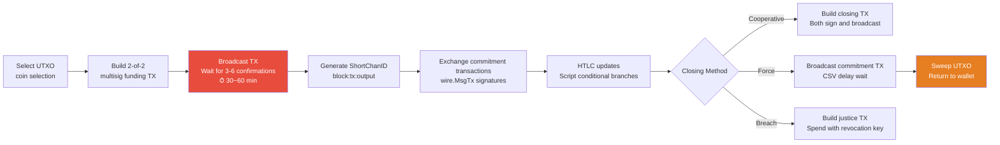
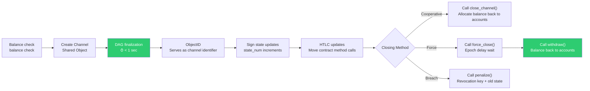
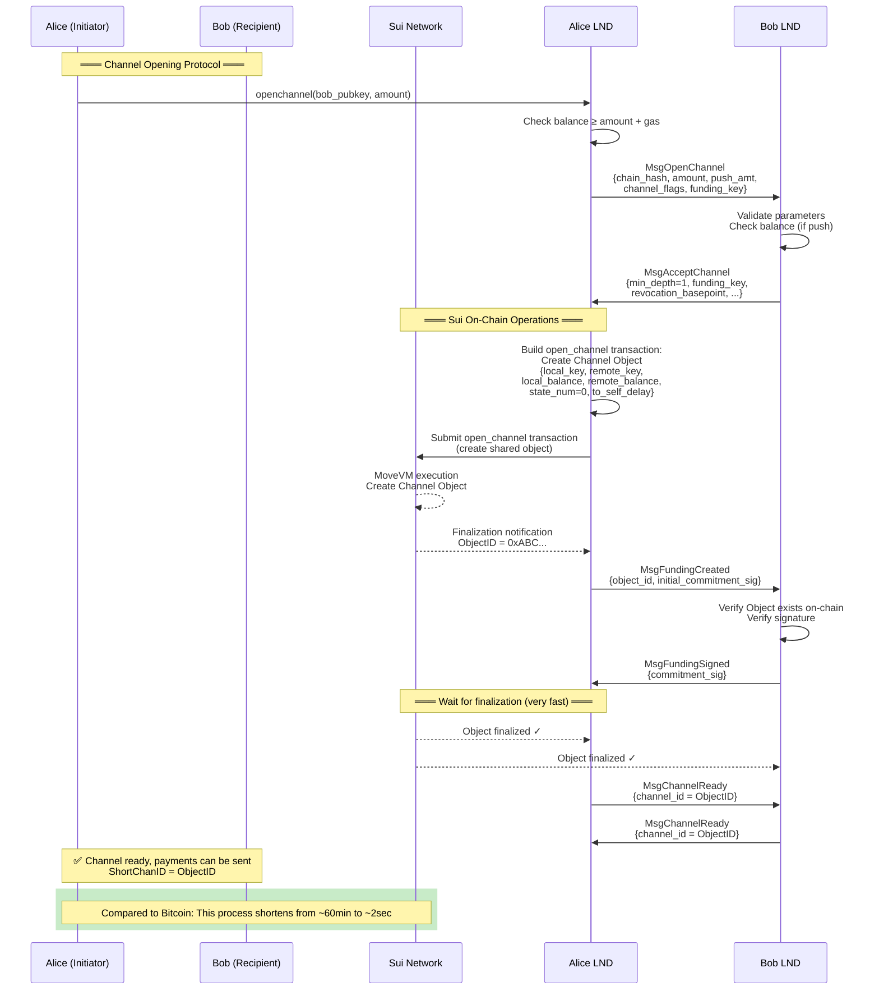
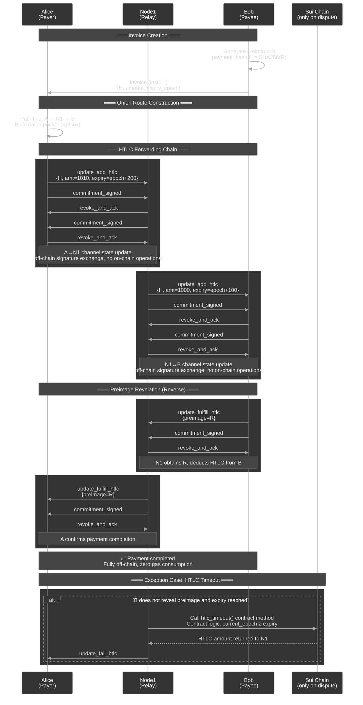
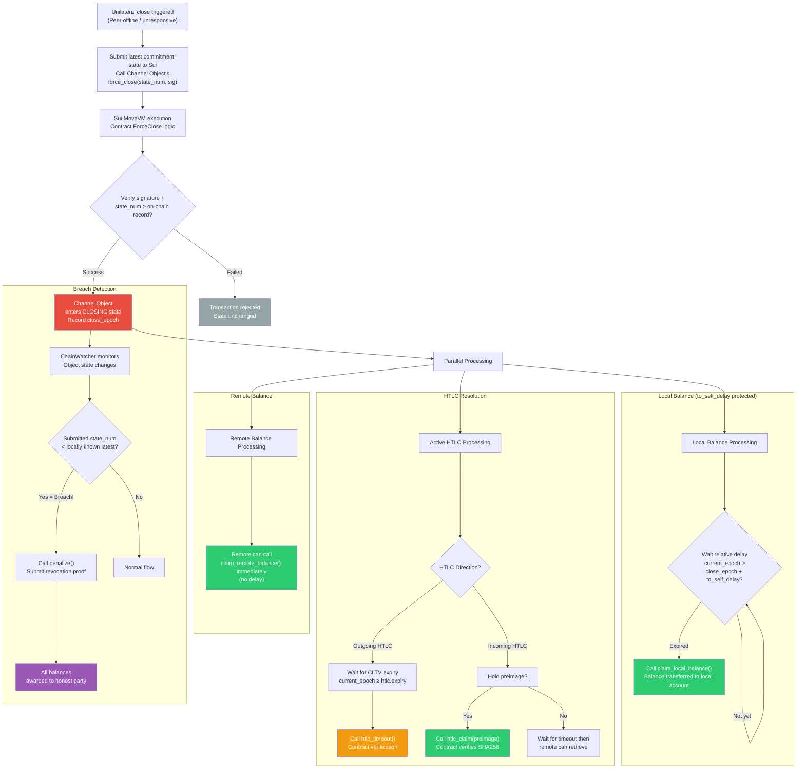
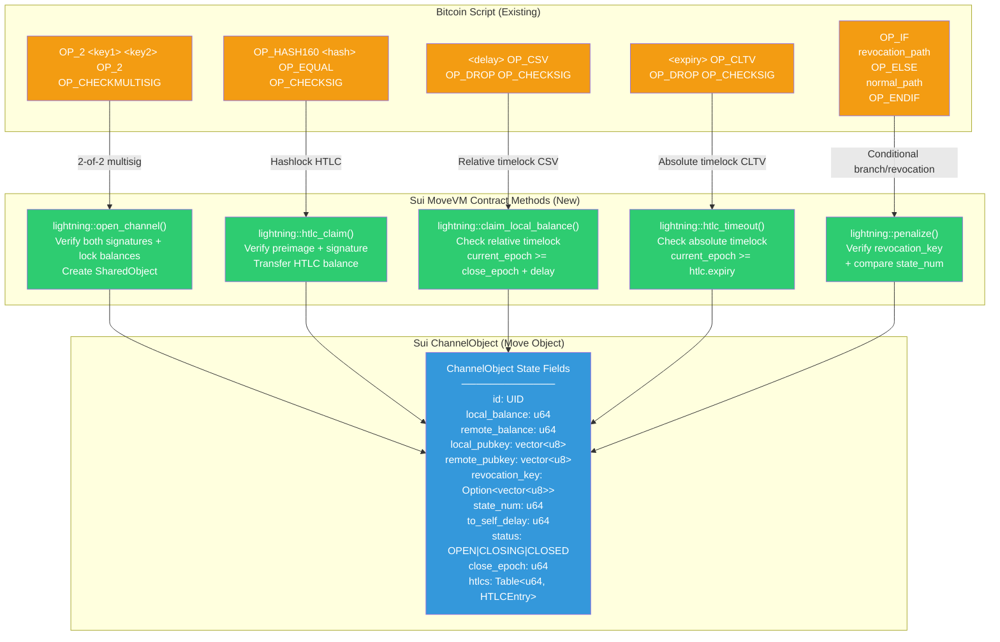
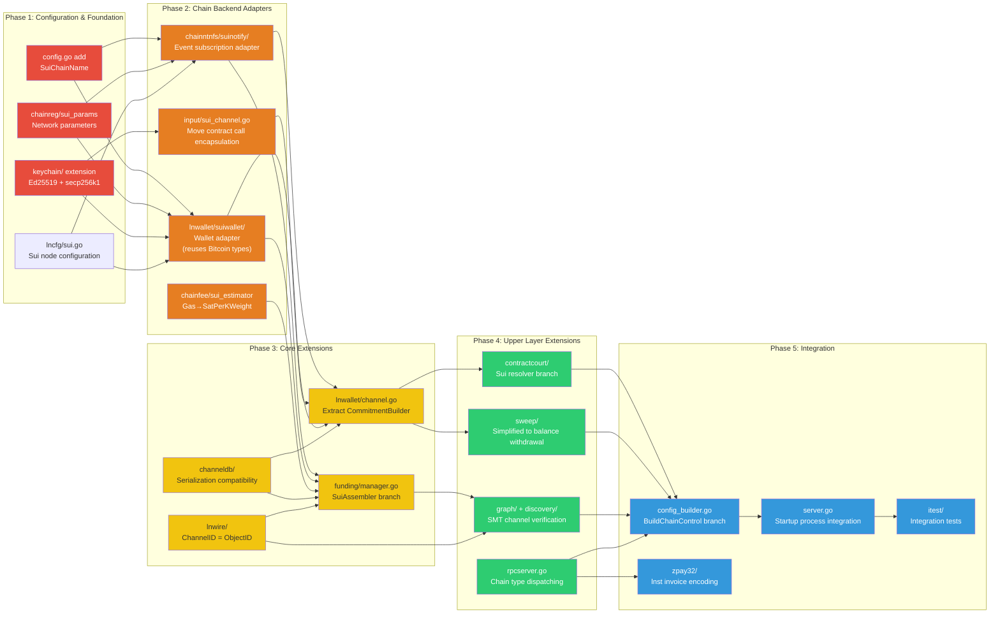
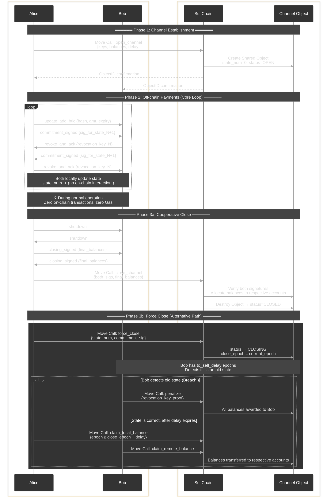

# Plan: Lightning Network Adaptation for Sui/MoveVM — Refactoring Document

## 0. Overview

Refactor LND Lightning Network to simultaneously support a **Bitcoin + Sui (MoveVM) dual system**. Leverage Sui's mature MoveVM smart contract capabilities to implement the core Lightning Network logic, with channels identified by a 32-byte `ObjectID`.

> **Background and Strategy Adjustment**: To enable parallel development, LND integration will first be carried out on the **Sui network** before Setu's general-purpose virtual machine (MoveVM) is fully integrated. Sui, as a mature MoveVM runtime environment, is ideal for initially validating the Move version of Lightning Network contract logic. The original Lightning Network script logic on Bitcoin (such as multisig, HTLC, timelocks, breach penalties) will be directly implemented through **MoveVM contracts**.
>
> **Goal**: By first adapting to Sui, accelerate LND's compatibility refactoring for the object-account model and MoveVM. Once Setu's MoveVM environment is ready, the relevant contract logic will be migrated to Setu.
>
> **Adaptation Strategy**: Shift from "adding hardcoded primitives on the Setu side" to **"deploying Move Lightning Network contracts on the Sui side"**. LND invokes the Move contracts on Sui through adapters to perform channel lifecycle management (`open_channel`, `close_channel`, `force_close`, `htlc_claim`, `penalize`, etc.).

Refactoring Strategy: **Zero-intrusion Adapter Pattern**. No new abstraction layers, no changes to existing interface signatures; instead, implement Sui/MoveVM adapters at the interface implementation level — the adapter internally reuses Bitcoin types (e.g., `wire.OutPoint.Hash` to store ObjectID, `btcutil.Amount` for unit mapping, `wire.MsgTx` to carry Move Call serialized bytes) and performs semantic conversion at the implementation boundaries. Existing Bitcoin code paths remain completely unaffected; Sui is inserted as a new `ChainControl` implementation, selectable via `lncli --chain=sui`.

Core refactoring workload distribution: **lnd backend adapter implementation for Sui/MoveVM (35%) → Move Lightning Network contract implementation on Sui side (20%) → Upper module extensions (25%) → Configuration/startup/testing integration (20%)**.

---

## 1. Process Interaction Diagrams

The following 8 diagrams cover:

1. **Architecture Overview** — Layer and module relationships in the dual-chain abstraction
2. **Channel Lifecycle Comparison** — Clear side-by-side difference between Bitcoin and Sui (MoveVM) processes
3. **Channel Opening Sequence** — Detailed interaction timeline between both parties and the chain
4. **Multi-hop HTLC Payment** — Full sequence for normal flow and exceptional timeout
5. **Force Close & Dispute Resolution** — Complete decision flow including breach penalty
6. **Bitcoin Script → MoveVM Contract Method Mapping** — How each Bitcoin contract operation translates to Move contract calls
7. **Refactoring Phase Dependencies** — Execution order and dependencies of 5 phases
8. **On-chain/Off-chain Data Flow Panorama** — Full channel lifecycle interaction swimlane

### 1. Adapter Pattern Dual-Chain Architecture Overview



---

### 2. Channel Lifecycle Comparison (Bitcoin vs Sui)

- Figure 1: Bitcoin Lightning Channel Lifecycle



- Figure 2: Sui Lightning Channel Lifecycle



---

### 3. Channel Opening Sequence Diagram (Sui Adaptation)



---

### 4. Multi-hop HTLC Payment Sequence Diagram



---

### 5. Force Close and Dispute Resolution Flowchart



---

### 6. Bitcoin Script → Sui MoveVM Contract Method Mapping

> **Note**: The original script logic on Bitcoin is mapped to specific functions in the Sui Move module. The LND adapter triggers on-chain state changes by calling these contract methods.



---

### 7. Module Refactoring Priority and Dependencies



---

### 8. Data Flow: On-chain vs Off-chain Interaction Panorama



---

## 2. Refactoring Steps

**1. Configuration Extension + Sui Network Parameters (Zero Intrusion)**

No new `chaintype/` abstraction layer. LND already has the `--chain` and `--network` dual parameters (`lncli --chain=bitcoin --network=mainnet`), naturally supporting multi-chain extension. Modification steps:

| File                              | Modification Content                                                                        |
| --------------------------------- | ------------------------------------------------------------------------------------------- |
| `config.go`                       | Add `SuiChainName = "sui"` constant + `Sui *lncfg.Chain` config item                       |
| `lncfg/sui.go` (new)              | Sui node configuration struct (RPC address, PackageID, epoch interval, etc.)               |
| `chainreg/sui_params.go` (new)    | `SuiNetParams` (network ID, genesis hash, default ports, etc.)                             |
| `chainreg/chainregistry.go`       | Add `"sui"` case in `switch` branch                                                         |

**Core Design Principle — Type Mapping at Adapter Boundary**:

When Sui adapters implement existing LND interfaces, they internally reuse Bitcoin types for semantic mapping without changing interface signatures:

| Bitcoin Type                  | Internal Usage in Sui Adapter                               | Description                       |
| ----------------------------- | ----------------------------------------------------------- | --------------------------------- |
| `wire.OutPoint{Hash, Index}`  | `Hash` ← ObjectID (32B), `Index` = 0                         | Channel identifier                |
| `btcutil.Amount`              | Directly store Sui minimum unit (int64 Mist)                  | Amount mapping                    |
| `wire.MsgTx`                  | `Payload` field carries Move Call serialized bytes            | Transaction wrapper               |
| `chainfee.SatPerKWeight`      | Internally convert GasPrice → SatPerKWeight                   | Fee rate mapping                  |
| `chainhash.Hash`              | Directly store Sui Transaction Digest / ObjectID              | 32B universal                     |
| `lnwire.ShortChannelID`       | Store truncated ObjectID in 8 bytes + TLV extension for full 32B | Routing protocol compatibility |

**2. Chain Backend Interfaces — Unchanged, Only New Sui Implementation**

**Do not modify** existing interface signatures. LND's core chain backend interface signatures remain as-is; the Sui adapter acts as a new implementation, performing semantic conversion internally:

- **`ChainNotifier`** — Adapter interprets `txid` in `RegisterConfirmationsNtfn(txid *chainhash.Hash, ...)` as Transaction Digest, subscribes to transaction finalization events
- **`BlockChainIO`** — Adapter interprets `GetUtxo(outpoint *wire.OutPoint, ...)` as querying Channel Object state
- **`Signer`** — Adapter interprets `tx` in `SignOutputRaw(tx *wire.MsgTx, ...)` as the serialization carrier for Move Calls, and signs the content with Sui signature scheme
- **`WalletController`** — The most modified adapter; internally performs semantic conversion from UTXO → balance (returns a "virtual UTXO" in `ListUnspentWitness`)

**3. Extend `ChainControl` + `config_builder.go`**

Modify `ChainControl` struct in `chainreg/chainregistry.go`:

- Add `ChainName string` field (`"bitcoin"` or `"sui"`)
- Add `"sui"` branch in `BuildChainControl` function in `config_builder.go` to create Sui adapter instances and inject into `ChainControl`
- Create `chainreg/sui_params.go` defining `SuiNetParams` (network ID, genesis hash, default ports, epoch interval)

**4. Implement Sui Chain Notification Backend `chainntnfs/suinotify/`**

Implement the `ChainNotifier` interface, core mapping:

| Bitcoin Concept                              | Sui Implementation                                                       |
| --------------------------------------------- | ------------------------------------------------------------------------ |
| `RegisterConfirmationsNtfn(txid, numConfs)`   | Subscribe to transaction finalization events                             |
| `RegisterSpendNtfn(outpoint)`                  | Subscribe to Channel Object state changes (triggered via Move Events)    |
| `RegisterBlockEpochNtfn()`                     | Subscribe to Sui Checkpoint/Epoch advancement events                     |
| Reorg detection                               | Greatly simplified (DAG has no classic reorgs)                           |
| `GetBlock()` / `GetBlockHash()`                | Query Checkpoint information                                             |

**5. Implement Sui Wallet `lnwallet/suiwallet/`**

Implement the adapted `WalletController` interface:

| Bitcoin Operation                           | Sui Operation                                                                 |
| -------------------------------------------- | ---------------------------------------------------------------------------- |
| `ListUnspentWitness()` — list UTXOs          | `GetBalance()` — query account balance                                       |
| `LeaseOutput(OutPoint)` — lock UTXO          | `ReserveBalance(amount)` — reserve balance                                   |
| `SendOutputs([]*wire.TxOut)` — build TX      | `MoveCall(package, module, func, args)` — call contract                      |
| `FundPsbt()` / `SignPsbt()`                  | `BuildMoveCall()` / `SignTransaction()` — build Sui transaction              |
| Coin selection (`selectInputs`)              | Not needed (deduct directly from balance)                                    |
| Change address generation                     | Not needed                                                                   |

Key management: reuse the `KeyFamily` system from [derivation.go] (../../../keychain/derivation.go), add Sui coinType, key derivation supporting both secp256k1 and Ed25519 dual paths.

**6. Sui On-Chain Channel Logic — Implemented via MoveVM Contracts**

The original script logic on Bitcoin is replaced by Move contracts on Sui.

**6a. Move Module `lightning` Core Functions**:

```move
public entry fun open_channel(...) // Create Channel SharedObject
public entry fun close_channel(...) // Cooperative close
public entry fun force_close(...) // Force close
public entry fun htlc_claim(...) // HTLC success path
public entry fun htlc_timeout(...) // HTLC timeout path
public entry fun penalize(...) // Breach penalty path
```

Create `input/sui_channel.go` on the Go side to encapsulate construction functions for the above contract calls.

**7. Channel Identifier System Redesign**

- Modify [channel_id.go] (../../../lnwire/channel_id.go) — `NewChanIDFromOutPoint` on Sui chain directly uses the first 32 bytes of ObjectID
- Modify [short_channel_id.go] (../../../lnwire/short_channel_id.go) — In Sui mode, `ShortChannelID` uses ObjectID (32 bytes)
- Update [channel.go] (../../../lnwallet/channel.go) — Change `FundingOutpoint` field to `chaintype.ChannelPoint`
- Modify [channel_edge_info.go] (../../../graph/db/models/channel_edge_info.go) — Rename/extend fields to support Sui public key formats

**8. Channel State Machine Adaptation**

Refactoring strategy for [channel.go] (../../../lnwallet/channel.go) is to **separate protocol logic from on-chain operations**:

- Extract interface `CommitmentBuilder`: Bitcoin implementation constructs commitment transactions; Sui implementation constructs Move Call state updates
- Extract interface `ScriptEngine`: Sui implementation invokes Move contract logic
- Keep core protocol logic unchanged: state number (`StateNum`), HTLC management (`UpdateLog`), etc.

**9. Funding Manager Adaptation**

Modify [manager.go] (../../../funding/manager.go):

- `waitForFundingConfirmation` — In Sui mode, wait for transaction to be Finalized
- Funding transaction construction switches to new `chanfunding.SuiAssembler` (directly call open_channel contract)

**10. Contract Court Adaptation**

Modify all resolvers in [contractcourt] (../../../contractcourt/) to call the corresponding Move contract methods.

**11. Sweep Module Simplification**

Add Sui mode in [sweep] (../../../sweep/), simplified to call contract to withdraw balance back to personal account.

**12. Graph and Discovery Adaptation**

- Modify [builder.go] (../../../graph/builder.go) — Sui queries whether Channel Object still exists
- Modify [gossiper.go] (../../../discovery/gossiper.go) — Sui verifies Channel Object existence + both keys match

**13. Fee Rate System Adaptation**

- Add `SuiEstimator` implementing `Estimator` interface in [chainfee] (../../../chainfee/)
- Modify [rates.go] (../../../chainfee/rates.go) — Add `GasPrice` type

**14. RPC and Invoice Adaptation**

- Modify `GetInfo` in [rpcserver.go] (../../../rpcserver.go) — Return `"sui"`
- Modify [zpay32] (../../../zpay32/) — Add Sui HRP

**15. Configuration and Startup**

- Modify [config.go] (../../../config.go) — Add `Sui *lncfg.Chain`
- Modify [config_builder.go] (../../../config_builder.go) — Add Sui branch in `BuildChainControl`
- Modify [server.go] (../../../server.go) — Initialize corresponding subsystems based on chain type

---

## 3. Complete List of Required Sui Capabilities

### P0 — Core Capabilities (Lightning Network cannot run without these)

| #   | Capability                         | Detailed Requirements                                                                                     | Corresponding LND Module                                   |
| --- | ---------------------------------- | -------------------------------------------------------------------------------------------------------- | ---------------------------------------------------------- |
| 1   | **Move Lightning Contracts**       | Implement open_channel/close_channel/force_close/htlc_claim/timeout/penalize                              | `input/sui_channel.go` + Move contracts                    |
| 2   | **Shared Object**                  | Channel Object must be operable by both parties via contracts                                             | `lnwallet/suiwallet/`                                      |
| 3   | **Hashlock**                       | Move contract must have built-in SHA256 preimage verification logic                                      | HTLC contract                                              |
| 4   | **Time Reference**                  | Contracts can read current epoch or clock for timelock comparison                                        | CSV/CLTV equivalent                                        |
| 5   | **State Version Control**           | Channel Object must have monotonically increasing `state_num` to prevent replay of old states            | Commitment state sync                                      |
| 6   | **Event Subscription API**          | Subscribe to state change events by ObjectID or PackageID                                                | `chainntnfs/suinotify/`                                    |
| 7   | **Finality Notification**           | Callback notification of finalization status after transaction submission                                 | Confirmation flow                                          |
| 8   | **Multi-signature Verification**    | Move contract must have built-in secp256k1 signature verification                                        | Transaction authorization                                  |
| 9   | **Object Query API**                | Query full object state by ObjectID                                                                      | Equivalent of `BlockChainIO`                               |
| 10  | **Atomic State Updates**            | Contract execution state changes must either all take effect or all roll back                             | Channel state consistency                                   |
| 11  | **Go SDK**                          | Support Sui transaction building, signing, submission, and event subscription                            | [keychain] (../../../keychain/) + adapter layer            |

### P1 — Important Capabilities (Affect Security and Extensibility)

| #   | Capability                        | Detailed Requirements                                                             | Corresponding LND Module                          |
| --- | --------------------------------- | -------------------------------------------------------------------------------- | ------------------------------------------------- |
| 12  | **Merkle Proof (SMT Proof)**      | Provide Binary+Sparse Merkle Tree proof of object existence/non-existence        | [discovery] (../../../discovery/) channel verification |
| 13  | **Historical State Query**        | Query historical state of Channel Object by version/epoch (for dispute arbitration) | [contractcourt] (../../../contractcourt/)         |
| 14  | **Gas Estimation API**            | Estimate gas consumption of Move contract calls                                  | `chainfee/`                                       |
| 15  | **Batch Operations**              | Atomically operate on multiple objects in a single transaction (batch HTLC settlement) | [sweep] (../../../sweep/) batch processing        |
| 16  | **Object Destruction Notification**| Generate subscribable event when Channel Object is destroyed (channel closed)    | Channel liveness check in [builder.go] (../../../graph/builder.go) |
| 17  | **Node Discovery/P2P**            | P2P connection information for Sui network nodes (for LN gossip bootstrapping)   | [chainreg] (../../../chainreg/) DNS seeds         |

### P2 — Optimization Capabilities (Enhance Performance and User Experience)

| #   | Capability                | Detailed Requirements                                                             |
| --- | ------------------------- | -------------------------------------------------------------------------------- |
| 18  | **Light Client Mode**     | Sui light client (only verify Merkle proofs, not full state)                     |
| 19  | **Watchtower Support**    | Third parties can monitor Channel Object state and automatically submit penalty transactions on breach |
| 20  | **Atomic Cross-Chain Operations** | Support atomic swaps / cross-chain HTLC between Bitcoin↔Sui (if dual-chain interoperability is needed) |

---

## 4. Verification

- **Unit Tests**: Each new Sui implementation independently tested, mocking Sui RPC
- **Contract Tests**: Use `sui move test` to verify contract logic
- **Integration Tests**: Modify [itest] (../../../itest/) framework, cover full scenarios: open channel, send payment, close, penalty, etc.
- **Commands**: `make itest tags=sui`
- **Manual Checks**: `lncli --chain=sui getinfo`

## 5. Decision Records

- **Adaptation Strategy**: Use **Adapter Pattern**. LND invokes Move contracts on Sui through adapters to replace original Bitcoin script logic.
- **Parallel Development**: Integrate Sui first to advance upper-layer logic development before Setu's general VM is ready.
- **ObjectID**: On Sui, use 32-byte ObjectID directly to identify channels.