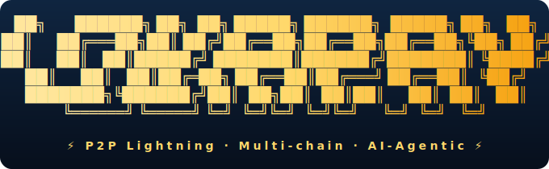

<div align="center">



# LokaPay P2P Lightning Node

**Multi-chain Lightning routing for the agentic economy.**
*One routing engine. Multiple chains. Infinite agents.*

<a href="https://github.com/loka-network/loka-p2p-lnd/releases"></a>
<a href="https://github.com/loka-network/loka-p2p-lnd/actions"></a>
<a href="https://github.com/loka-network/loka-p2p-lnd/stargazers"></a>
<a href="https://discord.gg/hetu"></a>
<a href="LICENSE"></a>
<a href="https://hub.docker.com/r/hetuorg/lnd"></a>
<a href="https://golang.org"></a>
<a href="https://x.com/lokachain"></a>
<a href="https://lokachain.org/"></a>

[Quick Start](#-quick-start) · [Why LokaPay](#-why-lokapay) · [Architecture](#-architecture-zero-intrusion-adapter-pattern) · [Docs](#-documentation) · [Security](#-security) · [Discussions](https://github.com/loka-network/loka-p2p-lnd/discussions)

</div>

---

## What is LokaPay

The next frontier of value transfer is not human-to-human — it is **agent-to-agent**. As autonomous AI agents coordinate, negotiate, and transact on behalf of humans and institutions, payment infrastructure must evolve to match.

LokaPay extends the Bitcoin-native **Lightning Network** routing engine to settle across multiple chains. The proven BOLT-compliant routing core stays untouched; chains plug in as alternative backends through a clean adapter boundary.

> **What this means in practice**
>
> - AI agents transact **thousands of times per second** at near-zero per-payment cost
> - **BTC ⟷ Sui ⟷ EVM** atomic settlement via HTLC preimage compatibility — no custodial bridge
> - Battle-tested LN routing (channel state machine, gossip, pathfinding, watchtower) preserved verbatim from upstream `lnd`

---

## ⚡ Quick Start

### Run with Docker (recommended)

```sh
docker pull hetuorg/lnd:v0.21.0

docker run -p 9735:9735 -p 10009:10009 \
  -v ~/.lnd:/root/.lnd \
  hetuorg/lnd:v0.21.0 \
  --chain=sui --sui.rpc=<sui-rpc-endpoint>
```

### Run from a release binary

```sh
curl -L https://github.com/loka-network/loka-p2p-lnd/releases/download/v0.21.0/loka-lnd-linux-amd64-v0.21.0.tar.gz \
  | tar xz
./lnd --chain=sui --sui.rpc=<sui-rpc-endpoint>
```

### Build from source

```sh
git clone https://github.com/loka-network/loka-p2p-lnd
cd loka-p2p-lnd
make install      # produces lnd and lncli in $GOPATH/bin
```

> [!NOTE]
> LokaPay is in **beta**. Read the [Safe Operating Guide](docs/safety.md) before connecting a mainnet wallet.

---

## 🎯 Why LokaPay

Four structural advantages over single-chain wallets, payment-focused L1s, and EVM-style bridges.

### 1. AI agent micropayments are economically viable

An AI agent making **10,000 micro-payments/day at $0.0001 each**:

| | Per-transaction fee | Daily cost | Outcome |
|---|---|---|---|
| Even the cheapest L1 (Sui, Solana, Tempo) | ~$0.001 | **$10** | Agent burns $10 to earn $1 — **unprofitable** |
| LokaPay Lightning | one-time channel: ~$0.001<br>then ~$0 forever | **~$0.001** | **Margin preserved, scales linearly** |

Lightning amortizes channel-open cost across an unlimited number of subsequent payments. This is the only payment rail where AI agents can settle micro-intents profitably.

### 2. Cross-chain atomic settlement — no bridge custodian

Lightning HTLC preimage compatibility means **any two chains** that implement compatible HTLC primitives can atomic-swap natively:

```
   BTC  ⟷  Sui  ⟷  EVM  (Base / Arbitrum / Polygon — roadmap)
              ⇕
        same HTLC, same secret s, atomic by SHA-256
```

- No wrapped assets, no IOUs, no mint-burn — real assets exchanged
- No custodian, no validator set, no relayer — failed swap auto-refunds via on-chain timeout
- Same primitive that has secured Lightning (Boltz, Loop, etc.) for 6+ years

### 3. Order-of-magnitude bridge security

| Trust model | Protocol-layer losses (last 3 years) |
|---|---|
| EVM Lock-and-Mint bridges (Ronin · Wormhole · Multichain · Poly · Nomad · Harmony · Orbit · …) | **> $2.5 billion** |
| Lightning HTLC protocol layer | **$0** |

Bridges custody your funds; HTLCs do not. The trust boundary collapses from *"trust an extra validator set"* to *"trust each chain's own consensus + SHA-256"*.

### 4. Native financial privacy

| | On-chain wallet | LokaPay Lightning |
|---|---|---|
| Balance | Permanently public | Channel-private |
| Counterparty | Permanently public | Endpoints only |
| Time / amount | Permanently public | Channel-private |
| Routing nodes see | N/A | Only *"N sats passed through"* |

---

## 🌐 Supported Chains

One adapter pattern. Three backends. Same routing engine on top.

| Chain | Adapter | Status | When to use it |
|------|---------|--------|----------------|
| **Bitcoin** | `bitcoind` / `btcd` / `neutrino` | ✅ Live | Mainnet liquidity, existing LN ecosystem |
| **Sui** | `suinotify` · `suiwallet` · `chainfee/sui_estimator` | ✅ Live | Sub-second DAG-BFT finality, Move-enforced channel primitives |
| **EVM** | `evmnotify` · `evmwallet` · `chainfee/evm` (planned) | 🚧 Roadmap | Tempo · Base · Arbitrum · OP · Polygon — same HTLC primitive |
| **Setu** | Hetu Project's payment consensus layer | 🔜 Upcoming | Intent-carrying payment flows |

All chains share **the same RPC interface, pathfinding engine, HTLC Switch, and channel state machine**. One codebase, multiple ledger backends, seamless routing.

---

## 🏗 Architecture: Zero-Intrusion Adapter Pattern

Rather than fork the Lightning core, LokaPay abstracts the consensus, wallet, and cryptographic layers underneath. **The Lightning application layer is untouched**; chains plug in via three stable interfaces.

```text
┌─────────────────────────────────────────────────────────────────────────────────┐
│                    LND Application Layer (unchanged)                            │
│           RPC Server · Routing Engine · HTLC Switch · FSM                       │
└────────────────────────────────────┬────────────────────────────────────────────┘
                                     │
┌────────────────────────────────────▼────────────────────────────────────────────┐
│                Chain Abstraction Interfaces (never modify)                      │
│       ChainNotifier · WalletController · Signer · BlockChainIO                  │
└────┬─────────────────┬───────────────────┬────────────────────┬─────────────────┘
     │ chain=bitcoin   │ chain=sui         │ chain=evm          │ chain=setu
┌────▼────────────┐ ┌──▼───────────────┐ ┌─▼────────────────┐ ┌─▼──────────────┐
│ Bitcoin    ✅   │ │ Sui Adapter ✅   │ │ EVM Adapter  🚧  │ │ Setu Adapter🔜 │
│ bitcoindnotify/ │ │ suinotify/       │ │ evmnotify/       │ │ (upcoming)     │
│ btcdnotify/     │ │ suiwallet/       │ │ evmwallet/       │ │                │
│ neutrinonotify/ │ │ input/sui_channel│ │ chainfee/evm     │ │                │
│ btcwallet/      │ │ chainfee/sui     │ │ → Tempo · Base · │ │                │
│                 │ │                  │ │   Arbitrum · OP  │ │                │
└─────────────────┘ └──────────────────┘ └──────────────────┘ └────────────────┘
```

### Type Mapping at the Adapter Boundary

Sui adapters reuse LND types internally and translate at the boundary — no codebase-wide type-system refactor required.

| LND Type              | Sui Semantic            | Notes                    |
| --------------------- | ----------------------- | ------------------------ |
| `wire.OutPoint.Hash`  | `ObjectID`              | Direct 32-byte mapping   |
| `wire.OutPoint.Index` | `0`                     | Sui has no UTXO index    |
| `btcutil.Amount`      | `u64`                   | Sui base unit            |
| `wire.MsgTx`          | Sui Event bytes         | Serialized Event payload |
| `chainhash.Hash`      | `EventId` / `AnchorId`  | 32 bytes                 |

---

## 🔬 Technical Implementation

<details>
<summary><b>1. Chain abstraction & adapter layer</b></summary>

New backends implement LND's `ChainNotifier`, `WalletController`, and `Signer` interfaces for Sui — and are architecturally pre-structured for Setu. The boundary is clean: the Lightning layer never knows which chain is running beneath it. See [`chainreg/chainregistry.go`](chainreg/chainregistry.go).

</details>

<details>
<summary><b>2. Sui adapter modules</b></summary>

- **[`suinotify/`](suinotify/)** — Event tracking and block notification via Sui RPC
- **[`suiwallet/`](suiwallet/)** — Key management, address derivation, transaction construction
- **[`chainfee/sui_estimator`](chainfee/)** — Dynamic fee estimation against live Sui network conditions

</details>

<details>
<summary><b>3. Move smart contract primitives</b></summary>

All channel lifecycle events — `ChannelOpen`, `ChannelClose`, `HTLCClaim`, penalty enforcement — route through `suiwallet`, which constructs `BuildMoveCall` requests against on-chain Move contracts. No Bitcoin scripting limitations; full programmability with Move's resource semantics.

</details>

<details>
<summary><b>4. Cryptographic compatibility</b></summary>

Extended Go's SECP256K1 signing pipeline to produce a deterministic `SHA256(Blake2B(intent))` payload matching the Mysten Sui TypeScript SDK specification — ensuring 100% interop with Sui Devnet validation requirements without forking the SECP256K1 library.

</details>

<details>
<summary><b>5. Distribution & version identity</b></summary>

Binaries carry SemVer build metadata `+loka-sui` (e.g. `0.21.0-beta.loka.1+loka-sui`) exposed via `lnd --version`, `lncli --version`, `lncli getinfo`, the startup log, and the `verrpc` RPC. SemVer build metadata is ignored for precedence — tooling that parses the version (BOS, RTL, lndmon) keeps working unchanged.

</details>

---

## 📋 Core Features

- Channel lifecycle: cooperative close / force-close / breach penalty
- Full channel state machine (BOLT 2 compliant)
- Multi-hop HTLC payment forwarding (timeout, claim, fail)
- Gossip network topology discovery and maintenance
- Dijkstra pathfinding + Mission Control reputation
- BOLT-11 invoice management
- Automated channel management (`autopilot`)
- Watchtower (offline penalty broadcasting)
- Sui chain: DAG finality replaces block confirmations (**< 1 second**)

---

## 📜 BOLT Specification Compliance

| Spec | Title | Status |
|------|-------|:------:|
| BOLT 1 | Base Protocol | ✅ |
| BOLT 2 | Peer Protocol for Channel Management | ✅ |
| BOLT 3 | Bitcoin Transaction and Script Formats | ✅ |
| BOLT 4 | Onion Routing Protocol | ✅ |
| BOLT 5 | Recommendations for On-chain Transaction Handling | ✅ |
| BOLT 7 | P2P Node and Channel Discovery | ✅ |
| BOLT 8 | Encrypted and Authenticated Transport | ✅ |
| BOLT 9 | Assigned Feature Flags | ✅ |
| BOLT 10 | DNS Bootstrap and Assisted Node Location | ✅ |
| BOLT 11 | Invoice Protocol for Lightning Payments | ✅ |

---

## 🗺 Roadmap

- ✅ Bitcoin LN backend (inherited from upstream, preserved unchanged)
- ✅ Sui adapter — `suinotify` / `suiwallet` / `chainfee/sui_estimator`
- ✅ Move smart contract channel primitives
- ✅ Sub-second DAG-BFT finality
- ✅ Reproducible release pipeline (15 platforms cross-compile, Docker multi-arch)
- 🚧 EVM chain adapter (Tempo · Base · Arbitrum · OP · Polygon) — same HTLC primitive, same adapter pattern
- 🚧 Cross-chain swap-provider service — bridge BTC ↔ Sui ↔ EVM liquidity
- 🔜 Setu integration — Hetu Project's intent / payment consensus layer
- 🔜 LSP / leaf-node mode for edge devices (Pi Zero · embedded ARM · home routers)
- 🔜 Watchtower marketplace

---

## 🛠 Build & Test

```sh
make build         # Build debug binaries: lnd-debug, lncli-debug
make install       # Install to $GOPATH/bin
make unit          # Unit tests (requires btcd binary; auto-installed)
make unit-module   # Submodules: actor/, fn/, tools/
make unit-race     # Race detector
make itest         # Integration tests (postgres backend needs Docker)
make lint          # golangci-lint via Docker
make release       # Reproducible cross-platform release (15 targets)
```

Useful flags (see [`make/testing_flags.mk`](make/testing_flags.mk)):

| Flag | Purpose |
|---|---|
| `pkg=<import-path>` | Scope unit tests to one package |
| `case=<TestName>` | Filter unit tests by name |
| `icase=<TestName>` | Filter integration tests by name |
| `backend=btcd\|bitcoind\|neutrino` | Choose chain backend for `itest` |
| `dbbackend=bbolt\|etcd\|postgres\|sqlite` | Choose DB backend for `itest` |
| `tags=<buildtag>` | Extra build tags |

> Required Go version: **1.25.5+** (see `GO_VERSION` in [Makefile](Makefile))

---

## 📚 Documentation

| Topic | File |
|------|------|
| Sui adaptation & integration plan | [1-refactor-docs/sui/lnd-and-sui-integration.md](1-refactor-docs/sui/lnd-and-sui-integration.md) |
| Sui chain architecture | [1-refactor-docs/sui/sui-architecture.md](1-refactor-docs/sui/sui-architecture.md) |
| LND refactor plan | [1-refactor-docs/sui/lnd-sui-refactor-plan.md](1-refactor-docs/sui/lnd-sui-refactor-plan.md) |
| LND engineering architecture | [1-refactor-docs/lnd-architecture.md](1-refactor-docs/lnd-architecture.md) |
| Sui ↔ LND interaction spec | [1-refactor-docs/sui/sui-ln-interaction-spec.md](1-refactor-docs/sui/sui-ln-interaction-spec.md) |
| Sui adapter & Move contract security audit | [1-refactor-docs/sui/security-audit.md](1-refactor-docs/sui/security-audit.md) |
| Docker deployment | [docs/DOCKER.md](docs/DOCKER.md) |
| Installation guide | [docs/INSTALL.md](docs/INSTALL.md) |

---

## 🔒 Security

This node is in **beta**. For mainnet operation, follow the [Safe Operating Guide](docs/safety.md).

A dedicated audit of the Sui adapter and the on-chain `lightning` Move module is maintained at [1-refactor-docs/sui/security-audit.md](1-refactor-docs/sui/security-audit.md). It enumerates every Critical / High / Medium / Low finding, remediation status, and the regression tests we recommend before mainnet. **Readers reviewing the Sui backend should start there.**

> [!IMPORTANT]
> If you discover a security vulnerability, please open an issue at <https://github.com/loka-network/loka-p2p-lnd/issues> tagged `security`, or reach out privately first for sensitive findings.

---

## 🤝 Contributing

- [Code Contribution Guidelines (upstream)](https://github.com/lightningnetwork/lnd/blob/master/docs/code_contribution_guidelines.md) — style and review process
- Issue tracker: <https://github.com/loka-network/loka-p2p-lnd/issues>
- Discussions: <https://github.com/loka-network/loka-p2p-lnd/discussions>

---

## 📄 License & Acknowledgments

MIT — same as upstream `lnd`. See [LICENSE](LICENSE).

Built on the shoulders of [`lightningnetwork/lnd`](https://github.com/lightningnetwork/lnd) — the reference Lightning Network implementation. We preserve everything that makes Lightning powerful. We extend it for everything that comes next.

<div align="center">
<sub>built by <a href="https://lokachain.org">Loka Network</a> · part of the <a href="https://hetu.io">Hetu Project</a></sub>
</div>
